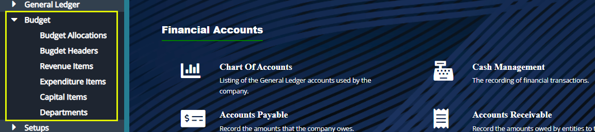
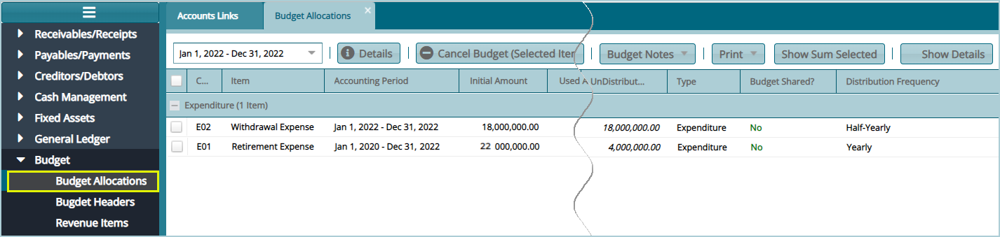
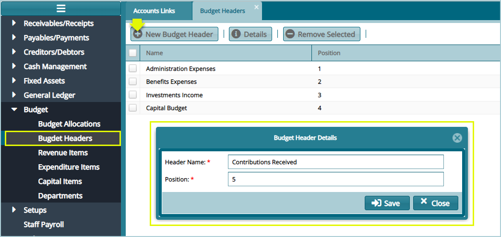
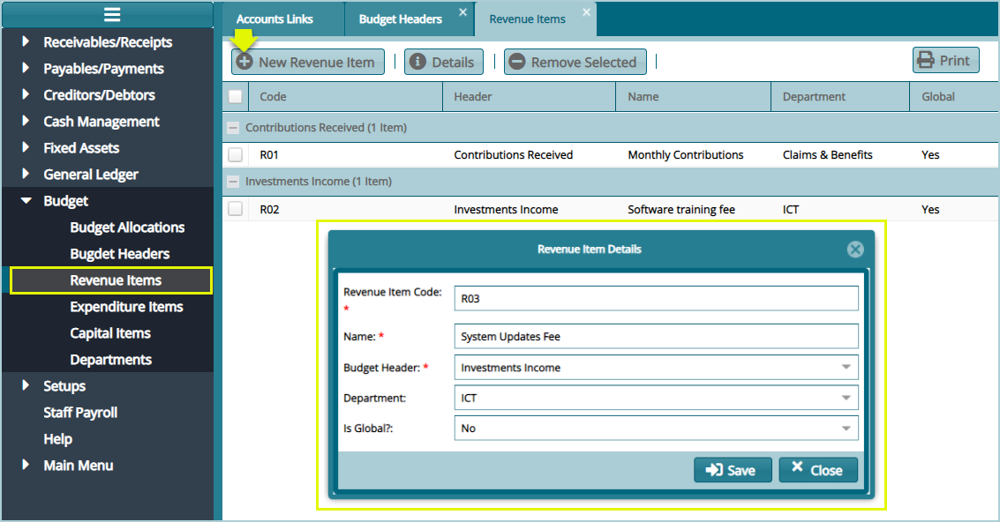
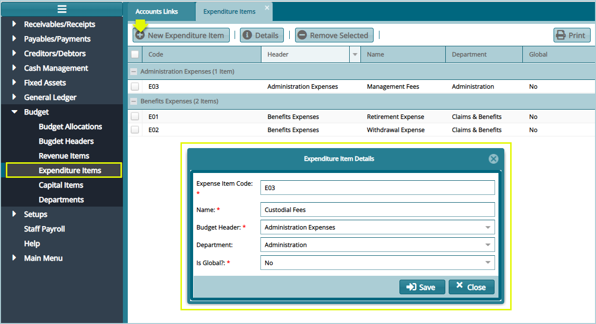
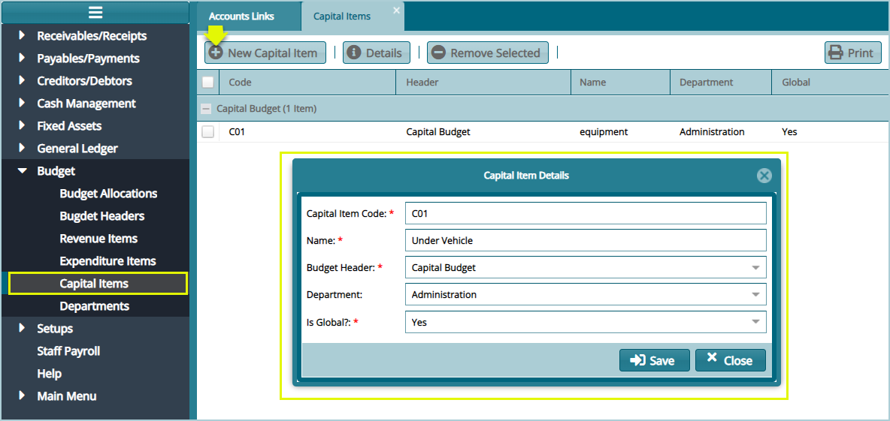
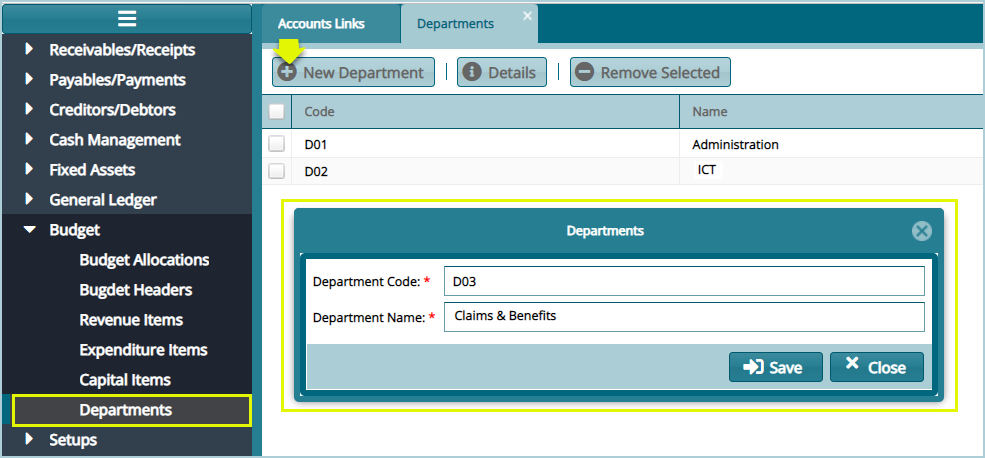

### Budget

The set of configurations under the Budget menu are set to aid in the creation and management of budgetary allocations in a scheme. Click on the drop-down submenu links to open the respective window for specific configurations as shown below: 

 

## Budget Allocation

Click the **Budget Allocations** link to open the Budget Allocations window where the allocations are listed in a grid table. Clicking the Details button will allow one to view all the details of a selected allocation record from the list as shown below:

 

## Budget Headers

Click the **Budget Headers** link to open the Budget Headers window, then click the **New Budget Header** button to create a header as shown below:

 

## Revenue Items

Click the **Revenue Items** link to open the Budget Headers window, then click the **New Revenue Items** button to create a new Item as shown below:

 

## Expenditure Items

Click the **Expenditure Items** link to open the Expenditure Items window, then click the **New Expenditure Item** button to create a new item as shown below:

 

## Capital Items

Click the  **Capital Items** link to open the Capital Items window, then click the **New Capital Item** button to create a new item as shown below:

 

## Departments

Click the **Departments**link to open the Departments window, then click the **New Department** button to create a new department as shown below:

 
