### Cash Management

The Cash Management menu provides access links to windows where
respective configurations are listed in grid tables, and new ones set.
Click the links highlighted below to access specific windows:

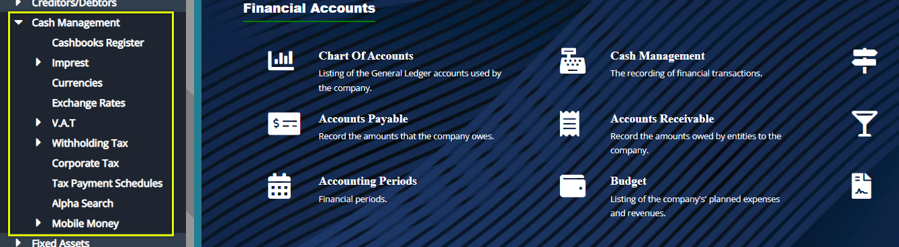 

## Cashbooks Register

Click the **Cashbooks Register** link to open the Register window where
different cash books are displayed in a grid table as shown below:

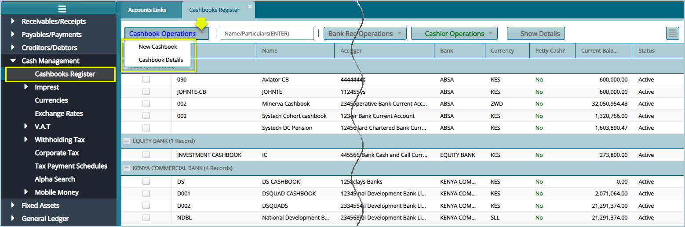 

## Creating a new cashbook

Click the **New Cashbook** link from the Cashbook Operations menu, as
shown previously,to open a dialogue box through which a new
Cashbook's details are captured. See screenshot below:

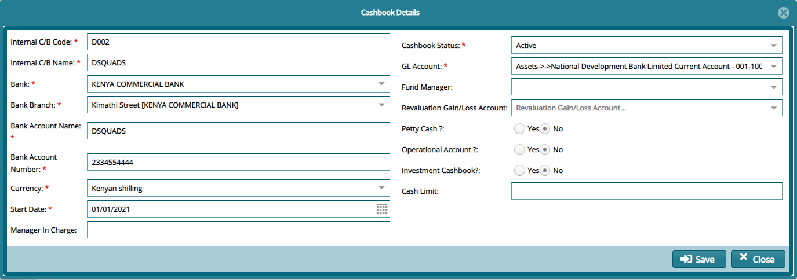 

**Tip**

Assumptions in the cashbook creation

-   That the chart of accounts is setup

-   That the GL transaction mappings are setup

-   That a cash book is related to a GL account

## Currencies

Click the **Currencies** link to open the Currencies window where
different currency details are displayed in a grid table as shown below:

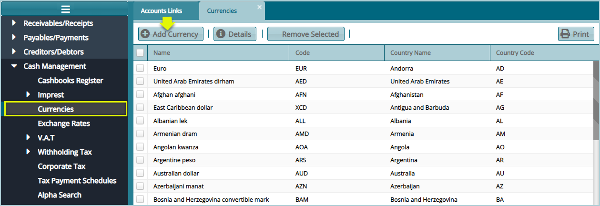 

Click the **Add Currency** button to open a dialogue box through which a
new Currency is configured as shown below:

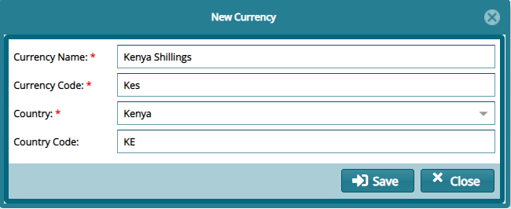 

## Exchange Rates

The Exchange Rate are configurations for the base currency exchange
rates. The settings also inform the foreign currency exchange rate in
comparison to the base currency for any transactions that will involve
foreign currency types in the accounting module.

Click the **Exchange Rates** link to open the Exchange Rates window,
then click the **New Exchange Rates** button to create a Rate as shown
below:

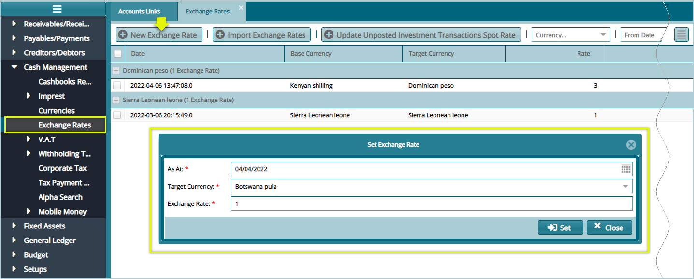 

## VAT Rates

Click the **Rates** link from the **V.A.T** drop-down menu to open the
V.A.T window, then click the **New Rate** button to create a new Rate as
shown below:

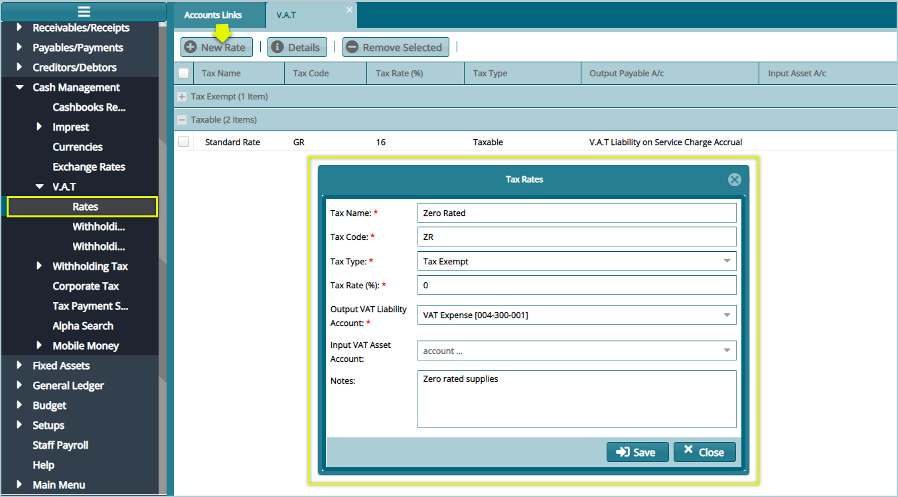 

## Withholding V.A.T Categories

Click the **Withholding V.A.T Categories** link from the **V.A.T**
drop-down menu to open the Withholding V.A.T Categories window, then
click the **New Categories** button to create a category as shown below:

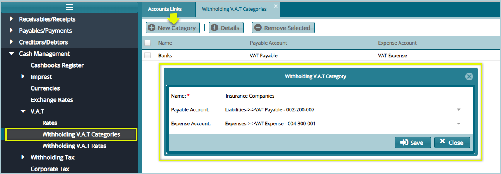 

## Withholding V.A.T Rates

Click the **Withholding V.A.T Rates** link from the **V.A.T** drop-down
menu to open the Withholding V.A.T Rates window, then click the **New
Rates** button to create a Category's Rate as shown below:

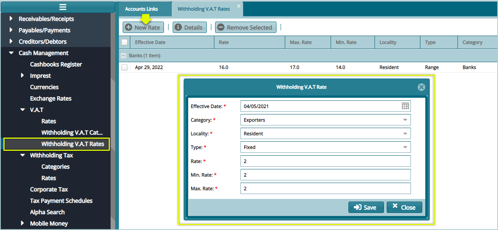 

## Withholding Tax Categories

Click the **Withholding Tax Categories** link from the **Withholding
Tax** drop-down menu to open the Withholding Tax window, then click the
**New Withholding Tax Categories** button to create a category as shown
below:

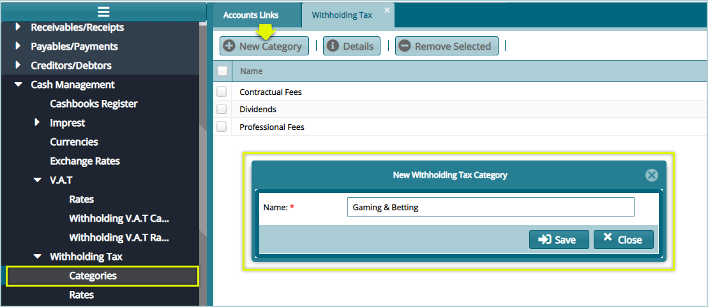 

## Withholding Tax Rates

Click the **Rates** link from the **Withholding Tax** drop-down menu to
open the Withholding Tax Rates window, then click the **New Rates**
button to create a new Rate as shown below:

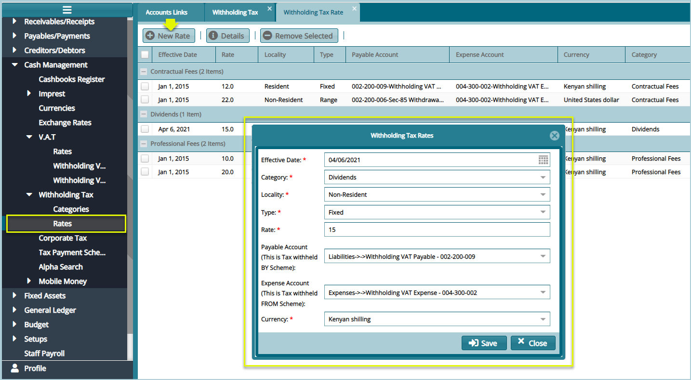 

##  Corporate Tax

Click the **Corporate Tax** link from the **Withholding Tax** drop-down
menu to open the Corporate Tax window, then click the **Generate**
button to create a new Income Tax as shown below:

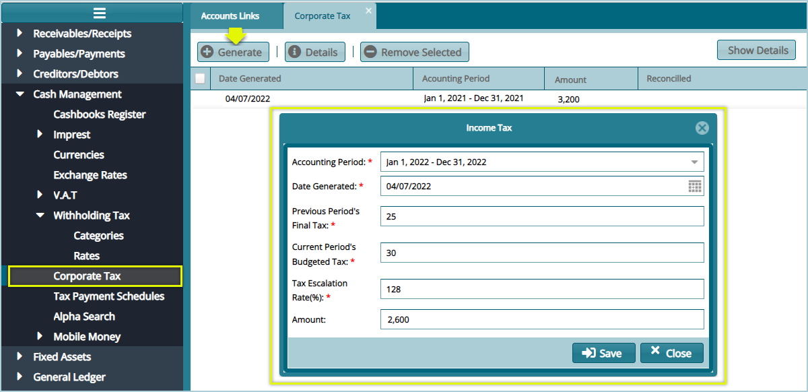 
