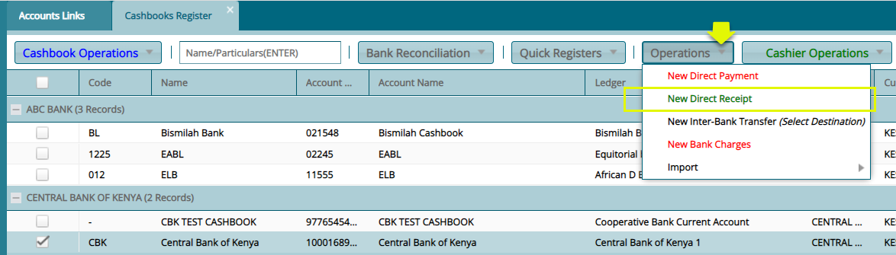
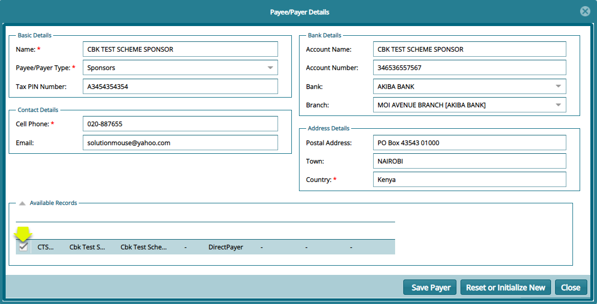
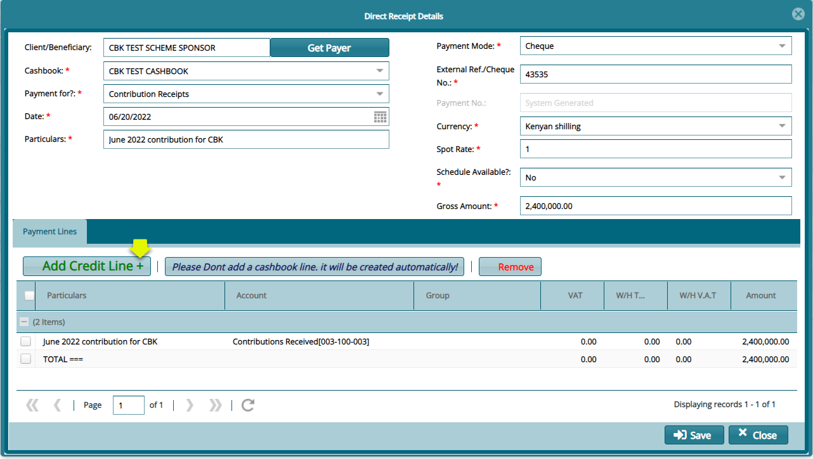
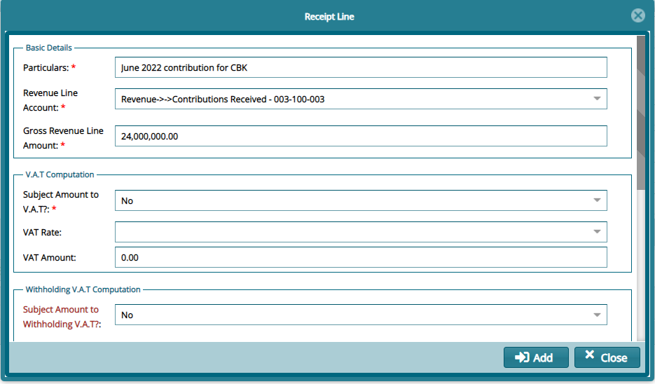
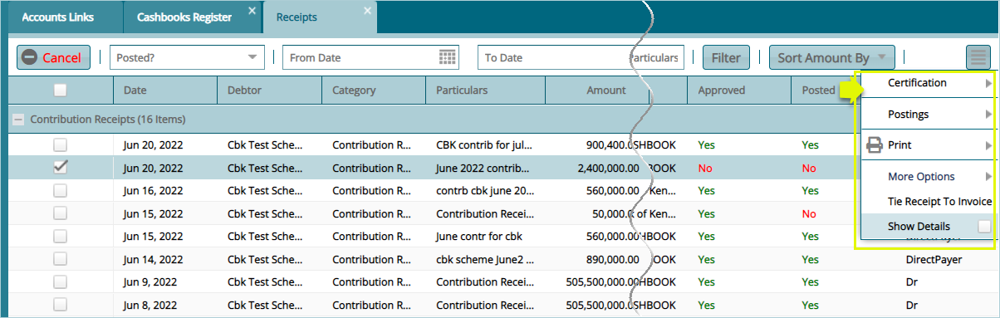

### Cash Management

The Cash Management menu provides access links to windows where respective configurations related to cash transactions in a scheme are listed in grid tables, and new ones are set. Click the links under the highlighted drop-down submenus shown below to access specific dialog boxes to set various configurations:

 

## Cashbooks Register

Click the **Cashbooks Register** link to open the Register window where different cash books are displayed in a grid table as shown below:

 

## Creating a new cashbook

Click the **New Cashbook** link from the Cashbook Operations menu, as shown previously, to open a dialog box through which a new Cashbook’s details are captured. See the screenshot below:

 

**Tips**

Assumptions in the cashbook creation:

- That the chart of accounts is set up.

- That the GL transaction mappings are set up.
  
- That a cash book is related to a GL account.

## Direct Receipting from Cashbook

When a new cashbook is created, it is listed among other prior cashbooks under the **Cashbook Register** window. From this window, it is possible to create a **New Direct Receipt** as demonstrated below:

 

Click the **New Direct Receipt** from the **Operations** menu as shown above to begin creating a receipt by providing the payer’s details as shown below:

 

**Note** Click to select available details of a payer to auto-refill the details of the payer if no available records, the details should be filled manually.

Click the **Save Payer** button, in the previous dialog box, to open the direct receipt details dialog box where the details of the receipt are to be provided as shown below:

 

Click the **Add Credit Line** button to map the receipt to the bank account to be credited and provide other details such as taxation information as shown below:

 

**Note:** Scroll down to fill all the details in the dialog box above and click the Add button to return to the Direct Receipt Details dialog box to complete the process.

Clicking the **Save** button on the **Direct Receipts Details** box will save the direct receipt in the **Receipts** window as shown below: 

 

**Tips**

-  The newly created receipt can be located on the grid table by filtering records by date. Select the receipt from the list and from the drop-down menu shown on the upper left side of the window click appropriately to certify, authorize and post the receipt as shown above.

- The created receipts can later be tied to a contribution batches until the amount on the receipt is depleted.

## Currencies

Click the **Currencies** link to open the Currencies window where different currency details are displayed in a grid table as shown below:

 

Click the **Add Currency** button to open a dialog box through which a new Currency is configured as shown below:

 

## Exchange Rates

The Exchange rates are configurations for the base currency exchange rates. The settings also inform the foreign currency exchange rate in comparison to the base currency for any transactions that will involve foreign currency types in the accounting module.

Click the **Exchange Rates** link to open the Exchange Rates window, then click the **New Exchange Rates** button to create a Rate as shown below:

 

## VAT Rates

Click the **Rates** link from the **V.A.T** drop-down menu to open the V.A.T window, then click the **New Rate** button to create a new Rate as shown below:

 

## Withholding V.A.T Categories

Click the **Withholding V.A.T Categories** link from the **V.A.T** drop-down menu to open the Withholding V.A.T Categories window, then click the **New Categories** button to create a category as shown below:

 

## Withholding V.A.T Rates

Click the **Withholding V.A.T Rates** link from the **V.A.T** drop-down menu to open the Withholding V.A.T Rates window, then click the **New Rates** button to create a Category’s Rate as shown below:

 

## Withholding Tax

**Categories**

Click the **Categories** link from the **Withholding Tax** drop-down menu to open the Withholding Tax window, then click the New Withholding Tax Categories button to create a category as shown below:

 

**Rates**

Click the **Rates** link from the **Withholding Tax** drop-down menu to open the Withholding Tax Rates window, then click the New Rates button to create a new Rate as shown below:

 

##  Corporate Tax

Click the **Corporate Tax** link from the **Withholding Tax** drop-down menu to open the Corporate Tax window, then click the Generate button to create a new Income Tax as shown below:

 
