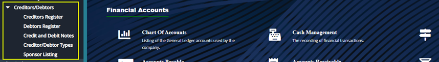
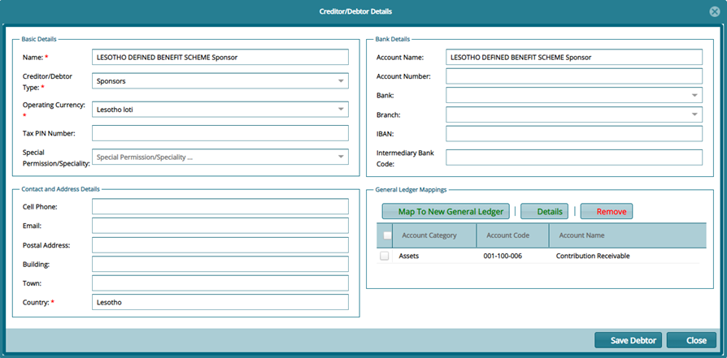
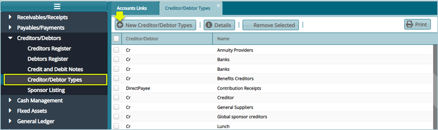
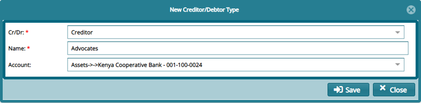

## Creditors/Debtors

The Creditors/Debtors menu provides access links to windows where the respective registers are located. Click the links highlighted below to view specific registers: 

 

## Creditors Register

Creditors Register stores record for all creditors in a scheme. Click the **Creditors Register** link to open the Creditors window where different scheme creditors are displayed in a grid table.

From this window, a new creditor can be created, a payment initiated for a selected creditor among other actions as shown below:

 

Click the **New Creditor** link from the Creditors Operations menu, as shown previously, to open a Creditor/Debtor Details dialog box through which a new Creditors details are captured as shown in the screenshot below::

 

## Debtors Register

Debtors Register stores record for all debtors in a scheme. Click the **Debtors Register** link to open the debtors window where different scheme debtors are displayed in a grid table. From this window, a new debtor can be created, and a receipt processed for a selected debtor among other actions as shown below:

 

Click the **New Debtor** link from the Debtor Operations menu, as shown previously, to open a Creditor/Debtor Details dialog box through which a new debtor’s details are captured as shown in the screenshot below:

 

## Creditor/Debtor Types

Creditor/Debtor Types distinguish the categories of debtors and creditors that a scheme recognizes. The creditor/debtor type tool aids in adding a new creditor or debtor category. The creditor and debtor categories are useful in the accounts receivables and account payables.

Click the **Creditor/Debtor Types** link to open the window where different Creditor/Debtor Types are displayed in a grid table. From this window a new type of creditor or debtor types can be created, details of the as selected type are viewed or deleted from the list as shown below:

 

Click the **New Creditor/Debtor** Type link, as shown previously, to open a Creditor/Debtor Type dialog box through which a new Debtor or Creditor is created as shown in the screenshot below:

 

