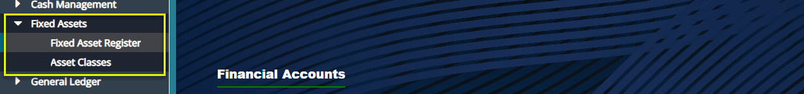
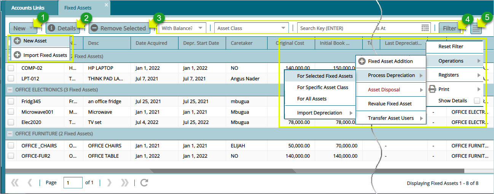
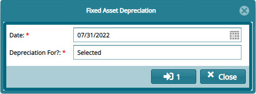
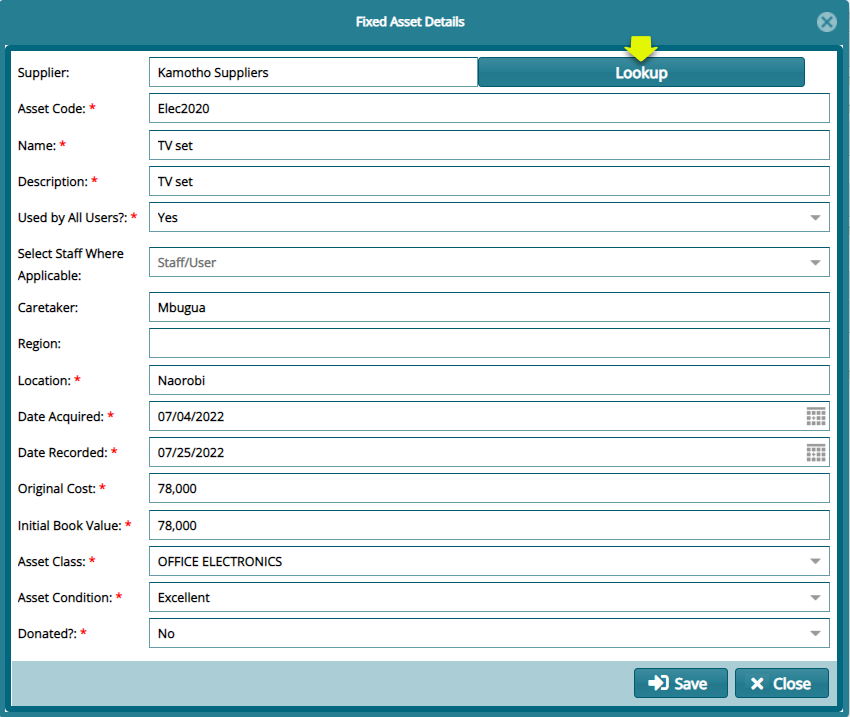
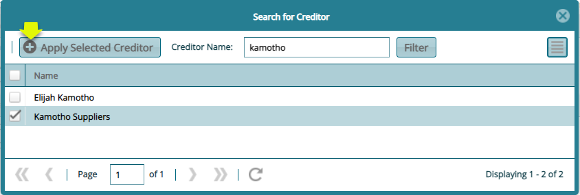
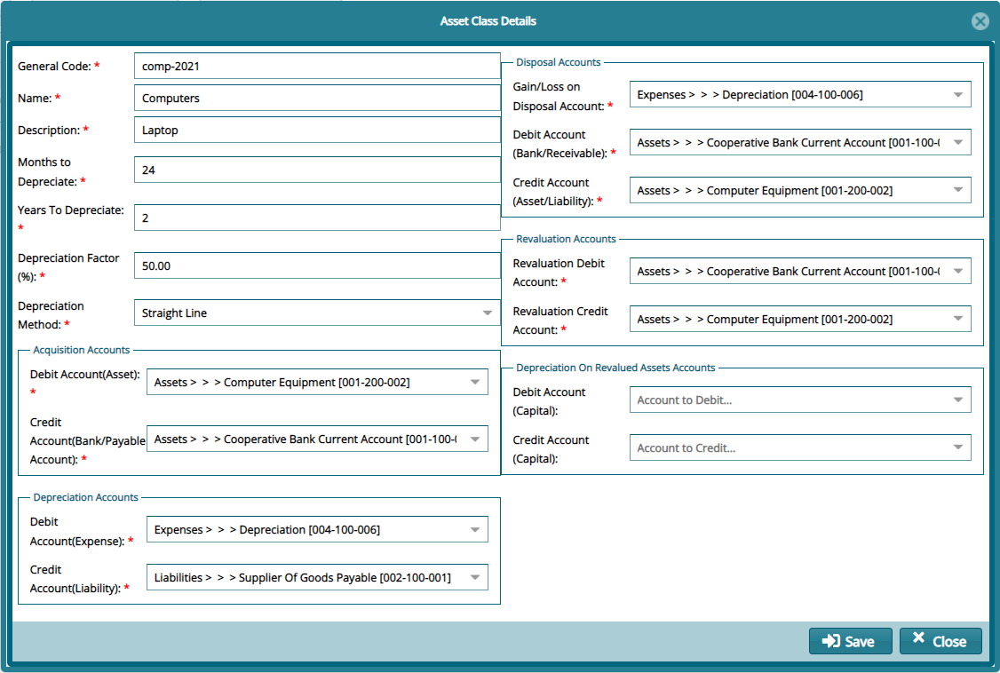

### Fixed Assets

The Fixed Assets dropdown-submenu provides access links to access a scheme's fixed assets register and asset classes respective. As shown in the screenshot below, click the **Fixed Assets Register** link to open a window where all the assets are listed in a grid table. Otherwise click the **Asset Classes** link to open a dialog box where asset classes are
defined:

 

## Fixed Assets Register

Clicking the **Fixed Assets Register** link will open the register window where a list of fixed assets is displayed in a grid table showing details such as the depreciation value of every asset as shown below:

 

 **Action**

-   Click **label 1** menu to access links towards creating new assets.

-   Click **label 2** button to view the details of a selected asset.

-   Click **label 3** button to remove a selected asset from the list.

-   Click **label** **4** to filter records based on the asset class, key words etc.

-   Click **label** 5 to open a breadcrumb drop-down menu from which     various setting can be done to run processes such as calculating the depreciation value on an asset.
  

## Processing a Depreciation

From the drop-down menu (see label 5 action), click the **Operation** sub menu to access the **Process Depreciation** menu and from the drop-down, click **For Selected Fixed Asset** to run the calculation as shown below:

 

## Creating a New Asset

To capture the details of a new fixed asset, click the **New Asset** link from the drop-down menu, as shown in the previous screenshot, to open a dialog box (the assets can also be uploaded in batch using a template by clicking the Import **Fixed Assets** links) where the details of the asset are captured as shown below:

 

Clicking the **Lookup** button in the above dialog box will open a window through which a supplier of the asset is selected as shown below:

 

## Asset Classes

Clicking the **Assets Classes** link will open the asset classes window where the various assets are listed as shown below:

 

## Creating a New Asset Class

Clicking the **New Asset Class** button will open a dialog box through which a new class of asset can be created. All key configuration concerning calculating depreciation values on assets are set here as shown in the screenshot below:

 