### General Ledger

The General Ledger menu provides access links to windows where the respective configurations are listed in grid tables and new ones set. Click the links highlighted below to access specific windows:

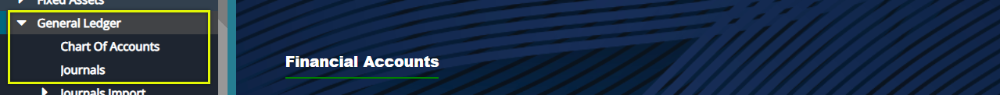 

## Chart of Accounts
A chart of accounts (COA) a index of all financial accounts set up for an scheme, and available for use by the bookkeeper for recording transactions in the general ledger. 

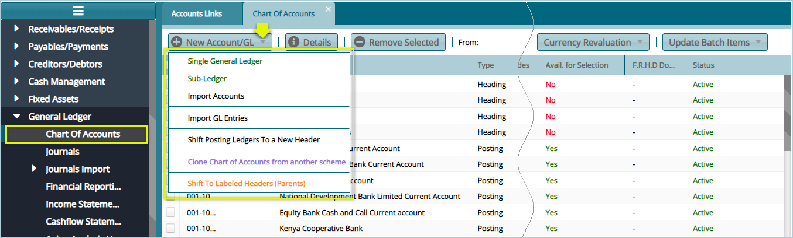 

Click the **New Account/GL** button and from the drop-down menu click **Single General Ledger** to open a dialog box and fill details to create a new GL as shown below:

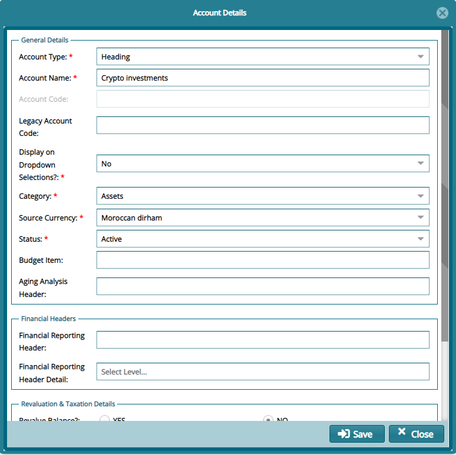 

## Financial Reporting Levels

Click on the **Financial Reporting Levels** link from the General Ledger drop-down menu to open the **Financial Reporting Levels** window where a financial reporting grid table divided into an upper and lower grid appears as shown below:

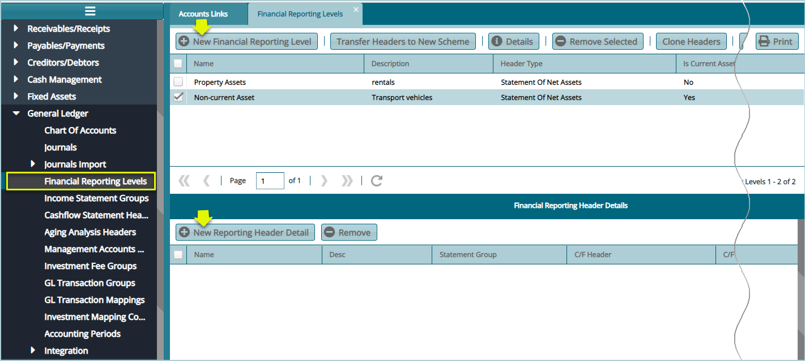 

Click on the **New Financial Reporting level** button to display the following **Financial Reporting Level Details** dialog box and create a new level as shown below:

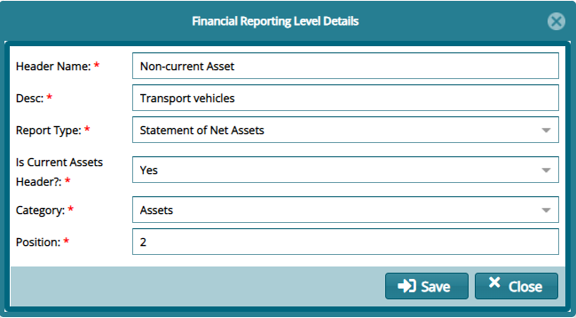 

After adding a new Reporting Level as demonstrated above, selecting the new level from the list as shown previously. On the lower grid table, click on the **New Reporting Header Details** button to display the following New Reporting Header Details dialog box and create a Header as shown below:

 

**Tips**

**Header Name:** type the Sub header name e.g., Non-Current Assets.

**Description:** type the Description for the sub header name e.g., Non-Current Assets.

**Report Type:** type the type of accounts the sub header name belongs to e.g., Statement of Net Assets.

**Category:** type the Main header name the sub header falls under e.g., Assets

**Position:** specifies the row the sub header will appear below the main header e.g., 9 (Nineth row).

**Header Name:** type the name of posting account under the Sub header name e.g., Banks.

**Desc:** type the description for the posting account under the sub header name e.g., Banks.

**Statement Type:** type the type of accounts the posting account name belongs to e.g., income.

**Position:** specifies the row the sub header will appear below the main header e.g., 1 (first row).

## Income Statement Groups

Click on the **Income Statement Groups** from the General Ledger drop-down menu to open a window where Statement groups are listed in a grid table. Clicking the New I**ncome statement groups button will** load an Income Statement Groups Details dialog box where details for a new group are captured. See screenshot below:

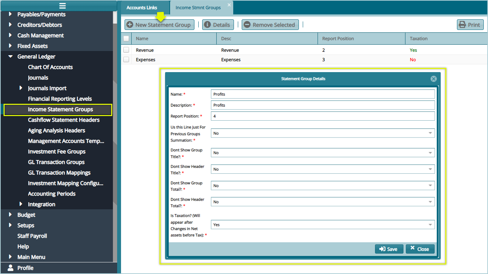 

## Cash Flow Statement Header

Click on the **Cash Flow Statement Header** link from the General Ledger drop-down menu to open a window where Cash Flow Statement Headers are listed in a grid table. Clicking the **New** **Cash Flow** **Statement groups** button will load an Income Statement Groups Details dialog box where details for a new Header are captured. See screenshot below:

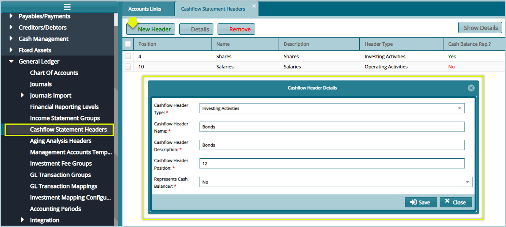 

## Aging Analysis Headers 

Aging Analysis is the evaluation and identification of any irregularities within a scheme\'s debtors and creditors accounts.

Click on the **Aging Analysis Header** link from the General Ledger drop-down menu to open a window where Aging Analysis Headers are listed in a grid table. Clicking the **New** button will load a New Aging Analysis Header dialog box where details for a new Header are captured. See screenshot below:

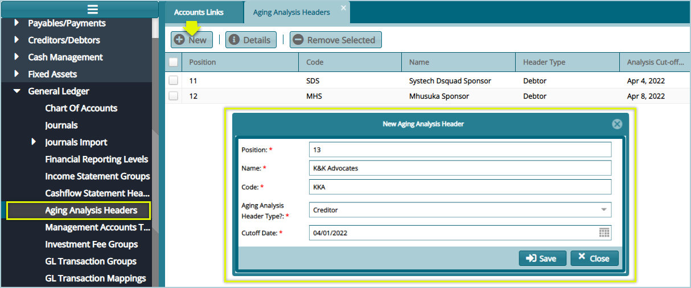 

## Accounting Templates

Click on the **Managing Accounts Templates** link from the General Ledger drop-down menu to open a window where templates are listed in a grid table. Clicking the **New** button will load a New Managements Accounts template dialog box where details for a new Header are captured. See screenshot below:

 

## GL Transaction Groups

In FundMaster, the **GL Transaction groups** and **GL Transaction Mappings**, aid in creating an interface of the business transactions between the investment module and the accounting module.

Click on the **GL Transactions Groups** link from the General Ledger drop-down menu to open a window where the GL Transactions groups are listed in a grid table. The following screenshot shows some of the groups on the list.

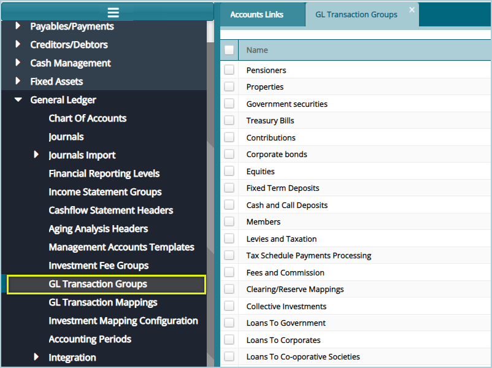 

## GL Transaction Mappings

Click on the **GL Transactions Mappings** link from the General Ledger drop-down menu to open a window where the GL Transactions Mappings to GL Transaction Groups are listed in a grid table. The following screenshot shows some of the mappings on the list.

 

Select a transaction item from the transaction Group from the list, as shown above, and then click the **Details** button to open a Transaction Mapping Details dialog box where the transaction account component allocations are listed in a grid table as shown below:

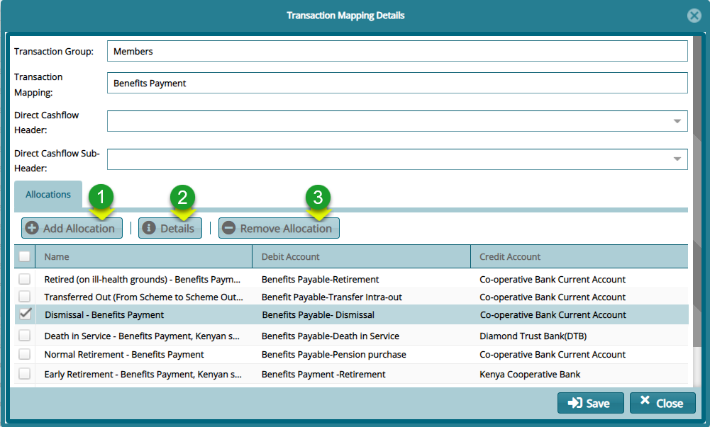 

**Action**

-   Click **label 1** button to create a new account component allocation

-   Click **label 2** button to view the details of a selected account component allocation from the list.

-   Click **label 3** button to remove a selected allocation from the list.

Click the **Add Allocation** button to load the Account Components Allocation dialog box and set a new component and correctly map the accounts that should be Debited and **Credited** by selecting from the list of accounts as shown below:

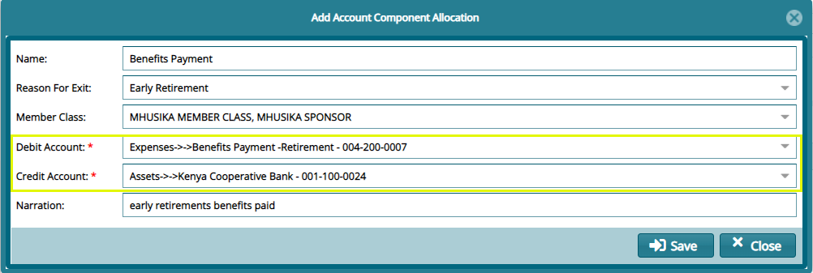 

**Tips**

-   Map the transaction accounts component to the correct accounts by selecting from the lists the account to Debit and Credit respectively as shown above.

-   The GL Transaction groups and GL Transaction Mappings in the FundMaster are hard corded in that they are built into the system, and they are not added by the user.

## Investment Mapping Configs

The investment classes' items are created in the Investment Module when you create an investment such as: property, Equity, Bonds & Securities and Deposits.

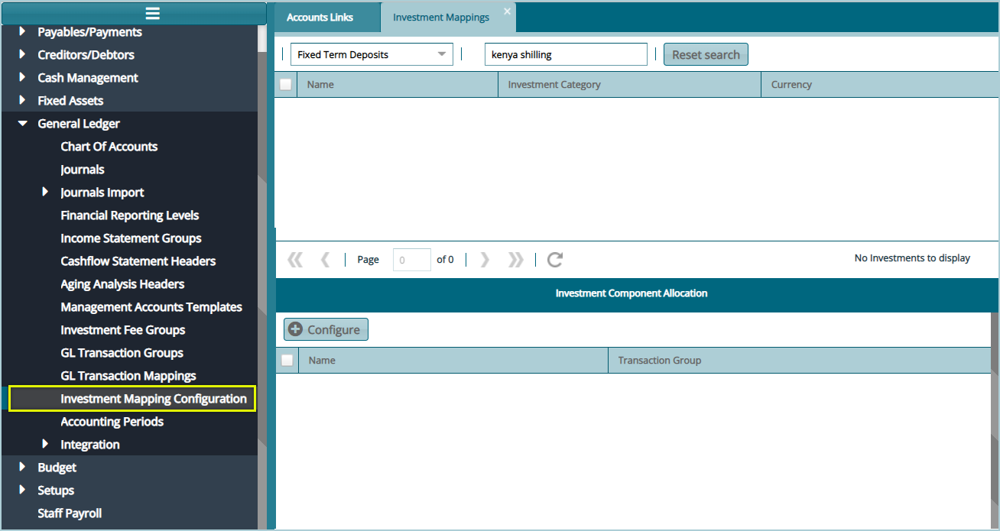 

## Accounting Periods

The accounting periods are created at the scheme creation stage in the Scheme Setup Module (Scheme Menu, New Scheme) by setting up:

-   The take on date

-   Financial Year Start day

-   Date of Commencement

You can define the accounting periods to either be populated in:

-   Quarterly Periods

-   Monthly periods

The system creates financial years by default.

Click on the **Accounting Periods** link from the General Ledger drop-down menu as shown below:

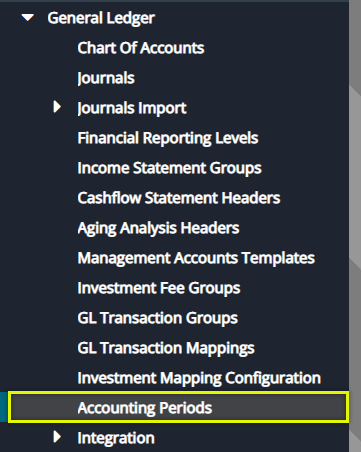 

Clicking the link as shown above will load a window on the right side of the menu where the accounting period for the working scheme are listed in a grid table as shown in the screenshot below:

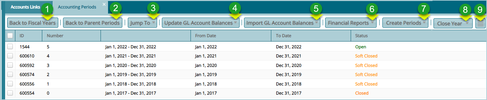 

**Action**

Click **Label 1:** *Back to fiscal years to* move either from the monthly periods to quarterly periods back to fiscal years or from monthly periods back to fiscal years.

Click **Label 2: Back to parent Periods** after selecting a period from the list to see the actual periods.

Click **Label 3: Jump to** (see screenshot below) and from the drop-down menu selected either monthly, quarterly, or daily periods to load a tabulation of the respective periods.

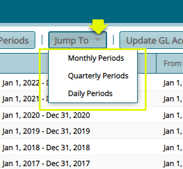 

Click **Label 4: Update GL Account balances** (see screenshot below) after selecting a period from the list to update the members' balances.It adds the present year's contributions to the previous year's closing balances.

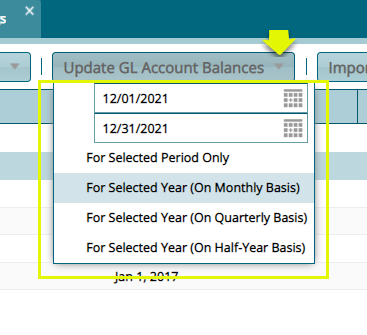 

Click **Label 5: Import GL Account balances** (see screenshot below after selecting a period from the list to import previous years closing balances in order to update the GL accounts present balances. You can also import Debts and Credits.

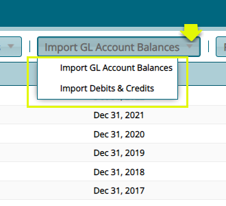 

Click **Label 6: The Financial Reports** (see screenshot below after selecting a period from the list to access links to generate and print different reports such as trial balances for selected period from the list.

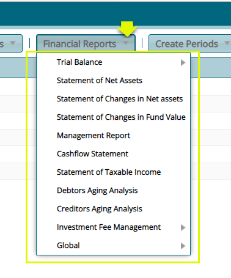 

Click **Label 7: Create periods** (see screenshot below) after selecting a period from the list to create new periods.

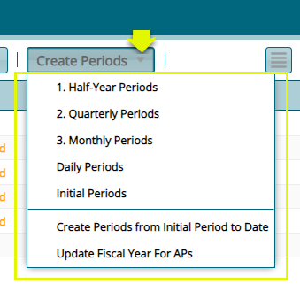 

Click **Label 8: Close Year** (see screenshot below) after selecting a period from the list to soft close an open period, close a period which is soft closed or permanently close a period which is closed. Select the option for a working scheme or all active schemes.

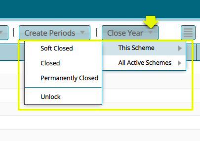 

Click **Label 9: the Details** button (see screenshot below) to remove GL balances, update zero balances or print statements from the drop-down list.

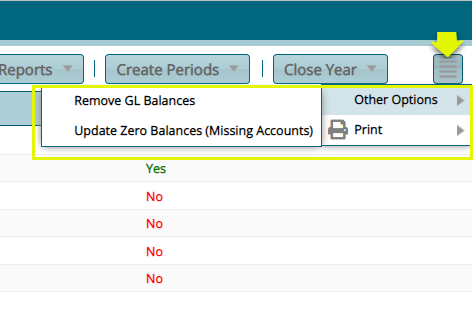 
