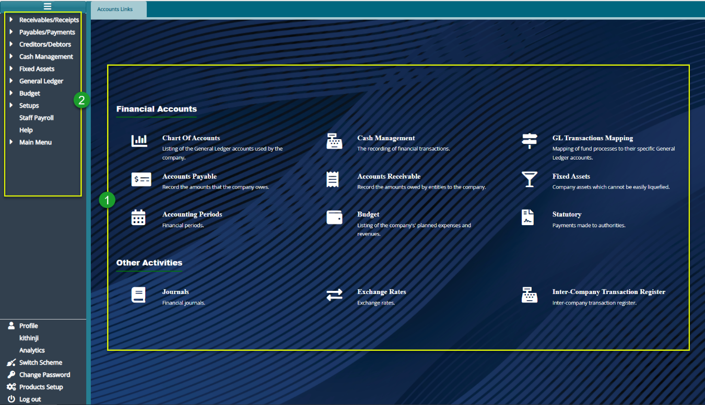

### Accounts Module
The accounting module enables configurations for seamless integration of accounting package with capabilities to handle straight-through processing for Receipting and Payments from all the other modules. For example, all contribution receipts and benefit payments are seamlessly posted to the General Ledger and financials prepared in real-time. 

Among the key configurations done in this module includes functionalities such as accounts receivables, accounts payables, cash management, asset management, general ledger, and budgeting. Other settings done in the module are user definable and flexible chart of accounts, general Ledger to record all the financial transactions, mapping of fund processes to their specific general ledger accounts, bank reconciliation and cash management, financial periods, company's budget, fixed assets, statutory payments, financial journals, exchange rates, intercompany transaction register, and Staff Payroll.

To access the Accounts Module dashboard, click the **Accounts Module** link on the FundMaster landing page to open **Accounts Links** Window as shown below:

 

**Action**

- Click the links under the section **labeled 1** to access shortcut route to set key configurations such as Exchange Rates, Charts of Accounts, Inter-company Transaction Register, among others.
- Click the menu item links listed on the left side panel in section **labeled 2** to configure all Accounts related settings such as Staff Payroll.

**Tip**

All the links under label 1 can still be accessed on the left side panel although some are tacked under sub menus.