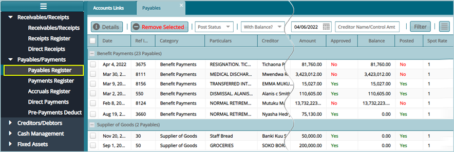
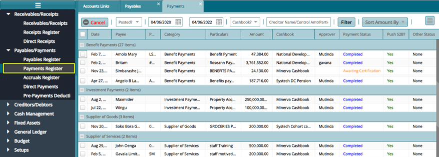
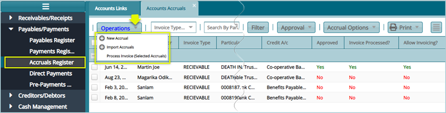
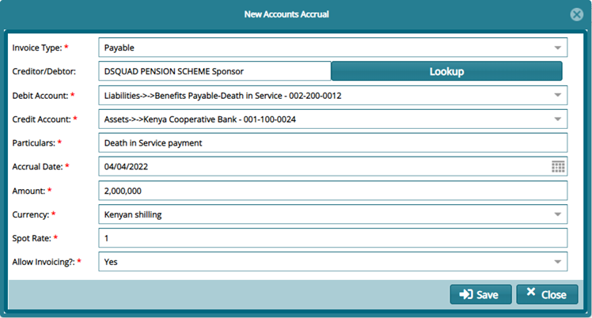
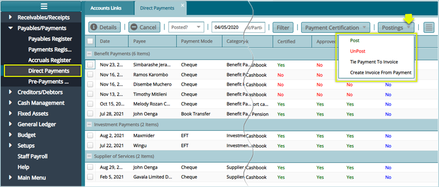

### Payables/Payments

The Payables/Payments menu provides access links to windows where the respective records are stored in registers. Click the links highlighted below to view specific registers:

## Payables Register

Payables Register stores records for a scheme’s short-term liabilities i.e., payments due to creditors.

Click the **Payables Register** link to access the Payables window where all pending payments are listed in a grid table. Records can be filtered by dates, creditors name or a selected record removed from the list as shown below:

## Payments Register

Payments Register stores records for a scheme’s processed payments details.

Click the **Payments Register** link to access the Payments window where all processed payments are listed in a grid table. Records can be filtered by dates, creditors name or sorted by amount or canceled as shown below:

## Accruals Register

Accrual Register stores records for a scheme’s earned revenues e.g., contributions or other forms of payments and incurred expenses that have yet to be received or paid. 

Click the **Accruals Register** link to open the Accounts Accruals window where accruals are listed and a link to create a new Accrual is located. The records in the grid table can be filtered by invoice type, particulars, date, or creditors name. A selected entity can also be approved from the **Approval** menu and **invoices processed** for payment from the Accrual options menu as shown below:

Clicking the **New Accrual** link from the **Operations** menu will open a dialogue box where settings for a new Accrual payment are done as shown below:

## Direct Payments Register

Direct Payments Register stores records for all direct payments made by a scheme.

