### Receivable/Receipts
Configurations under Receivable/Receipts category are set to aid in the management of moneys that are flowing into a scheme. Click a link to open the respective window for specific configurations as shown below: 

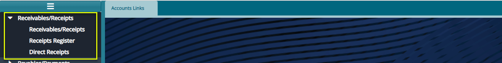 

## Receivables
Clicking the **Receivables/Receipts** link will launch the **Receivables** window where a list of all receivables created in the scheme are listed as shown below:

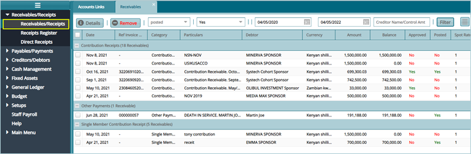 

## Create a New Receivable
To create a new receivable, navigate to the Debtors window where a list of all debtors in a scheme are listed in a grid table. Records in the table can be filtered either by name or displayed based on balances. Select the debtor to create a Receivable (known as an invoice towards a due payment) as shown in the following screenshot:

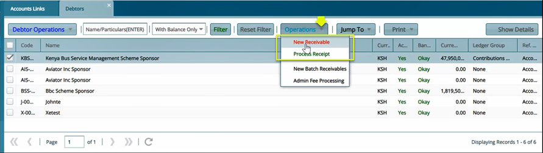 

Clicking the **New Receivable** as shown in the previous screenshot will open a form through which the details of a Receivable are to be provided as shown in the following screenshot:

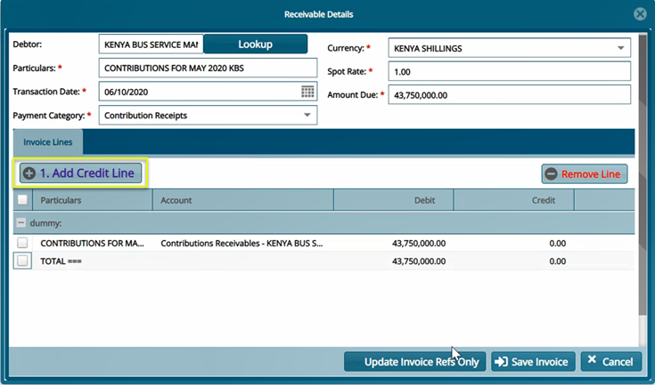 

Clicking the **Add Credit Line** button as highlighted above will open a new form where some extra invoice settings are done such as **Mapping the Invoice** to the correct subledger in the general ledger account to balance accounts. See screenshot below:

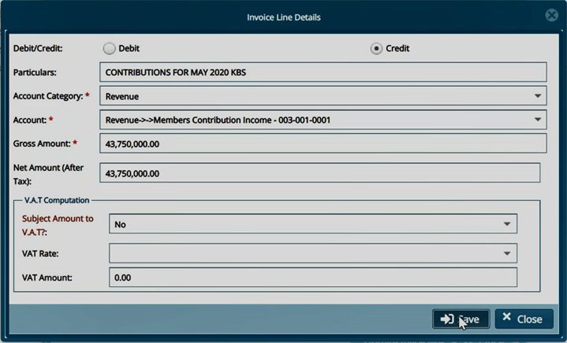 

After providing the invoice details, clicking the save button will confirm the creation of a receivable by loading a Success pop-up dialogue box with a confirmation message as shown below:

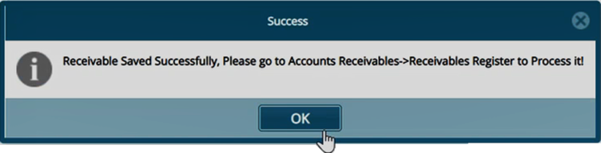 

After successfully creating a Receivable, navigate back to **Receivables** window where a your newly created receivable is listed among other receivables created in the scheme. Select the receivable you just created and **Post** it as shown below:

 

## Receipts Register

The Receipt Register stores the records of all receipts for various forms of payments done in a scheme. 

Click the **Receipts Register** link to open the Receipts Register window. For certification of the receipt, select it from the list and click the **Certify** and **Approve** buttons respectively as shown below:

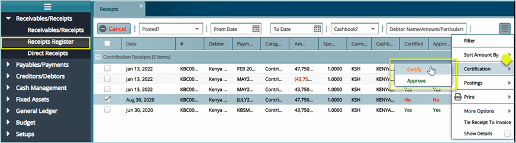 

After a successful certification of a Receipt, the next step is to post it – publish the transaction as authentic. The following screenshot shows how to post a Receipt:

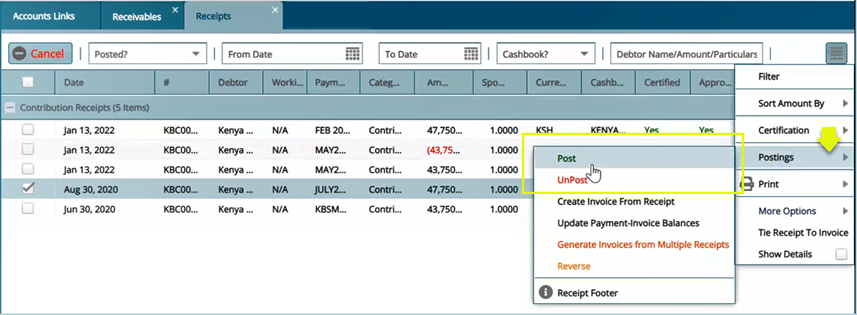 

## Direct Receipts
FundMaster allows creation of a Receipt which can then be tied to contributions received from employers.

To see all Direct Receipts created in a scheme, click the **Direct Receipts** link to open the Direct Receipts window where a new receipt can be created, details of an existing receipt viewed, a receipt canceled, certified, and posted. Records in the grid table can also be filtered by dates or debtor’s name, amount, or particulars. See a sample screenshot below:

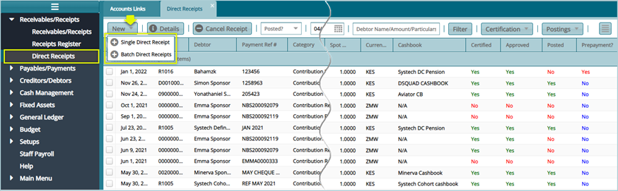 

To create a new Receipt, click the **Single Direct Receipt** link (receipts can also be added in batches: click the Batch Direct Receipts link) from the drop-down menu. This will open a new window through which the configurations are done as shown in the next screenshot:

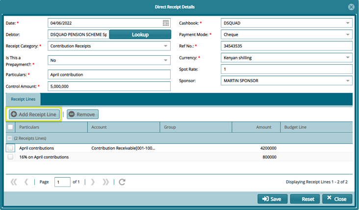 

Clicking the **Add Receipt Line** button as highlighted above will open a new form where some extra receipt details such as VAT tax configured as shown in the screenshot below:

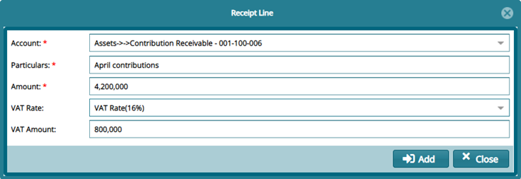 
