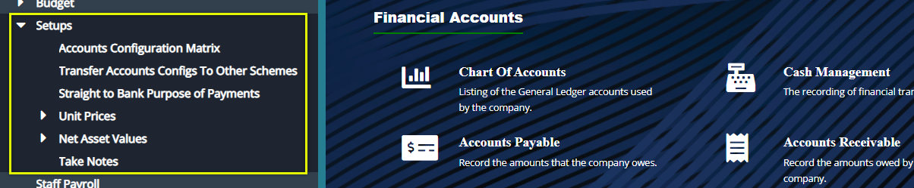
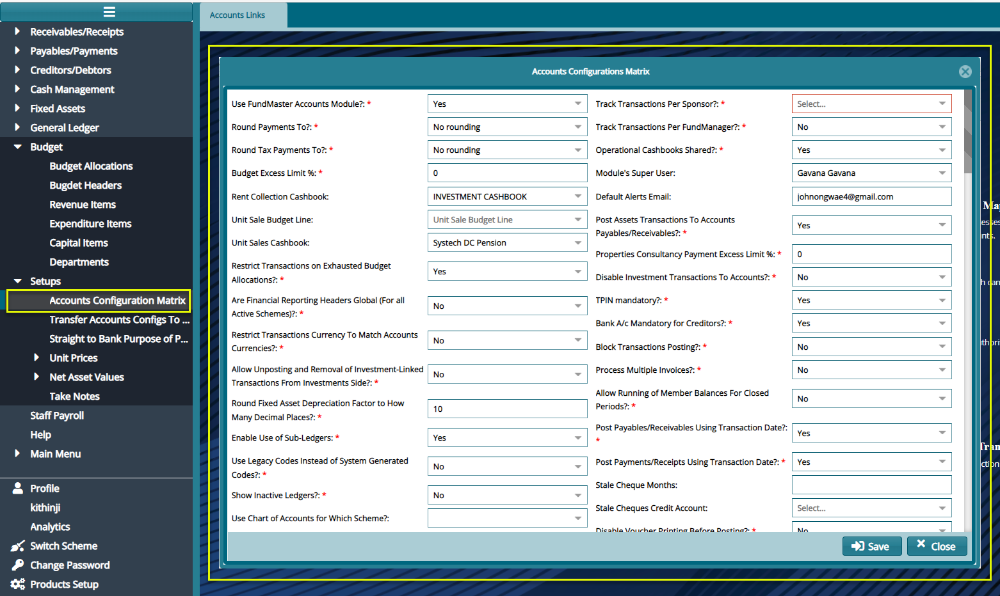
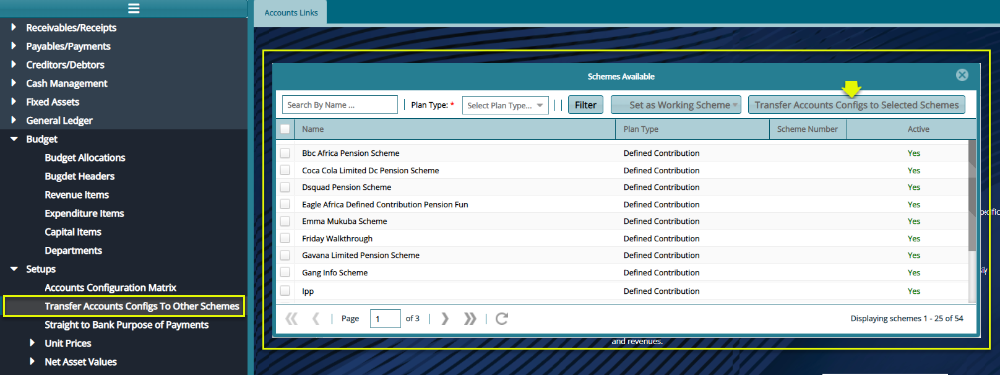
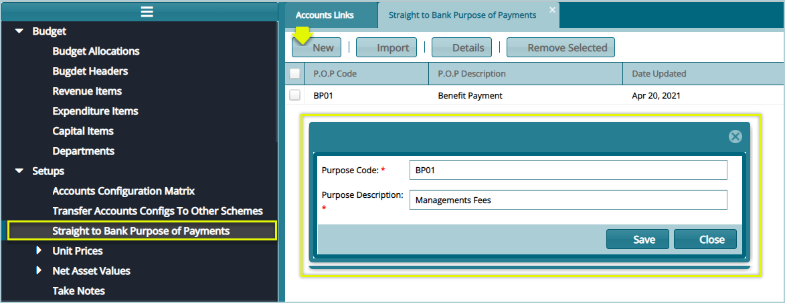

### Setups

The set of configurations under the Setups menu are set to aid in the configurations of other key setups in the account’s module such as payments integration with banks. Click a link to open the respective window for specific configurations as shown below: 

 

## Accounts Configurations Matrix 

Click the **Accounts Configurations Matrix** link to open the Matrix Configurations Matrix dialog window, set the parameters appropriately, and click the save button as shown below: 

 

## Transfer Accounts Config To Other Schemes

Click the **Transfer Accounts Config To Other Schemes**link to open the Schemes Available window. To transfer the working scheme’s current accounts module configs, select the scheme(s) from the list and then click the **Transfer Accounts Config to selected Schemes**  button as shown below:

 

## Straight to Bank Purpose of Payments

Click the **Straight to Bank Purpose of Payments** link to open the Straight to Bank Purpose of Payments window, then click the **New** button to create a new Straight to Bank config as shown below:

 

## Take Notes

Click the **Take Notes** link to open the Notes window, then click the **New** button to create a new **Note Details** as shown below:

 
