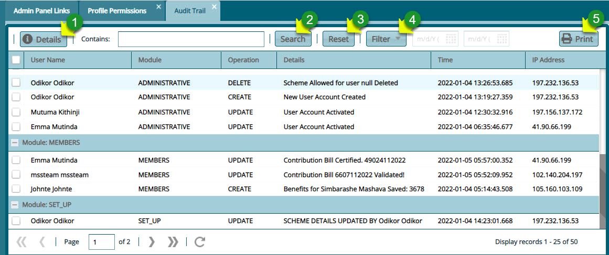

### Audit Trail

Clicking the **Audit Trail** link will open the Audit Trail window which lists all key activities that have taken place in the system per the active users.

A user can view details of audit trails, filter through the records and view print a copy of records among other operations as shown in the screenshot below:

  

 
 **Action**

-	Click label 1 textbox to access a drop-down menu and select the module to filter log records for. e.g., pensioners, accounts etc.

-	Click label 2 textbox to access a drop-down menu and select the type of operation to view logs for e.g., update, create, delete.

-	Click label 3 date fields and select dates to filter records based on dates.

-	Click label 4 text field and type keywords to filter logs in the list.

-	Click label 5 button to filter records according to the set parameters.

-	Click label 6 button to repopulate the list after using the filter.

-	Click label 7 button to view the details of a selected log record from the list. 

-	Click label 8 button to access links to print audit reports and other operations.
