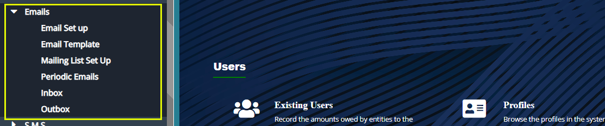
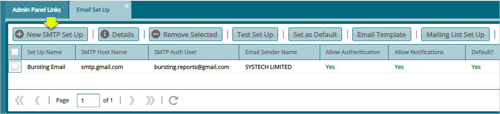
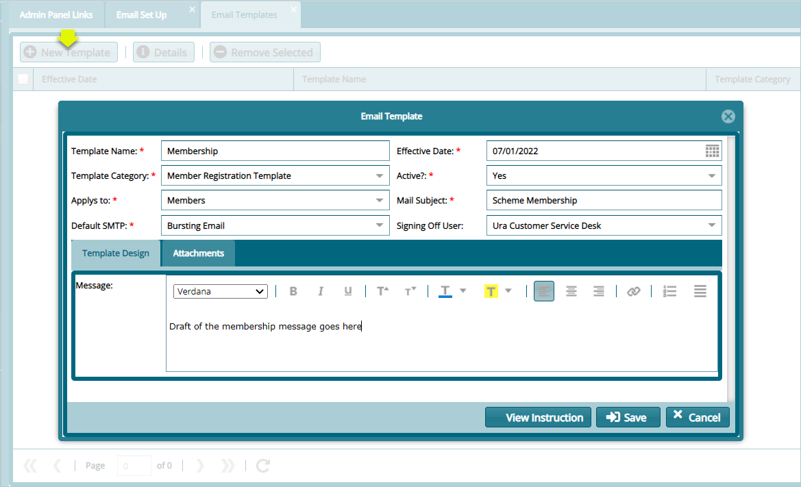
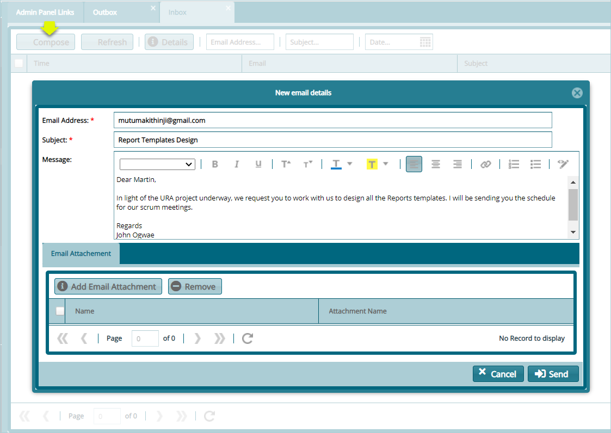
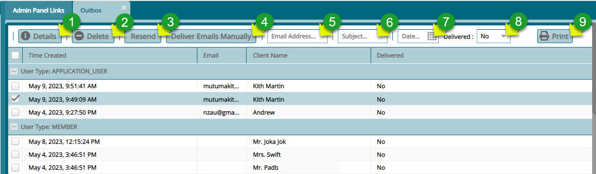
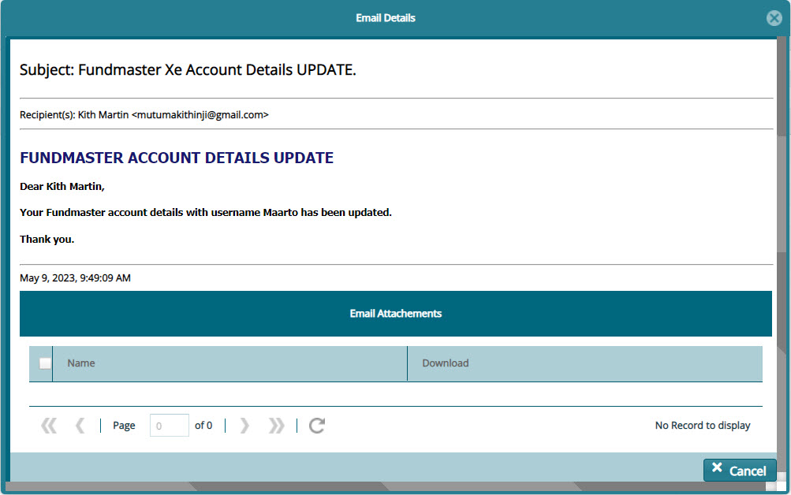
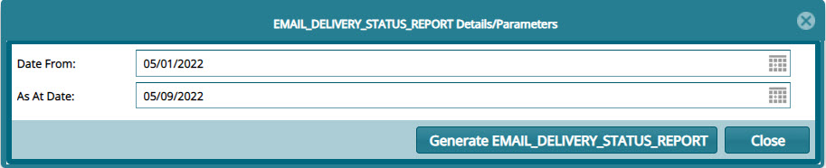
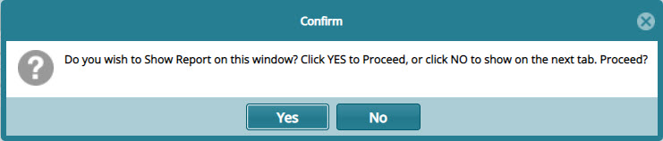

### Email

Email configurations enable the setting of various email transmission parameters toward sending and receive of emails from the system. Click on the drop-down submenu links enclosed in the screenshot below to begin the configuration process:

   

## Email Set Up

Click the **Email Set Up** link to open a dialog box and configure email set up parameters as shown below:

   

## Email Template

Click the **Email Template** link to open a dialog box and design email template for various types of communication in the system as shown below:

   

## Inbox

Click the **Inbox** link to open the Inbox window. Then click the **Compose** button to open a dialog box through which an email is composed and sent as shown below:

   

## Outbox

Click the **Outbox** link to open the Outbox window where all outgoing email from the system are listed as shown below:

   

**Action**

-   Click **label 1** button to view the details of a selected mail record from the list.

-   Click **label 2** button to remove a selected record from the list.

-   Click **label 3** button to try and send again a mail that has not been delivered. Note that mail is marked has been marked 'No' on the delivered column.

-   Click **label 4** button to begin the process of sending a selected mail manually.

-   Click **label 5** text box and type in an email address then click enter on your keyboard to filter the mails by email address.

-   Click **label 6** text box and type in a word then click enter on your keyboard to filter the mails by the typed word.

-   Click **label 7** and from the calendar select the dates to filter.

-   Click **label 8** text box and from the drop-down list select 'No' or 'Yes' to filter records based on delivery status.

-   Click **label 9** button view a report on mails sent from the system.

Clicking the **Details** button, as shown in the previous screenshot, will launch an emails details window showing more information on a selected email as shown in the screenshot below:

   

Clicking the **Print** button, as shown in the previously, will launch a dialog box prompting a user to select the date range for generating the report. After selecting the date click the **GENERATE EMAIL DELIVERY STATUS REPORT** button to proceed as shown below:

   

Clicking the **GENERATE EMAIL DELIVERY STATUS REPORT** button will load dialog box prompting for confirmation on where to open the report. Click **Yes** to generate the report within the same window you are working on, otherwise click **No** to generate the report in a separate window on your browser. See screenshot below:

   

