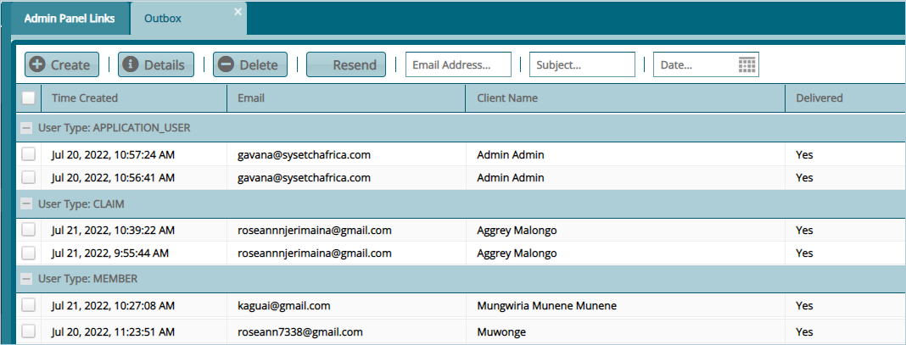

### Email

Email configurations enable the setting of various email transmission parameters toward sending and receive of emails from the system. Click on the drop-down submenu links enclosed in the screenshot below to begin the configuration process:

   

## Email Set Up

Click the **Email Set Up** link to open a dialog box and configure email set up parameters as shown below:

   

## Email Template

Click the **Email Template** link to open a dialog box and design email template for various types of communication in the system as shown below:

   

## Inbox

Click the **Inbox** link to open the inbox window. Then click the **Compose** button to open a dialog box through which an email is composed and sent as shown below:

   

## Outbox

Click the **Outbox** link to open the outbox window where all outgoing email from the system are listed as shown below:

   
