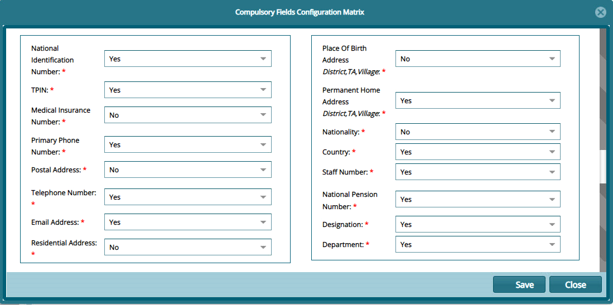
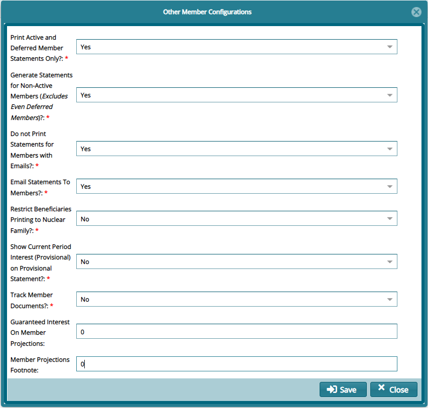

### Members Module Configurations

Before the actual onboarding of members, there are several configurations that
need to be set based on the needs and expectations of a particular scheme and
the organizations participating. Such configs are Compulsory Fields
Configurations Matrix and Members Document Checklist.

### Compulsory Fields Configuration Matrix

Before filling member's registration form with data, configure the mandatory
fields that needs to be filled. This is informed by the fact that different
schemes would need different data from participating members. Below is a
screenshot of the dialogue box. Set **Yes** or **No** for selected items.

 

### Other Member Settings

Fill in the form below to configure other member related settings such as issues
to do with member statements.

 
