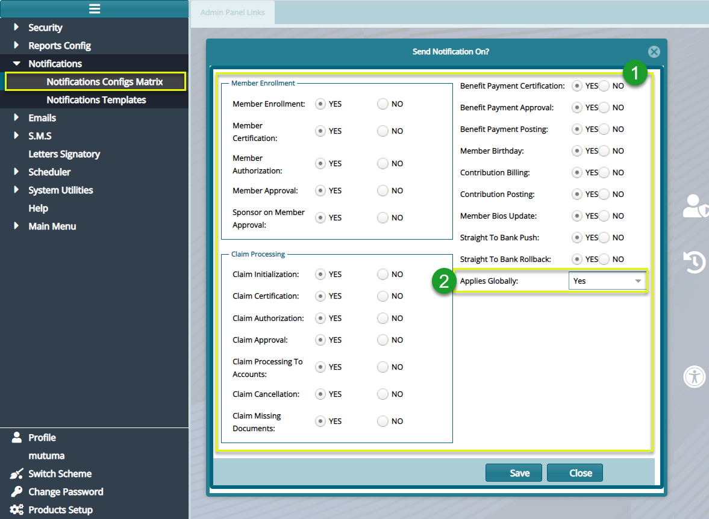

### Notifications

FundMaster communicates from within the system and without through an advanced
notification system using emails, SMS, or both. The system allows an
administrator to configure notification matrix (i.e., what key system activities
need notifications) and setup email templates for sending messages to target
audience concerning issues such as password reset alerts.

### Notification Configuration Matrix

Clicking the **Notifications** link labeled 3 will display a drop-down menu from
which the **Notifications Config Matrix** link is accessed. Click this link to
display a **Send Notifications Form** where a user is allowed to select the key
events, activities for which notifications messages ought to be sent.

Check the **Yes** or **No** checkbox on the listed items enclosed under **label
1**, otherwise choose whether to make the configurations global or not under
text box **labeled** **2** as shown in the screenshot below:

  

**Action**

-   Tick the appropriate checkbox – **Yes** or **No** under the encloser
    **labeled 1** to determine which action to send notification.

-   Select **Yes** or **No** in the drop-down menu **labeled 2** to determine
    the scope of application of the configurations.

-   Click the **Save** button to confirm the configurations, otherwise close the
    form.

### Creating Notification Templates

FundMaster allows administrators to design notifications template in such a way
that instead of writing a notification to every recipient individually, key
words (e.g., member name) are embedded in a message to enable sending of a copy
to a list of members in a click. On the screenshot below, see a grid table
listing available templates.

  

**Action**

-   Click **label 1** button to add a new template

-   Click **label 2** button to view the details of a selected template

-   Click **label 3** button to delete a selected template from the system
