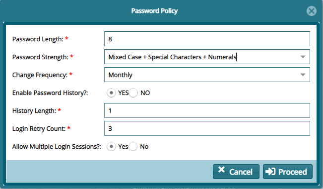

### Password Policy Settings

Clicking the **Password Policy Settings** link will open a dialogue box, allowing one to set a new password policy as shown below:

  

**Action**

-   Type in the details in the text fields and click the **Proceed** button to commit the policy changes. Otherwise, cancel the process.