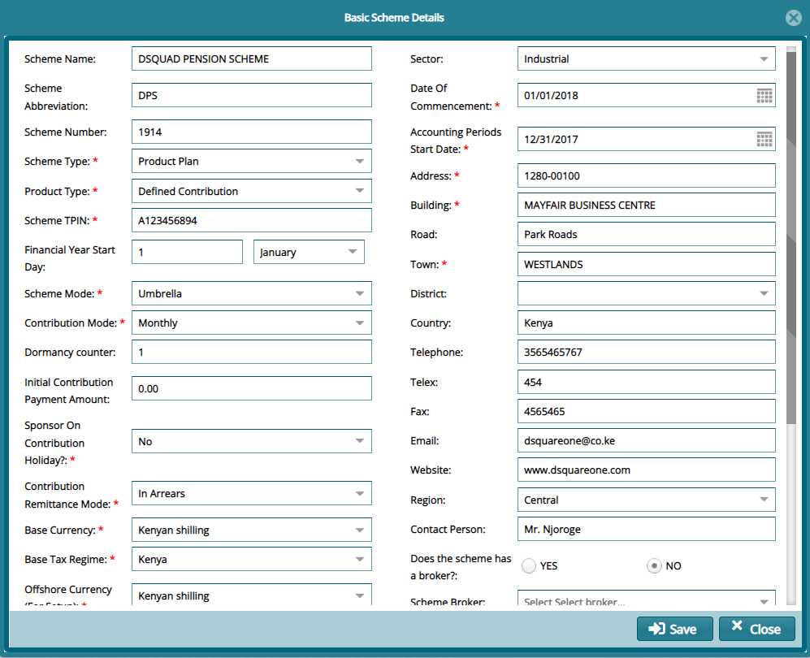

### Basic Scheme Details

Now that the system is running the new scheme, the next step is to provide the
scheme’s details beginning with the basic detail.

To access the details dialogue box, from the left side panel of the Setup Links
window, click the **Basic Schemes Details** link. This will launch a dialogue
box where all the details can be viewed and edited as shown below.

 

**Tip**

If you modify any items, remember to click the **Save** button to reflect
changes.
