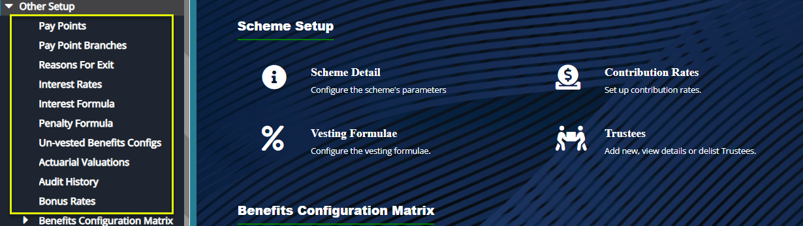
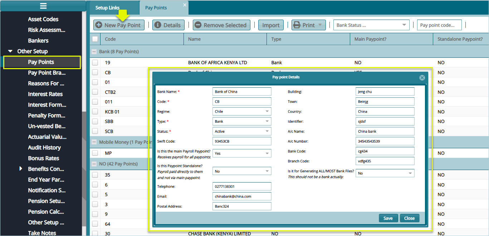
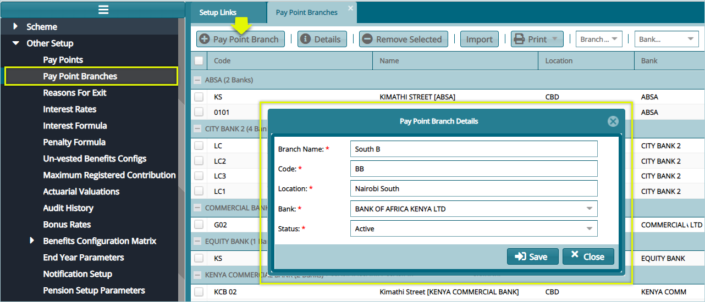
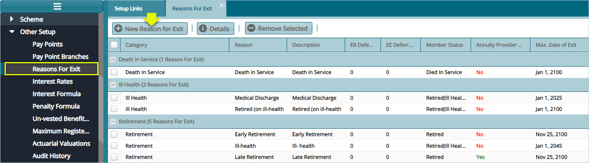
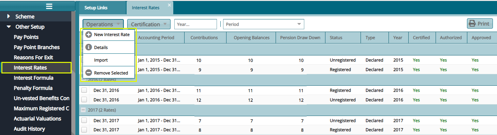

## Other Scheme Setup configs

Configurations under **Other Setup** category enable formulation of interests, penalties,
setting up pay points, actuarial valuations etc. The screenshot below shows a
section within Setup Links left side panel where the various links are accessed from: 

 

## Pay Points

Click the **Pay Points** link to open a Pay Points window and then click the
**New Pay Point** button to capture details for a new Pay Point as shown below:

 

## Pay Point Branches

Click the **Pay Points Branches** link to open a Pay Points Branches window and
then click the **Pay Point Branches** button to capture details for a new Pay
Point Branch as shown below:

 

## Reasons for Exit

Click the **Reasons for Exit** link to open the Reasons for Exit window where a grid table displaying various reason for exit configurations. See scheenshot below: 

 

**Tips**
- The reason for exit configurations enables creation of various reasons for exit
by a member in a scheme. These configs are then saved in the system for
retrieval at the exit (movement) of the member (see initiate movement under the
members register module).

- The main reasons for exit are Withdrawal, Retirement, Death in
Service and Medical. Each reason is tied to the benefits calculation.

Click the **New Reason for Exit** button to open a dialogue box through which a new exit reason is configured as shown below: 

 

## Interest Rates

Click the **Interest Rates** link to open the Interest Rates window to view the details of rates already configured in the scheme as shown below: 

 

Clicking the **New Interest Rates** link from the **Operations** drop-down menu as shown in the previous screenshot will open a dialogue box through which a new interest rate can be defined as shown below:

 

## Interest Formula

Click the **Interest Formula** link to open the Interest Formula window, then click the **New Formular** button to create a formular as shown below:

 

## Maximum Registered Contribution Configuration

Click the **Max Registered Contribution** link to open the Maximum Registered Contribution window, then click the New Max Registered Contribution button to create a configuration as shown below:

 

**Tips**
- This configuration is dependent on the regime where the system is used. For instance, in Kenya the salaried employees registered contribution amount is pegged at a maximum of KES. 20,000. 
- This means that any contribution above this amount is subjectable to tax. Click the highlighted link access the window through which a new configuration can be done as shown below:

Clicking the **New Max Registered Contribution** button will load a dialogue box
through which a new configuration is set as shown below:

 