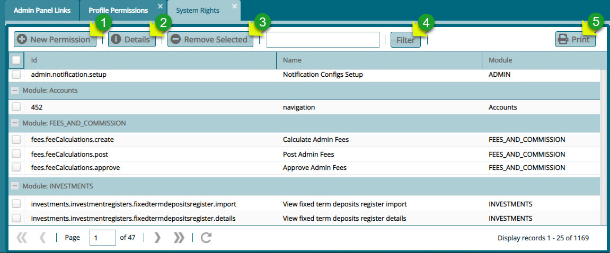

### System Rights

Clicking the **System Rights** link will open a window listing all the system rights grouped based on modules. A user can create a new system permission, view the details of a selected permission in the list, and remove one among other actions. See the screenshot below:

  

**Action**

-	Click **label 1** button to add a new permission to a selected module.

-	Click **label 2** button to view the details of a selected permission.

-	Click **label 3** button to delete a selected permission from the system.

-	Click **label 4** button to find a record quickly from the list.

-	Click **label 5** button to view a print layout copy of a profile register.