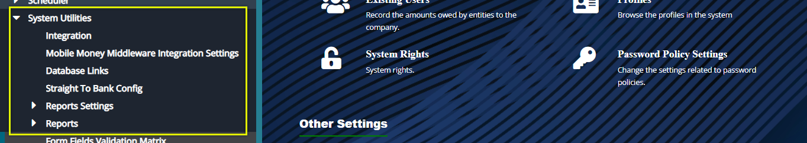
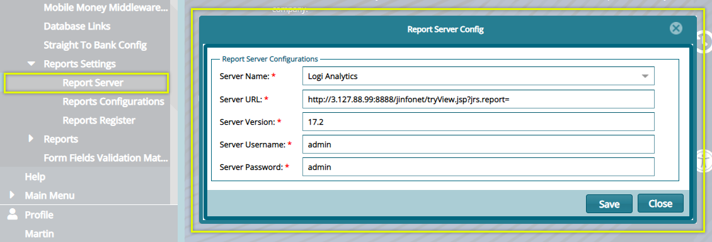
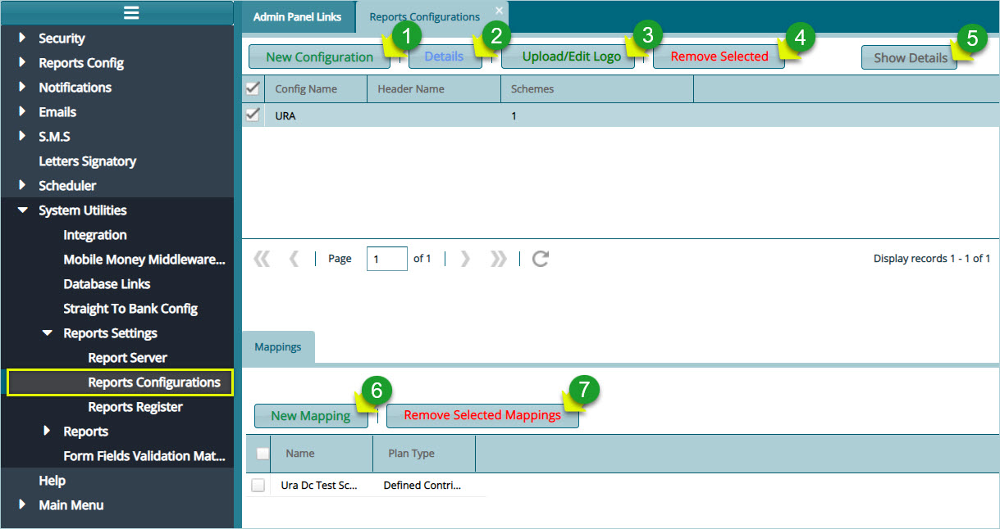
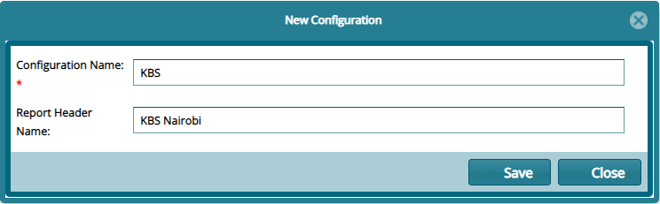
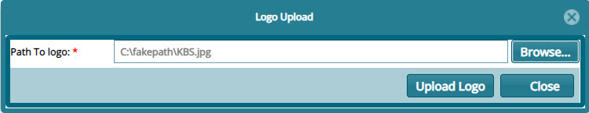
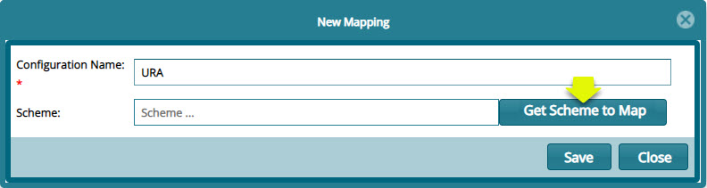
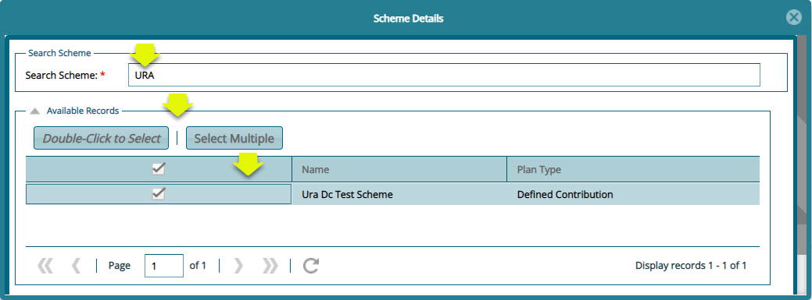
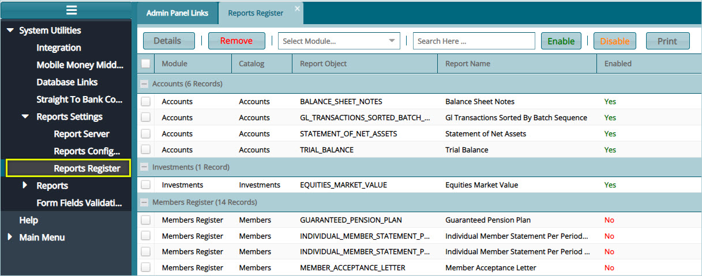

### System Utility 

Configurations under system utility enable configurations related to FundMaster integration with other systems. To configure specific utilities, click the enclosed links to open configuration dialogue boxes
as shown below:

  

## Report Settings

Click the **Report Server** link to open a **Report Server Config** dialogue box to configure setting that enable FundMaster to connect to a report server as shown in the screenshot below:

  

### Reports Configurations

Click the **Report Server** link to open a **Report Server Config** dialogue box to configure settings that enable a scheme to connect to a report server as shown in the screenshot below:

  
  
-   Click **label 1** button to open a dialogue box where a new configuration is done.

-   Click **label 2** button to view the details of a select report configuration.

-   Click **label 3** button to upload or edit logos that are used on the header of generated reports.

-   Click **label 4** button to remove selected configurations from the list.

-   Click **label 5** button to show the Mapping section on the lower side of the window where an individual scheme is mapped to a report configuration.

-   Click **label 6** button to create a new mapping: connect a scheme to the selected report configuration.

-   Click **label 7** button to remove a selected scheme mapping.

### Creating a report configuration

Clicking the **New Configuration** button will open a dialogue box where settings for a new report configurations are done as shown below:

  

### Uploading report logos

To upload logos for use in the system generated reports, select the configuration whose reports need logos. Locate the list on the report's configuration window. Then click the **Upload/Edit logo** button to open a dialogue box and upload the logos as shown below:

  

**Action**

-   Click **label 1** button to upload the logo that goes to the right side of the report's header.

-   Click **label 2** button to upload the logo that goes to the left side of the report's header.

-   Click **label 3** button to close the window after a successful upload.

Clicking either of the Upload buttons will open a Logo Upload dialogue box through which a path to locate the logo from a user's device is provided. Click the **Upload logo** button to move the selected logo to the system as shown below:

  

### Mapping scheme to a configuration

To map a scheme to a specific report configuration, select the configuration you want to map a scheme to from the list of
configurations on the upper section of the window, then click the **New Mapping** button located on the lower section of the window to open a new mapping dialogue box. Type the name of the new mapping and click the **Get Scheme to Map** button to map the scheme to the set report configuration as shown below:

  

Clicking the **Get Scheme to Map** button will open the scheme details window. Search for the scheme you want to map and click the **Double-Click to Select** button to select the scheme. You can also select multiple schemes by clicking the **Select Multiple** button as shown below:

  

### Reports Register

Click the **Reports Register** link to open the Reports Register window where a list of all report objects from various module are listed. From this window a particular report can be selected and **Enables** or **Disabled** as shown in the screenshot below:

  

**Tip**

Select a report from the list and click the Enable button to have the report activated for so that it can be generated from the reports server. Otherwise clicking the Disable button means the report cannot be generated.

