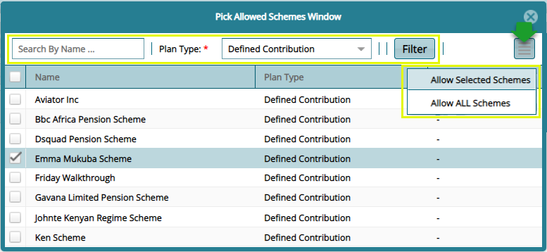

## Creating User Accounts

User accounts are individual accounts for the system users. User accounts are assigned to specific profiles which define the permissions assigned to a user to allow access to specific system functions.

## Existing Users

Clicking the **Existing Users** link will open the Existing Users window where a grid table listing all system users and their specific details are displayed as shown below:

  

**Action**

-   Click **label 1** button to add a new system user.

-   Click **label 2** button to view the details of a selected user.

-   Click **label 3** button to reset the account password to the initial one.

-   Click **label 4** button to lock, unlock or disable a selected user’s account.

-   Click **label 5** and type a user’s name on the search box to filter the record.

-   Click **label 6** and select a user profile to filter records.

-   Click **label 7** button to migrate allowed schemes.

-   Click **label 8** button to view a print copy of users details.

## Adding a New User

Clicking the **New User** button will open a New User Details dialog box. To successfully create a new user, the fields marked with a red asterisk must be filled with relevant details as shown in the following screenshot:

  

**Action**

-   Click **label 1** button to see all the schemes that the user is allowed to access as will be shown in the next screenshot.

-   Click **label 2** button to see all the sponsors that the user is allowed to access.

-   Click **label 3** button to see all the classes that the user is allowed to access.

## Allowing Schemes Access to Users

Clicking the **Allowed Scheme** tab will display a grid table listing all the schemes that a user has access to. From this window, a list of all schemes available in the system can be accessed by clicking the **Assign Schemes to User** button as shown in the next screenshot:

  

**Action**

-	Click the button **labelled 1** to open a dialog box listing all available schemes from which new schemes can be selected and added to a user’s account as will be shown in the following screenshot. 

-	Click the button **labelled 2** to open a dialog box listing all available schemes from which new schemes can be selected and added to the profile category of the user.

-	Click the button **labelled 3** to remove select schemes from a user’s assigned schemes.

  

## Assigning Schemes to User

Clicking the **Assign Scheme to User** tab will open a grid table listing all the schemes in the system to date.

Locate the button on the upper-right side from which selected schemes or all schemes in the list can be picked and assigned to a user as shown in the screenshot below:

  

**Action**

-   Find a Scheme quickly from the list by typing a name on the **search box**; select the Plan Type from the drop-down box and click the **Filter** button.

-   Click the checkboxes to select Schemes and then click the button on the upper-right side to display a drop-down menu. Click either **Allow Selected Schemes** or **Allow All Schemes** to allow access to the  schemes respectively.