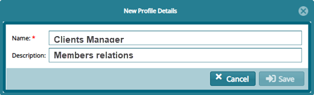

## Profiles

A profile is a visual display of personal data associated with a specific user
or a customized desktop environment. A profile can be used to store the
description of the characteristics of a person therefore profiling is the
process of constructing a profile via the extraction of a set of data.

By default, the system administrators profile exists, the system administrators
can create other profiles which store specific users or group of users with
different roles, for example management profile, pension administration and
others as will be demonstrated in this section.

## Profiles Register

Clicking the **Profiles** link will open profile grid table listing profiles
created in the system to date. A user can browse through the list, create a new
profile, view details of a selected profile and remove a profile from the
system. See screenshot below:

**Action**

-   Click **label 1** button to add a new profile to the system

-   Click **label 2** button to view the details of a selected profile from the
    list

-   Click **label 3** button to remove a selected profile from the system

-   Click **label 4** button to print a copy of profile register.

## Creating a New Profile

Clicking the **New Profile** tab within the Profile Register window as shown in
the previous figure will open a dialogue window. Through this, a new system
profile can be created by typing the profile name and a description as shown
below:

   

## Enabling Profile Permissions

Once a profile is created, the next step is to give or enable permissions to a
newly created profile. The permissions enable the new profile to access system
modules and assign rights to certain functions in an individual module.

## Profile Permissions

Clicking the **Profiles Permission** link will open profiles permission grid
table where permissions can be assigned to profiles. The table provides
drop-down menus to choose profiles and the modules to assign permissions among
others as shown below:

**Action**

-   Click drop-down **labeled 1** to display a drop-down menu to select a
    profile

-   Click drop-down **labeled 2** to display a drop-down menu to select a module

-   Click the filter button **labeled 3** to populate a list of permissions only
    related to the module selected.

## Enabling Permissions

After clicking the **Filter** button as explained in the previously, a grid
table listing all permissions in a selected module will be displayed. Under the
enabled column, a selected permission record can be enabled (activated to
function in that profile) or disabled (deactivated so as not to be available in
that profile). Note that an activated permission is indicated as Yes while
deactivated permission is indicated as No as shown below:

**Action**

-   Select a permission from the list and click button **labeled 4** to activate
    it if it is indicated Yes in the enabled column

-   Select a permission from the list and click button **labeled 5** to
    deactivate it if it is indicated as No inn the enabled column

-   Click the button **labeled 6** to inherit permissions from another profile

-   Click the button **labeled 7** to rollback inherited permission

-   Select an option from the print drop-down menu **labeled 8** to make a print
    a copy of permission details.
