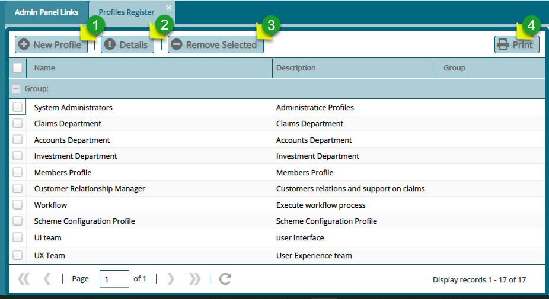
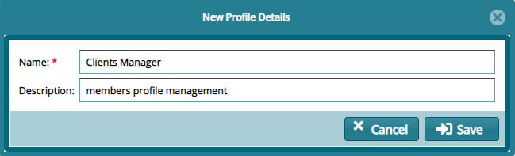
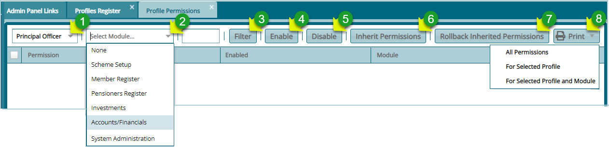
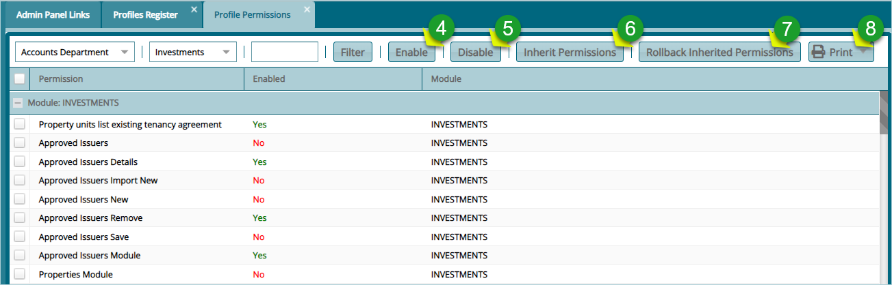

## Profiles

A profile in FundMaster denotes a group of users with specific privileges in the
system. The system supports profiling of users and by default creates a **System
Administrator Profile** from which other profiles are created.

Profiles store specific users or group of users with different roles, for
example management profile, pension administration and others as will be
demonstrated in this section.

## Profiles Register

Clicking the **Profiles** link will open profile grid table listing profiles
created in the system to date. A user can browse through the list, create a new
profile, view details of a selected profile and remove a profile from the system
as shown in the screenshot below:

  

**Action**

-   Click **label 1** button to add a new profile to the system

-   Click **label 2** button to view the details of a selected profile

-   Click **label 3** button to delete a selected profile from the system

-   Click **label 4** button to save a copy of the profile register.

## Creating a New Profile

Clicking the **New Profile** tab will open a dialogue box. Through this, a new
profile can be created by providing the profile name and a description as shown
below:

  

## Enabling Profile Permissions

Once a profile is created, the next step is to allow access to certain functions
in the system to a newly created profile. The permissions given enables the new
profile to access system modules and rights to certain functions in an
individual module.

## Profile Permissions

Clicking the **Profiles Permission** link will open profiles permission grid
table where permissions are assigned to profiles. The table provides drop-down
menus to choose profiles and the modules whose permissions are to be assigned to
a profile among others as shown below:

  

**Action**

-   Click list box **labeled 1** to display a drop-down list of profile and
    select one

-   Click list box **labeled 2** to display a drop-down list and select a module

-   Click the filter button **labeled 3** to populate a list of permissions
    related to the module selected.

### Enabling Permissions

After clicking the **Filter** button, a grid table listing all permissions in a
selected module will be displayed. Select permission from the list and click the
**Enable** button to activate the function in that profile. Also click disable
button to deactivate a permission.

  

**Action**

-   Select a permission from the list and click button **labeled 4** to activate
    it if it is labeled **No** in the enabled column.

-   Select a permission from the list and click button **labeled 5** to
    deactivate it if it is labeled **Yes** in the enabled column.

-   Click the button **labeled 6** to inherit permissions from another profile

-   Click the button **labeled 7** to undo the inherence process

-   Select an option from the print drop-down menu **labeled 8** to view a print
    layout copy of permission details.
