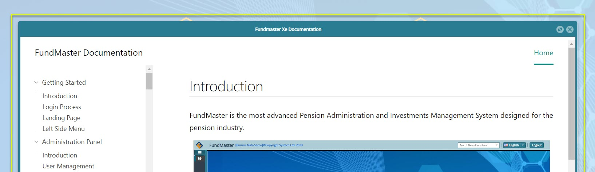

### Left Side Menu

Click the hamburger icon on the upper-left corner of the landing page to expand the pane, allowing access to more controls. The expanded pane displays a help tab on the uppermost section for accessing the help documentation. On the lower section of the pane are more controls elements for further configurations. See screenshots below:

   

 
| **No.**  | **Element**          | **Description**                                                                                                 |
|-----------|----------------------------|-----------------------------------------------------------------------|
| 1.        |   Help link           | A link to the help documentation for user reference. Click to open the page.                                                                                                     |
| 2.        |   Account config      | A section with links for configuring user account details.                                                                                                                       |
| 2(a).     |   User Profile        | This is where the logged in user's profile name is displayed.                                                                                                                      |
| 2(b).     |   Switch Scheme       | A link to the schemes page where a user able to switch from the currently running scheme to another without terminating a session.|
| 2(c).     |   Change Password     | Allows a user to change password for security reasons.                                                                                                                          |
| 2(d).     |   Products Setup      | Clicking on this link will open the products page to view available products and create new.                                                                        |
| 2(e).     |   Logout              | Click to terminate all the running processes and close the current profile account ready to log in as a new user.                                                                |
 
 

 ## Help Documetnation

The **Help** link located on the upper section of the left side pane give access to the system help documentation as shown below:

   

Clicking the Help link will load a separate window through which the help documentation is displayed. Use the documentation to learn more about the system. See the help documentation window below:

   

  
 ## Password Change

 Click the **Change Password** link to open a dialog box through which the current user account password can be changed. The change password link is highlighted in the screenshot below:

  

Clicking the Change Password link, as shown in the previously, will load a dialog box. See an example of how to change the password in the screenshot below:

  

 ## Switch Schemes

After logging into the system, you can change from the current scheme to another. To achieve this, click the Switch Scheme button as shown below:

  

Clicking the **Switch Scheme** link will open a new window displaying all the available schemes the user can switch to as shown below:

  

**Action**

-   Click the search box **labelled 1** and type to search a scheme by name.

-   Click the drop-down menu **labelled 2** to select an option to search for scheme records based on plan type.

-   Click the filter button **labelled 3** to filter records based on search name or plan type.

-   Click the drop-down menu **labelled 4** to select and set a scheme from the list as the working Scheme.
 
 
 Clicking the **Set as Working Scheme** button as shown in the screenshot above will load the selected scheme allowing a user to work on the new scheme.

 
 ## Product Setup

Clicking the **Product Setup** link labelled 2(d), will open a window displaying a list of all fund products in the system under the product tab and a list of product categories as shown in the next screenshot.

### Products

Clicking the **Product** tab will open a window displaying a list of all fund products in the system. From this window, the details of each product can be viewed, new products added, and the product sequence seen as shown below:

   

**Action**

- Click **label 1** button to add a new fund product.

- Click **label 2** button to view the details of a product.

- Click **label 3** button to see the product sequence.

###  Product Categories

Clicking the **Product Category** tab will open a window displaying a list of all fund product categories. From this window, the details of each product category can be viewed, new product category added and removed from the
system as shown below:

 

**Action**

  -   Click **label 1** button to add a new product category.

  -   Click **label 2** button to view the details of a product category.

  -   Click **label 3** button to remove a selected product category.

