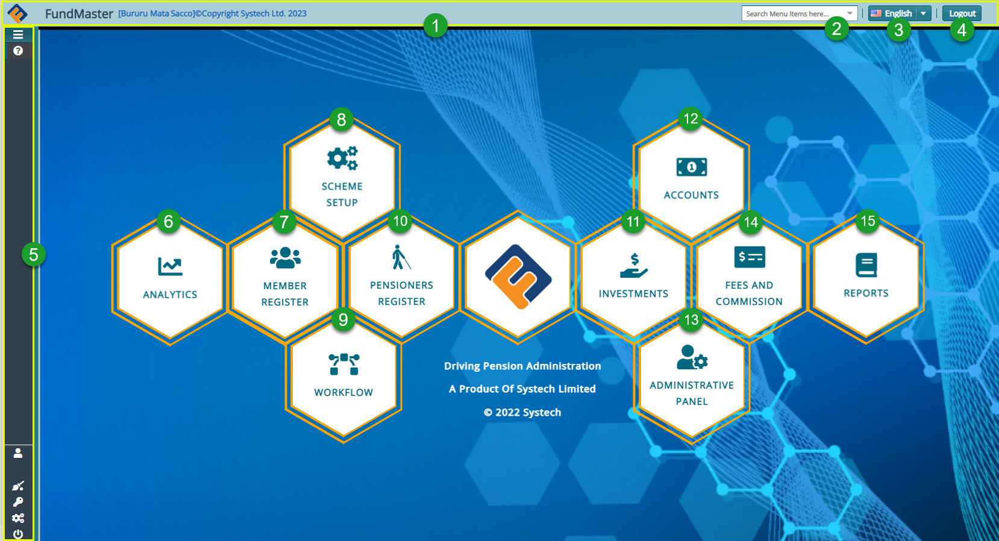

## Getting Started

To access FundMaster on your device, launch your preferred internet browser and input the web Internet Protocol address provided by your system administrator as shown below:

 

## Login Process

After inputting the access IP address, a user is directed to the login page where one is supposed to enter login credentials for authentication.

**Note:** to successfully access the login page, the IP address must be correct and the local area connection stable. The following is a screenshot of the login page:

   

  
**Action**

-	Type Username and Password respectively in text boxes **labelled 1**.

-	Click and select a preferred access language from the drop-down menu **labelled 2**.

-	Click the login button **labelled 3** to log in to the system.

**Tip** 

- The system is set to allow a user only three attempts at log in after which the account is locked. The locked account can only be reactivated by the system administrator.

## Landing Page

This is the dashboard (with the main menu and other controls) seen on a user’s screen when one successfully logs in to FundMaster. See the screenshot below:

  

The circled numbers in the screenshot above correspond to the numbers in the following table that describe the key navigation clickable elements on the FundMaster landing page:

| **No.** 	| **Interface Elements**    	| **Description**                                                                    |
|---------	|---------------------------	|------------------------	|
| 1.    	| Top menu bar              	| This is the bar where the system version trademark, the name of the running scheme, language drop-down menu, and logout button are located.    	|
| 2.     	| Search box   	                | A drop-down list with shortcut links for accessing key menu item.   
| 3.     	| Language drop-down menu   	| Click to select a language of choice. This will render the navigation and   content in the selected language.                                       	|
| 4.    	| Logout button             	| Clicking this button will terminate all the running processes and close the system.                                                               	|
| 5.    	| Left side pane            	| This is the left side panel. Click to expand and display more menu items.                                                                                    	|
| 6.    	| Analysis icon         	    | A link to launch the scheme setup module.                                                                     	|
| 7.    	| Members icon                	| A link to launch the member module                                                                   	|
| 8.    	| Scheme Setup icon          	| A link to launch the scheme setup module.                                                                                                         |
| 9.    	| Workflow icon             	| A link to launch the workflow Module.                                                                                                         |
| 10.    	| Pensioners Register icon      | A link to launch the pensioners module.                                                                                                         |
| 11.    	| Investments icon  	        | A link to launch the investments Module.                                                                                                         	|
| 12.   	| Accounts icon 	            | A link to launch the accounts Module.                                                                                                        	 |
| 13.   	| Administrative Panel icon    	| A link to launch the Administrative panel Module.                                                                                                                    	|
| 14.   	| Fees and Commission icon   	| A link to launch the fees and commisions module.                                                                                                           |
| 15.   	| Reports icon              	| A link to launch the reports module.                                |