### Bond & Securities

  

## Treasury Bonds

Under the Government Securities sub menu, click the **Treasury Bonds** option to view a grid table with a list of all the added bonds in categories of maturity terms in years. Note that before a bond is listed on this window it has already been bought through the acquisition process from the Issues window. See the treasury bonds window below:

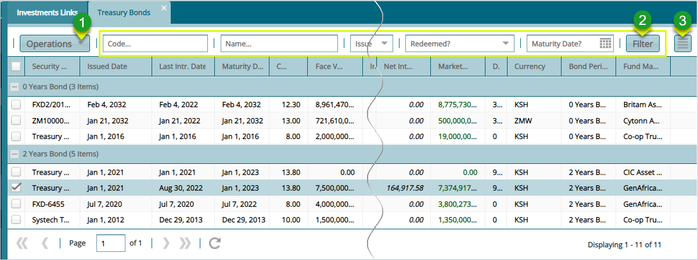  

**Action**

-   Click **Label 1** button to open a drop-down menu with different activity options such as valuation of a bond.

-   Click **Label 2** button to filter records based on set parameters such as bond name, issuer etc.

-   Click **Label 3** button load a section on the lower section of the window showing all transaction details of a selected bond record.

Clicking the Operations menu **labelled 1** will open a drop-down menu where a variety of actions, as as processing accrued interest, can be initiated against a selected bond record as will be demonstrated in the following section.

## Processing Accrued Interest

To process accrued interest for a bond, select the bond from the treasury bonds window and from the **Operations** drop-down menu, click **Process Accrued Interest,** then **For Selected bonds** to process accrued interest for a single bond as shown below:

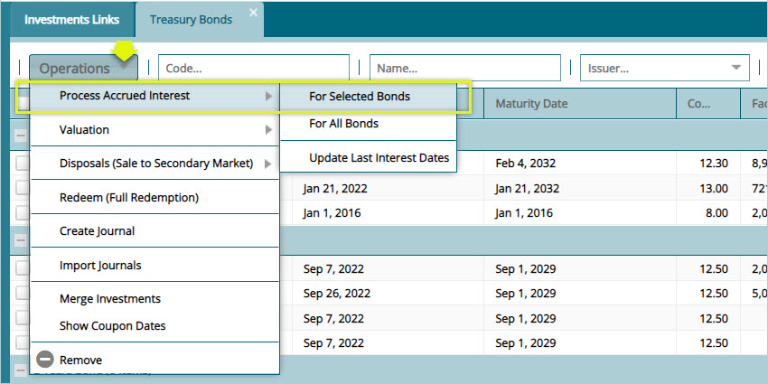  

Clicking the **For Selected Bonds** link will open a dialog box showing the amortization method used to compute the accrued interest. Click to confirm as shown below:

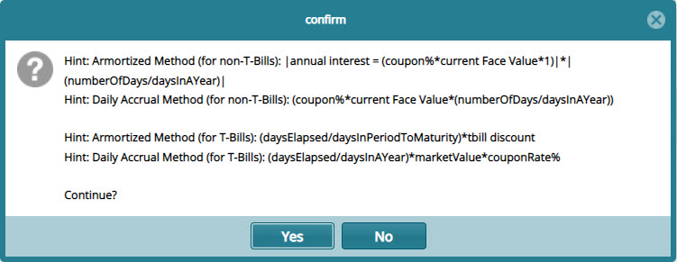  

Clicking **Yes**. as shown previously, will open a **Process Accrued Interest** dialog box for confirming the transaction date and financial period (you can process on monthly or quarterly bases otherwise leave it blank to run for the entire period) as shown below:

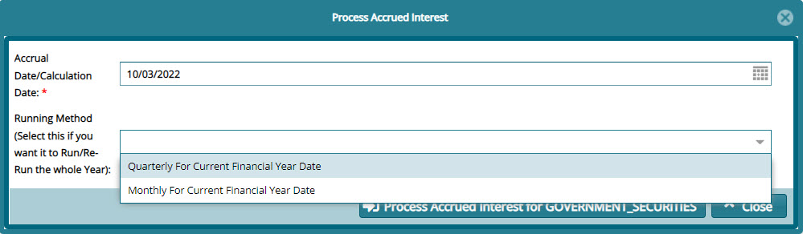  

## Posting Accrued Interest

After processing Accrued Interest, the transaction needs to be posted to the accounts. To post an accrued interest transaction, select the record from the grid table and from the **Certification** menu, click the **Pre-Approve**, **Certify** and **Approve** in that order as shown below:

  

After a successful **Certification** process, go to the **Posting** menu and **Post** the transaction as shown below:

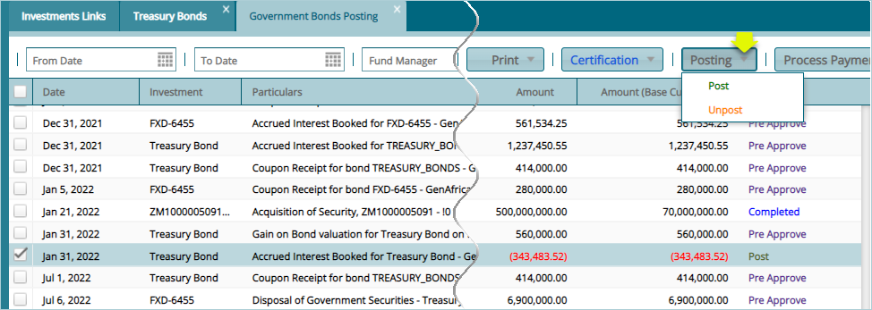  

A successful posting of an Accrued Interest will be recorded as shown below:

  

## Valuating a Bond

After processing accrued interest for a selected bond, the next step is to do a **valuation** for the bond as shown below:

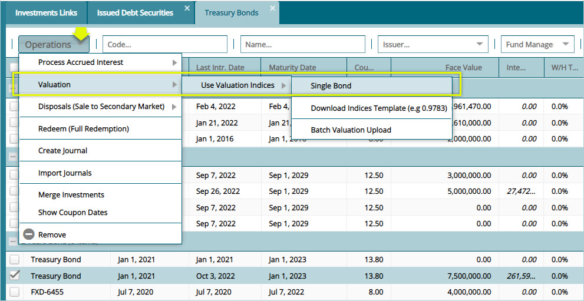  

Clicking the valuation for a single bond, as shown above, will open a dialog box for filling details such as the clean price valuation index and spot rate as shown below:

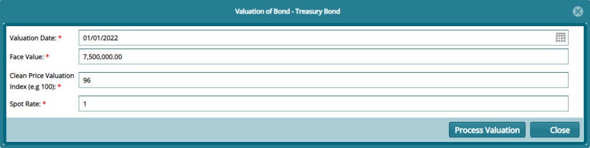  

## Disposal (Sale to secondary market)

To dispose a bond in the secondary market, select a particular bond from the **Treasury Bonds** window and from the **Operations** menu, select **Disposals (sales to secondary market)** to process as shown below:

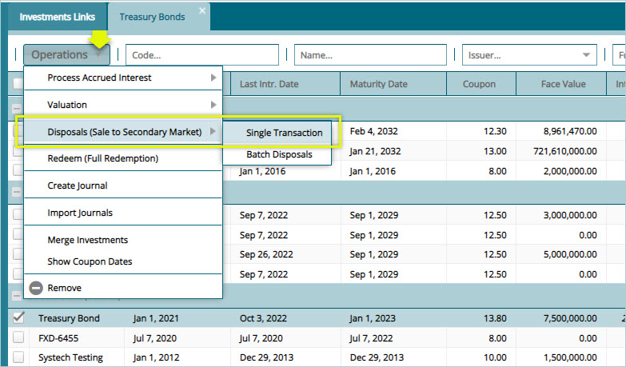  

Clicking the **Single Transaction** from the sub menu item, as shown above, will open the **Acquisition** window through which disposal details are confirmed as shown below:

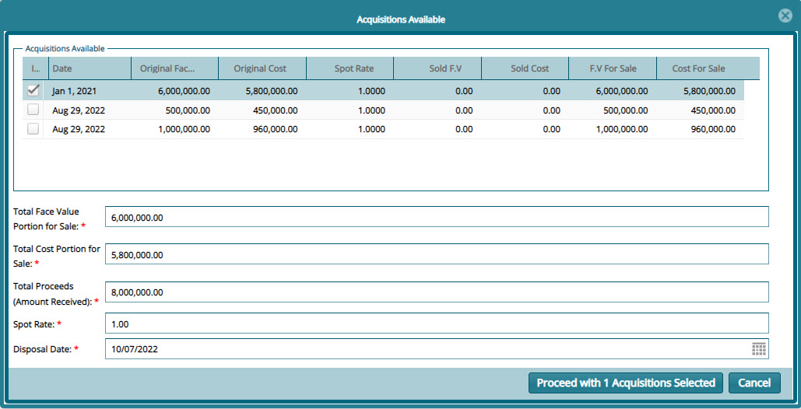  

## Bond Redemption

To redeem a bond, select the particular bond from the Treasury Bonds window and from the **Operations** menu, select **Redeem (full redemption)** to process the bond as shown below:

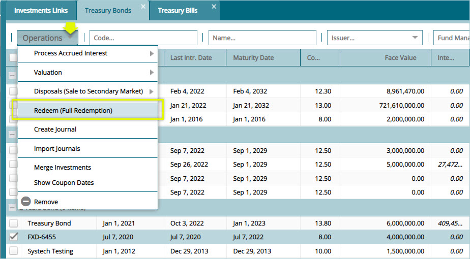  

Clicking the **Redeem** menu item, as shown previously, will open a **Redeem Security** dialog box where redemption details are populated as shown below:

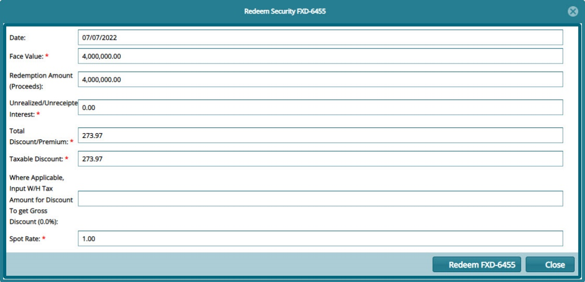  

## Treasury Bond Posting Process

After processing an Accrue Interest and Valuating a bill, the transaction needs to be posted to the accounts. To post a transaction, select the record from the **Governments Bonds Posting** window and from the **Certification** menu, click **Pre-Approve**, **Certify** and **Approve** in that order as shown below:

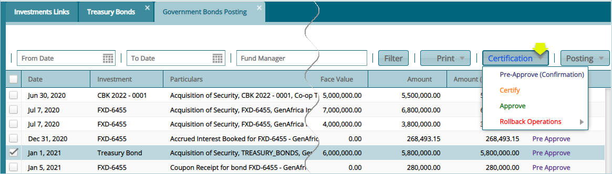  

After a successful certification process, from the **Posting** menu, click **Post** to complete the posting process as shown below:

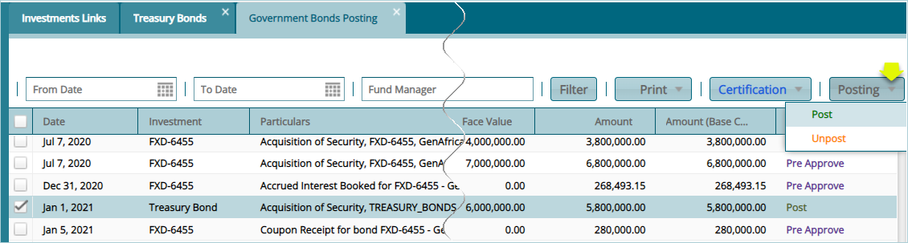  

## Treasury Bond Transaction Breakdown

To view transactions breakdown for the different operations as demonstrated previously, click the hamburger button on the upper right corner to display a section at the lower part of the window as shown below:

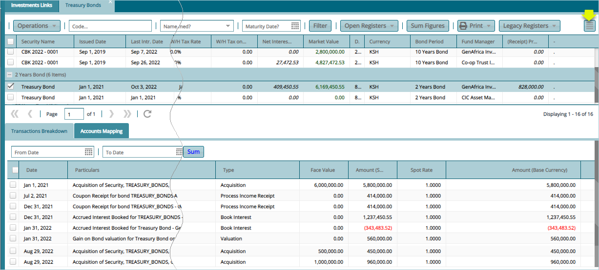  
