## Deposits

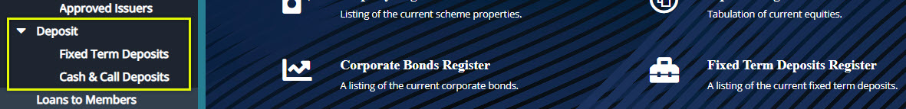  

### Fixed Term Deposits

A term deposit is a fixed-term investment that includes the deposit of money into an account at a financial institution. Term deposit investments usually carry short-term maturities ranging from one month to a few years and will have varying levels of required minimum deposits. To view a list of fixed term deposits, the screenshot below:

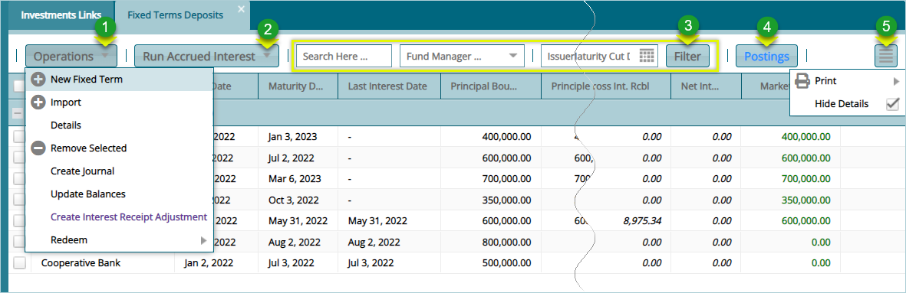  

**Action**

-   Click **Label 1** menu to open a drop-down menu with different activity options such as creating a new fixed term deposit.

-   Click **Label 2** menu to open a drop-down menu to run accrued interest on deposits.

-   Click **Label 3** menu to filter records based on set filter parameters such as fund manager, issuer etc.

-   Click **Label 4** button to post a selected fixed deposit from the grid table.

-   Click **Label 5** button to load a section on the lower section of the window showing all transaction details of a selected fixed deposit record.
-   

#### Creating a New Fixed Term Deposit

Clicking the **New Fixed Term** will open a dialog box through which a new fixed term can be created as shown below:

  

#### Run Accrued Interest

To process accrued interest for a fixed term, select the record or run process for all deposits as shown below:

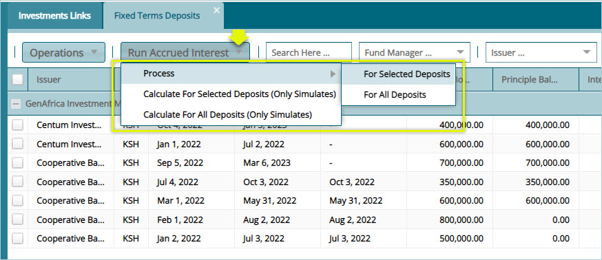  

#### Posting a Fixed Term Deposit

To post a transaction, select the record from the grid table and take actions as shown below:

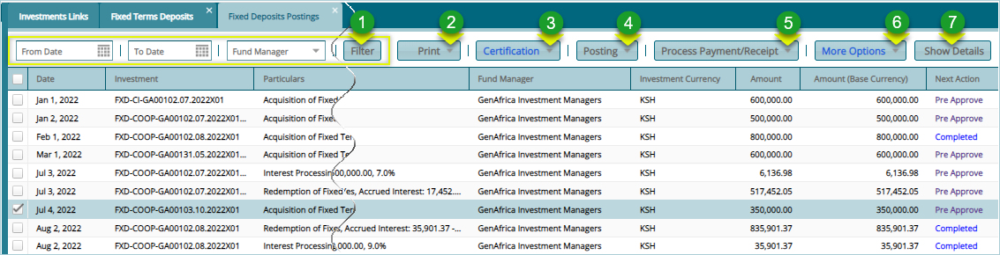  

**Action**

-   Click **label 1** button to filter records based on set filter parameters such as fund manager, dates etc.

-   Click **label 2** button to print a schedule.

-   Click **label 3** menu to open a drop-down menu to pre-approve, certify, approve a transaction, or roll back a record action.

-   Click **label 4** button to post a selected fixed deposit from the grid table.

-   Click **label 5** button to process a transaction payment.

-   Click **label 6** button to change a transaction date.

-   Click **label 7** button to load a section on the lower section of the window showing all transaction details of a selected fixed deposit record.

A successful posted fixed term deposit acquisition transaction will look as shown in the screenshot below:

 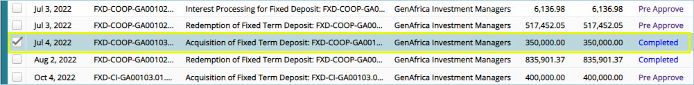  

#### Printing Various Reports

Click the print menu and from the drop-down click to print various reports as shown below:

 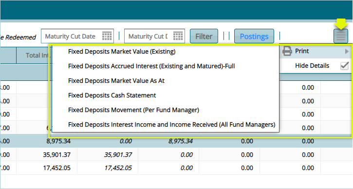  

### Cash & Call Deposits

Call deposits are basically accounts that require you to keep a minimum balance in exchange for a higher interest rate. Unlike time deposits, you have ready access to most of your cash, yet are still able to earn a higher return. To view a list of cash & call deposits, the screenshot below:

 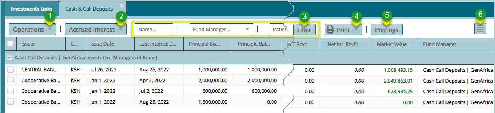  

**Action**

-   Click **Label 1** menu to open a drop-down list of operation such as creating a new cash and call.

-   Click **label 2** to calculate accrued interest for a selected record among other actions.

-   Click **label 3** button to filter records based on set filter parameters such as fund manager, name etc.

-   Click **Label 4** button to print deposit history among other reports.

-   Click **Label 6** button to post a selected transaction from the grid table.

-   Click **Label 5** button to process a transaction payment.

-   Click **label 6** button to load a section on the lower section of the window showing all transaction details of a selected record.

#### Creating a New Cash & Call 

Clicking the **New Cash & Call** from the Operations menu as shown below:

 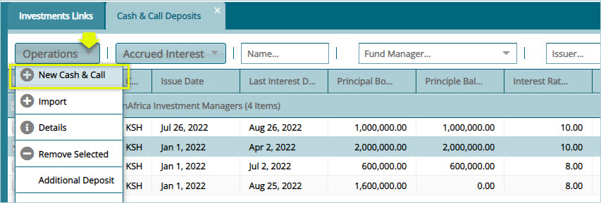  

Clicking the link shown above will open a dialog box through which a new cash & call deposit can be created as shown below:

 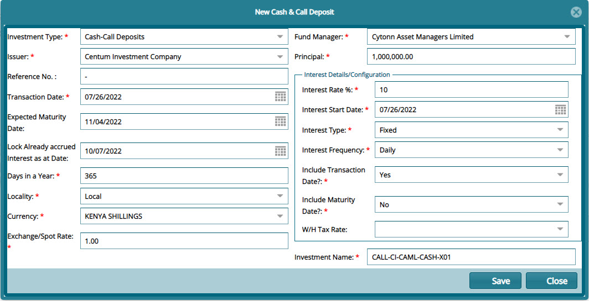  

#### Run Accrued Interest

To process accrued interest for a cash & call, select the record and click calculate accrued interest among other actions shown below:

 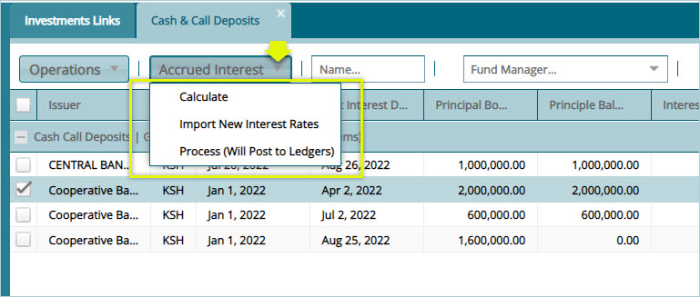  

Clicking the **Calculate** link will open a dialog box for defining the date of running the **interest** and **spot rate** as shown below:

 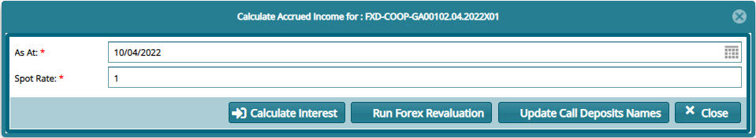  

#### Posting a Call & Cash deposit

To post a transaction, select the record from the grid table and take actions as shown below:

 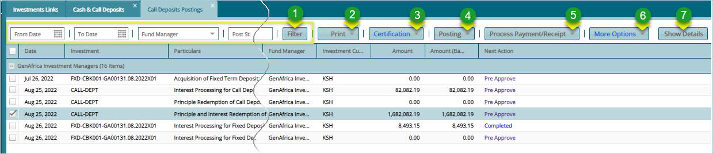  

**Action**

-   Click **label 1** button to filter records based on set filter parameters such as fund manager, dates etc.

-   Click **label 2** button to print a schedule among other reports.

-   Click **label 3** menu to open a drop-down menu to pre-approve, certify, approve a transaction, or roll back a record action.

-   Click **label 4** button to post a selected call & cash deposit from the grid table.

-   Click **label 5** button to process a transaction payment.

-   Click **label 6** button to change a transaction date.

-   Click **label 7** button to load a section on the lower section of the window showing all transaction details of a selected record.

A successful posted transaction will look as shown in the screenshot below:

 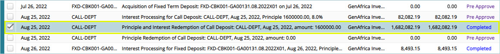  

## Other Investments

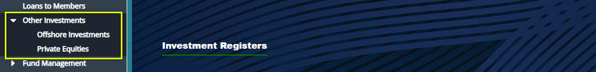  

### Offshore Investments

Offshore investments refer to a wide range of investment strategies that capitalize on advantages offered outside of an investor\'s home country. To view a list of Offshore investments, see the screenshot below:

  

**Action**

-   Click **label 1** menu to open a drop-down menu to acquire a new Offshore investment among other actions.

-   Click **label 2** button to filter records based on set filter parameters such as fund manager, Offshore company etc.

-   Click **label 3** button to open view a list of Offshore Investments Companies in a different window.

-   Click **label 4** button to open the postings window and post a selected transaction.

-   Click **label 5** to print an Offshore Investments report such as movements report.

-   Click **label 6** button to load a section on the lower section of the window showing all transaction details of a selected record.
  
    
