### Equities

Equities refer to the shares in a company's ownership - the total amount of money that you one receives when the company pays off all its debt and liquidates its assets. When a scheme invests in a company's equity, through fund managers, the scheme become a partial owner of the listed company.

To access the equities window, click the Equities link as shown below:

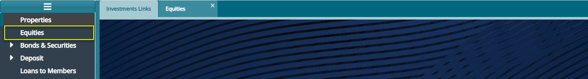  

Clicking the Equities link, as shown previously, will open the equities window where a list of equities is displayed in a grid table as shown below:

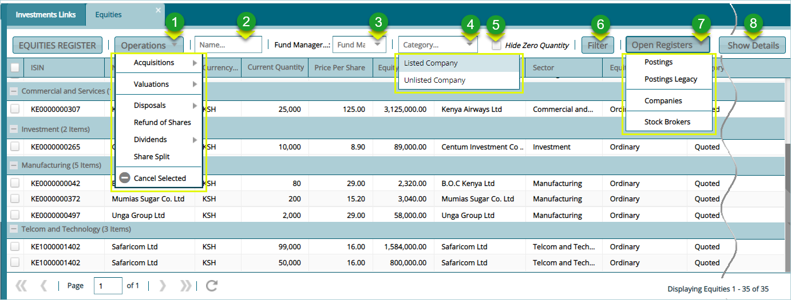  

**Action**

-   Click **Label 1** button to carried out key operations in relation to equities such as acquiring shares from listed companies.

-   Click **Label 2** button to type and retrieve a share record from the list by name.

-   Click **Label 3** button to select a filter record based on a fund manager.

-   Click **Label 4** button to select filter records based on the type
  
-   Click **Label 5** button to check the box and hide zero figures.

-   Click **Label 6** button to filter the records based on the settings in the previous menus.

-   Click **Label 7** button to open a drop-down menu for further activities related to equities posting transaction.

-   Click **Label 8** button to open a section at the lower part of the window showing extra details for a selected record.

Clicking **Show Details** label 8 button will load an extra section at the lower part of the window showing all the transactions related to a selected equities record as shown below:

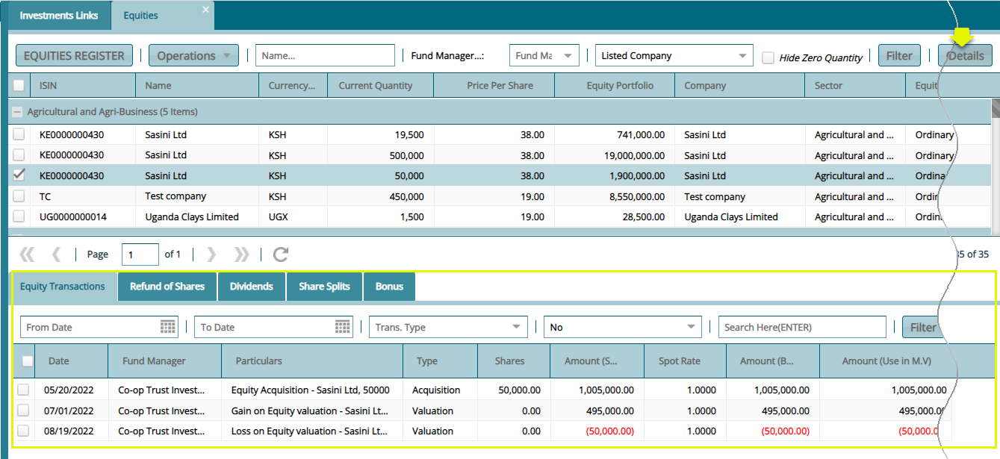  

## Equities Acquisition Process

To run the process of equities acquisition in the system, the company whose shares the scheme is interested in to be already created in the system. The process of adding companies to the system is demonstrated later in this section.

### Acquiring New Equities

To process a new equity acquisition, unlike the previous process demonstrated above, click the **Companies** link from **Open Register** drop-down menu as shown below:

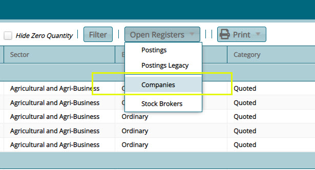  

Clicking the **Companies** link, as shown above, will open the companies window listing all companies whose shares are available for purchase. Click the checkbox to select a company and from the **Acquisition** drop-down menu, then click the **Single Transaction** to proceed (click Batch Acquisition to buy shares in batch) as shown below:

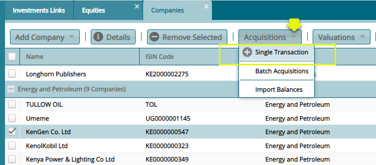  

Clicking the **Single Transaction** link will open the equity acquisition details dialog box for filling with the required details as shown below:

 

After filling the acquisition details and clicking the **Process Acquisition** button as shown above, navigate to the equity window and locate the newly acquired equity from the grid table as shown below:

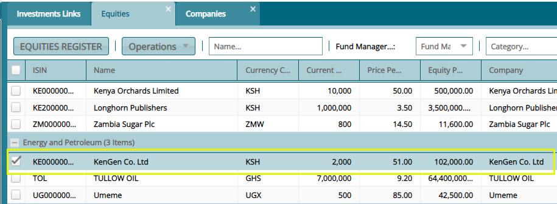  

### Acquiring Additional Equities

To acquire more equities from previous transaction, first select that equity record from the grid table and from the **Operations** menu, click the **Acquisitions** sub menu to select the preferred method as
shown below:

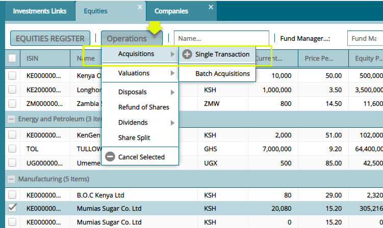  

**Tips**

-   To acquire additional equities, make sure the previous transaction entry is selected from the grid table

Click the **Single Transaction** link to open the equity acquisition details dialog box and fill in the required details to process the purchase as shown below:

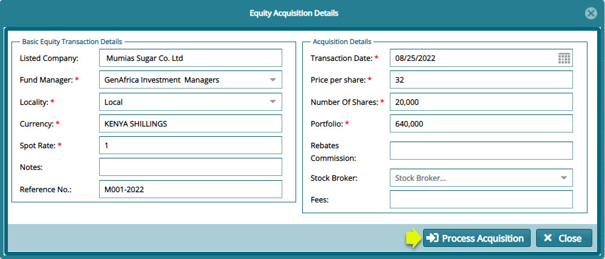  

**Tips**

-   Equities can be acquired in batch or as a single transaction.

-   Equities can be acquired under the same entity many times, or a new acquisition initiated from the company's window as will be demonstrated.

Processing the above equity acquisition will update the equities register. Clicking the **Show Details** menu on the upper right corner of the window will display new section on the lower section of the window showing the recording of the new transaction as shown below:

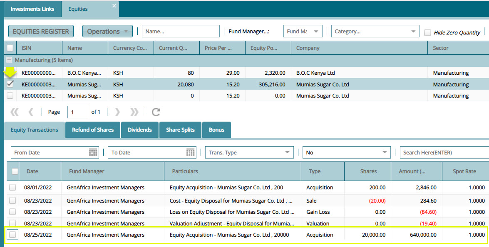  

**Tips**

-   Notice that this equity acquisition is addition purchase transaction from a previous acquisition entity.
  

## Equities Disposals Process

To sell an equity, first select that equity record from the grid table and from the **Operations** menu, click the **Disposals** then **single transaction** (for a single equity otherwise select Batch Disposal to sell any equites at once) as shown below:

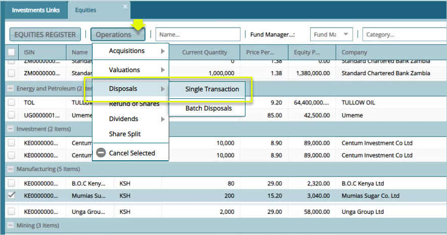  

Click the **Single Transaction** link to open the equity acquisition details dialog box and fill in the required details to process the purchase as shown below:

  

**Tip**

-   Notice that this disposal transaction has reduced the number of Mumias Sugar shares quantity from 200 to 100. See the new record as shown below:

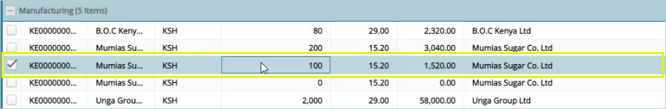  

### Equities Posting Process

After the disposal of an equity share, the transaction needs to be posted to the accounts. To post a sales transaction, select the record from the grid table and on the Open Register menu, select posting as shown below:

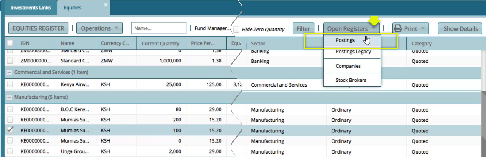  

### Certification Process

From the **Certification** Menu, click **Pre-Approve,** **Certify** and **Approve** in that order to as shown below:

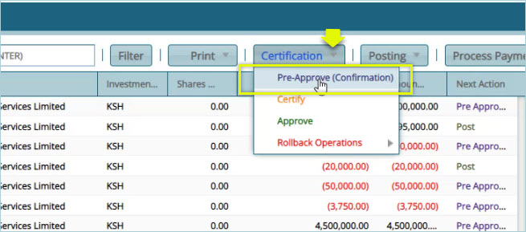  

**Tip**

-   Note that from the **Certification** menu, as shown above, it is possible to **Rollback Operations** from Approve back to Pre-approve.

### Posting 

After a successful certification of a disposal transaction the next step is to post the transaction to Accounts module for accounts managements.
To post a transaction, select the record from the grid table and on the **Posting** menu, click **Post** as shown below:

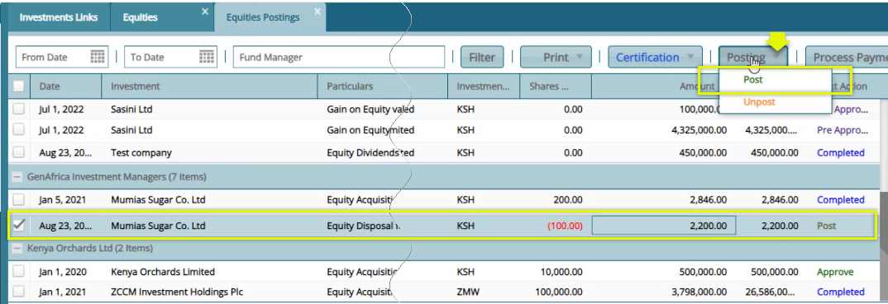  

**Tips**

-   Note that from the **Posting** menu, as shown above, it is possible to **UnPost** a transaction.

A successfully posted transaction is shown below:

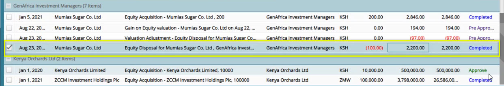  

## Companies

Companies are the establishments whose equities are floated to the public for buying. Some companies are listed in the stock market while others are not.

To access the Companies window, navigate to the Equities window and click the **Companies** link from **Open Register** drop-down menu as shown below:

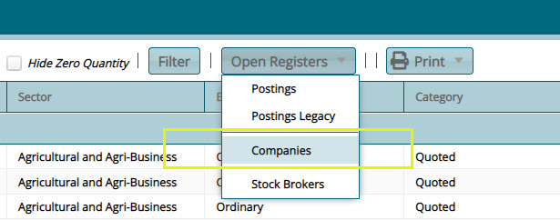  

Clicking the **Companies** link will open the Companies window where all companies whose equities can be acquired are listed in a grid table. From this window, several activities can be carried out as demonstrated in this section. See screenshot below:

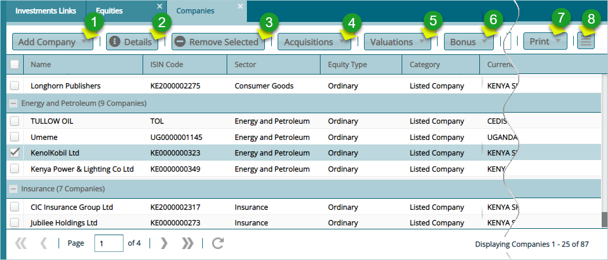  

**Action**

-   Click **Label 1** button to add a new company whose equities are ready for acquisition.

-   Click **Label 2** button to view the details of a selected company from the grid table.

-   Click **Label 3** button to delete a company record from the grid table.

-   Click **Label 4** button to select an acquisition method from the drop-down menu.

-   Click **Label 5** button to selecta a valuations method for a selected company's equities.

-   Click **Label 6** button to calculate bonus for a selected equity.

-   Click **Label 7** button to view and print a copy of listed companies.

-   Click **Label 8** button and from the drop-down menu select to remove the valuation price of a selected company or to load a new section with extra details of a selected record from the grid table.
  

### Adding a New Company

To add a new company whose equities are ready for acquisition, from the **Add Company** drop-down menu, click the **New Company** button (a list of companies can also be imported in batch) as shown below:

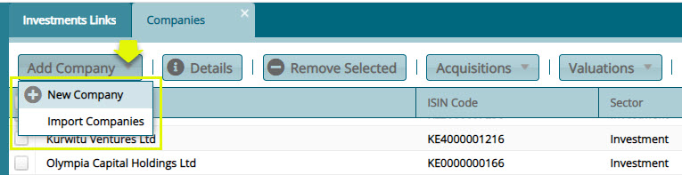  

Clicking the New Company button will open a dialog box where company details are provides as shown below:

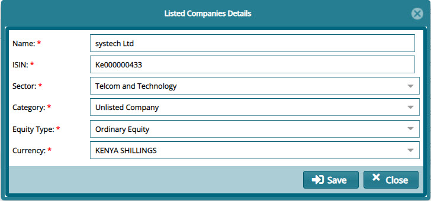  

## Equities Valuation

Click the **Acquisition** menu and from the drop-down list, select the valuation method to use for a selected company from the grid table. Proceed to carry out the valuation process as shown next.

### Valuations Process

Click the **Valuation** menu and from the drop-down list select the valuation method to use for a selected company from the grid table. Proceed to carry out the valuation process as shown below:

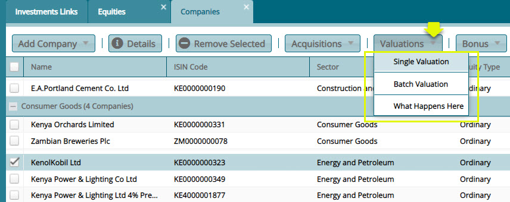  

Clicking the **Single Valuation** link, after selecting a company from the grid table as shown previously, will open an **Equity Price** details dialog box where the company's equities can be valued by providing details such as the latest price as shown below:

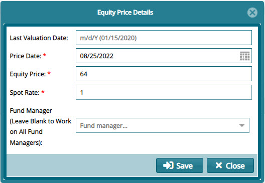  

### Removing Equities Prices

Clicking the **hamburger** icon on the right upper corner will allow a user to view and delete equity prices of selected records from the grid table as shown below:

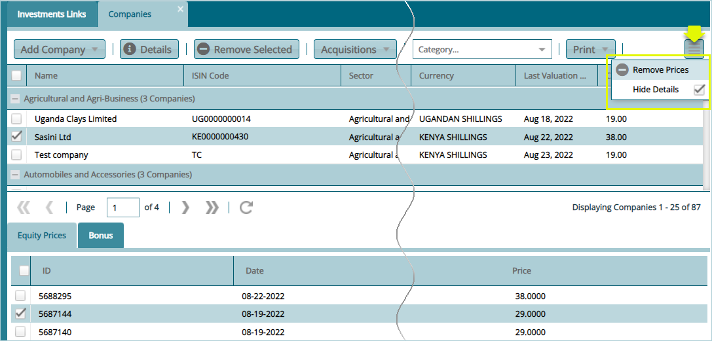  

**Tip**

-   Select an equity price record from the lower section part of the window and click the **Remove Prices** button as shown above to delete it.
