### Fund Management

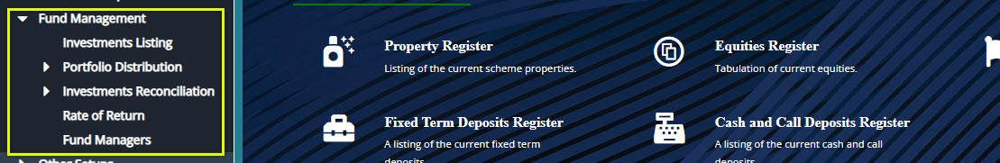  

## Portfolio Distribution

#### Holding Distribution

The window below shows the portfolio distribution of a scheme:

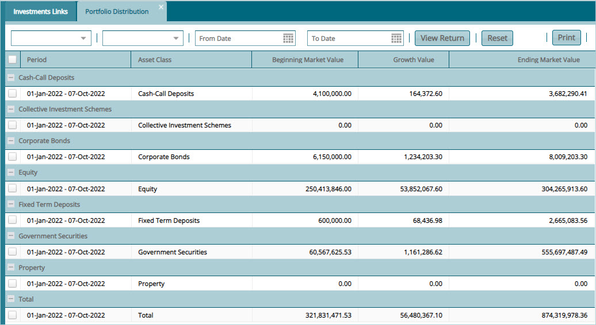  

#### Exposure Distribution

The window below shows the exposure distribution of a scheme:

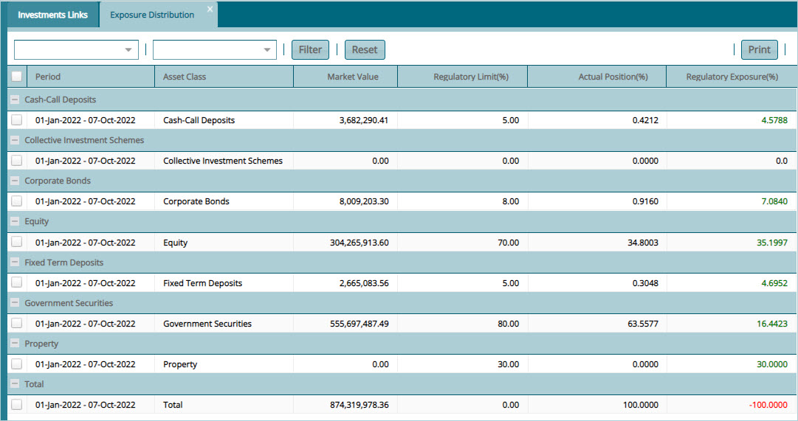  

#### Issuer Exposure Distribution

The window below shows the Issuer exposure distribution of a scheme:

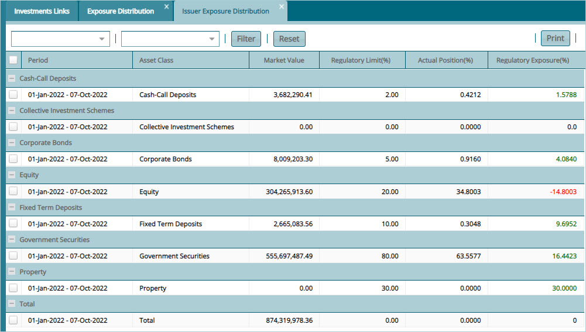  

## Return on Investments

#### Investments reconciliation

The window below shows the investments listing in a scheme:

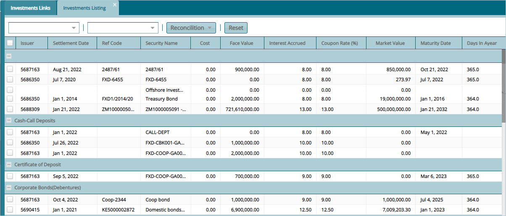  

### Rate of Return

The window below shows the rate of returns on all scheme investments:

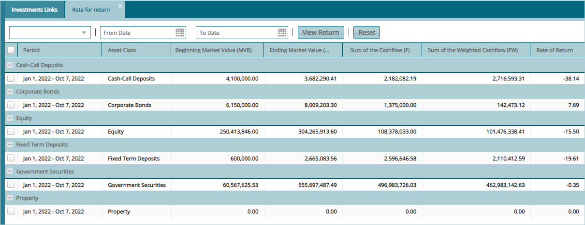  

## Fund Managers

Click the **Fund Managers** link on the left side panel to open the fund managers window where all the fund managers in a scheme are listed in a grid table as shown below:

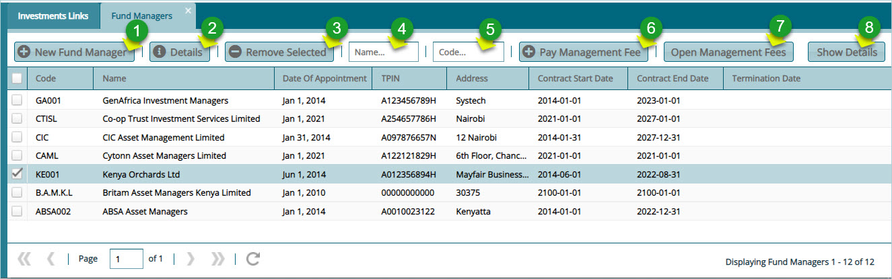  

**Action**

-   Click **Label 1** button to add a new fund manager.

-   Click **label 2** button to view the details of a selected fund manager.

-   Click **label 3** button to remove a selected manager's record from the list.

-   Click **label 4** button to search for a specific manager from the list by name.

-   Click **label 5** button to search for a specific manager from the list by code.

-   Click **label 6** button to pay management fee to a selected fund manager.

-   Click **label 7** button to open management fees window.

-   Click **label 8** button to show extra details of a fund manager.
  

Clicking the **New Fund Manager** button will open the fund manager details dialog box through which details for a new manager can be captured and saved in the system as shown below:

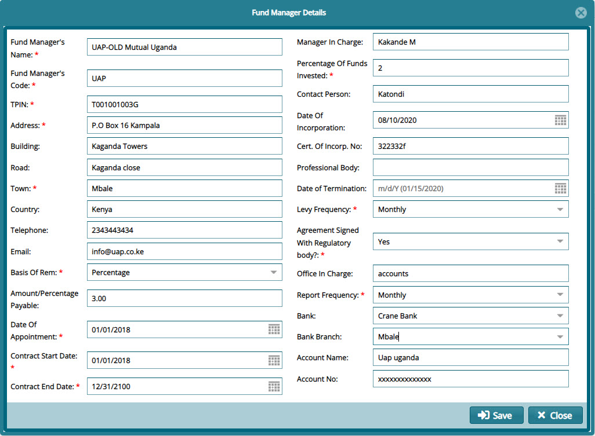  

Clicking the **Pay Management Fee** button will open the management fee payment details dialog box through which payment details to a fund manager are captured as shown below:

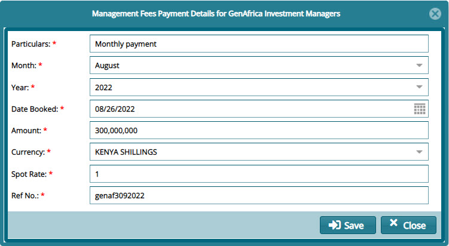  

## Other Setup

From the **Other Setup** drop-down menu, click on a link to open a new window through which settings are configured as shown below:

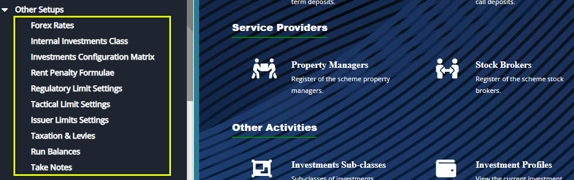  

### Investments Configurations Matrix

The Investments configurations matrix provides a group of key parameters that must be set to determine how the investments module work.

Click the **Investments Configurations Matrix** link, as shown previously, to open the Investments configuration window to set the parameters as shown below:

  

## Reports

From the **Reports** drop-down menu, click on a link to open a particular report in a new window shown below:

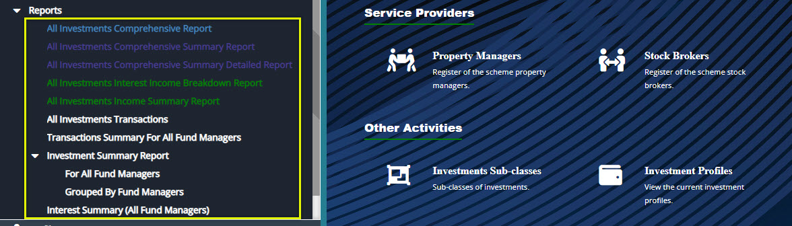