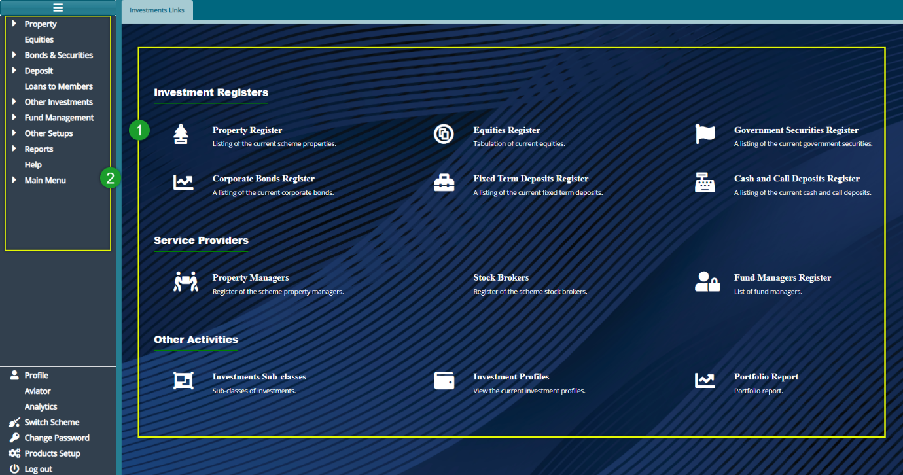

### Investment Module

This module enables a pension scheme to manage its investments by allowing the pension fund administrators to keep track of how their member funds are growing. The investments module handles investments in Real Estate, Debt and Equity instruments. It makes it possible to integrate key investment activities with other modules such as the
Accounts module. This enables efficient property management through adding a new property, listing current properties, and registering scheme property managers among others.

The features of the module include: A Property sub-module that handles all aspects of real estate (Commercial and Residential), an Equities Register which handles all aspects of Listed and non-listed equities (Purchases, Sales, Valuat listing of the current fixed term deposits, a register of the scheme property managers, a register of scheme.

To access the investments Module dashboard, click the **Investments Module** link on the FundMaster landing page to open **Investments Links** window shown below:

  

**Action**

- Click the hot links under the section **labelled 1** to access shortcut routes to commonly visited links in the investment module.

-   Click the menu item links listed on the left side panel in section **labelled 2** to configure all investments related settings such as equities.
  

**Tip**

- All the links under label 1 can still be accessed on the left side panel although some are tacked under sub menus.