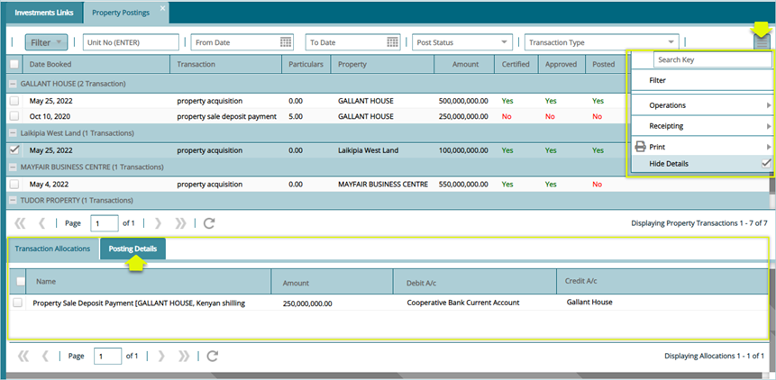

## Posting

The two links under the posting menu allow viewing of a scheme’s property details. Click on the drop-down submenu links to open the respective windows for specific configurations as shown below: 

  

### Property Postings

Click the Property Postings link to open the property posting window where all scheme’s property details are listed in a grid table. From this window the records in the grid table can be filtered from the top menu bar, clicking the icon on the upper right side will load a submenu where other operations such as certification and receipting can be done as shown below:

  

Click the Property Postings link to open the property posting window where all scheme’s property details are listed in a grid table. From this window the records in the grid table can be filtered from the top menu bar, clicking the icon on the upper right side will load a submenu where other operations such as certification and receipting can be done as shown below:

**Tip**

- Click the Posting Details tab on the lower section of the window as highlighted above to view the posting details of a selected record.
