## Management of properties

Configurations under the manage category are set to aid in the management of various participants in a scheme. Click on the drop-down submenu links to open the respective windows for specific configurations as shown below: 

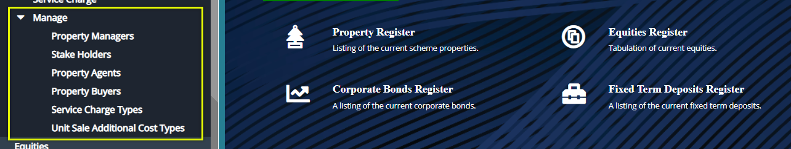  

### Property Managers

Click the **Property Managers** link to open the property managers window where all the property managers in a scheme are listed in a grid table as shown below:

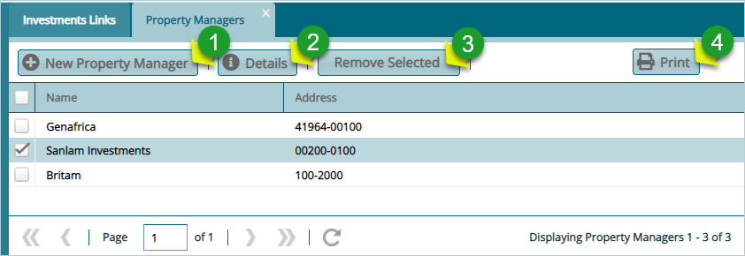  

**Action**

-   Click **Label 1** button to add a new property manager.

-   Click **label 2** button to view the details of a selected manager from the grid table.

-   Click **label 3** button to remove a selected manager's record from the list.

-   Click **label 4** button to compile and display a print version of managers details.

Clicking the **New Property Manager** button will open the property manager details dialog box through which details for a new manager can be captured and saved in the system as shown below:

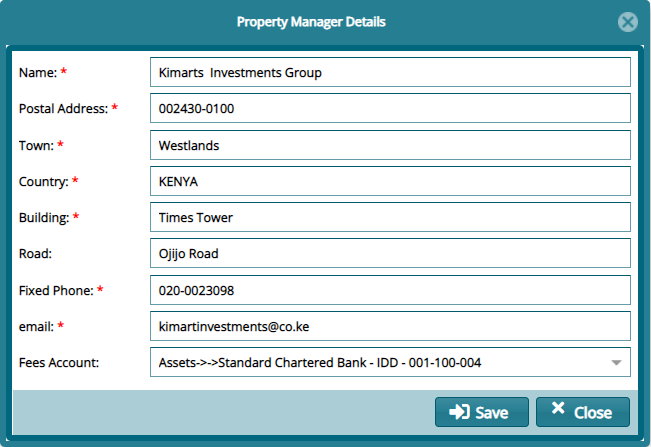  

**Tips**

Fill all the mandatory fields marked with a red asterisk sign and on the fees account field select the GL account to associate the property managers transactions with the appropriate account. Click the **Save** button to commit changes.

### Stake Holders

Click the **Share Holders** link to open the property shareholders window where all the property shareholders in a scheme are listed in a grid table as shown below:

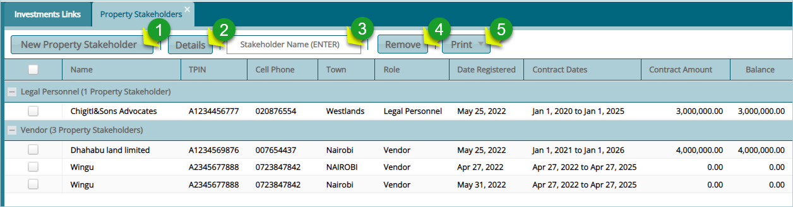  

**Action**

-   Click **Label 1** button to add a new property shareholder.

-   Click **label 2** button to view the details of a selected shareholder from the grid table.

-   Click **label 3** button and type the name of a shareholder to filter records by name.

-   Click **label 4** button to remove a selected shareholder record from the list.

-   Click **label 5** to compile and display a print version of shareholders details.
  

Clicking the **New Property Shareholder** button will open the Property Shareholder details dialog box through which details for a new shareholder can be captured and saved in the system as shown below:

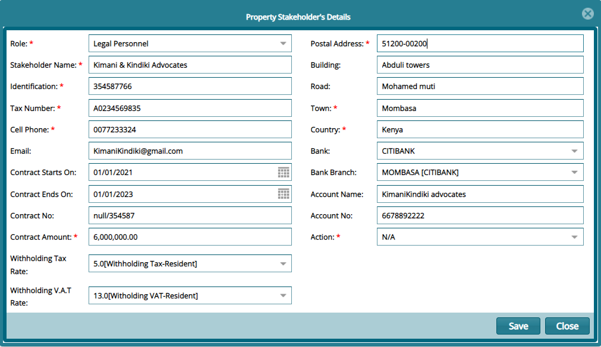  

### Property Agents

Click the **Property Agents** link to open the property agents window where all the property agents in a scheme are listed in a grid table as shown below:

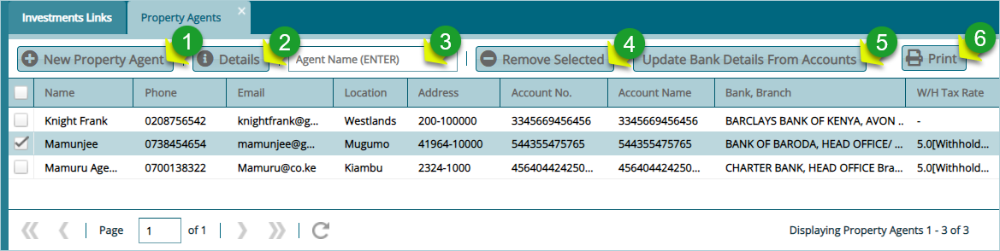  

**Action**

-   Click **Label 1** button to add a new property agent.

-   Click **label 2** button to view the details of a selected agent from the grid table.

-   Click **label 3** button and type the name of an agent to filter records by name.

-   Click **label 4** button to remove a selected agent record from the list.

-   Click **label 5** button to update bank details of a selected agent from the list.

-   Click **label 6** to compile and display a print version of agents' details.
  

Clicking the **New Property Agent** button will open the Property Shareholder details dialog box through which details for a new shareholder can be captured and saved in the system as shown below:

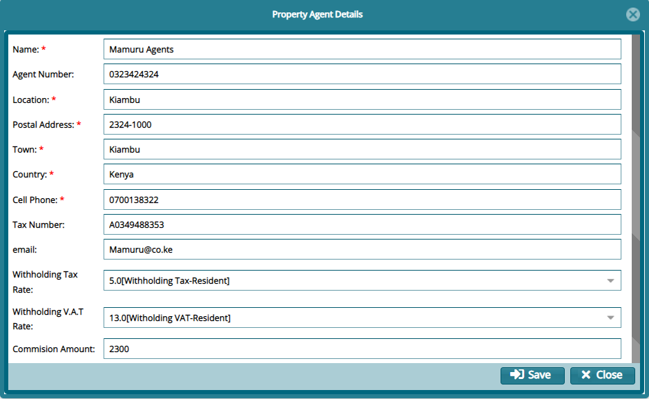  

### Property Buyers

Click the **Property Buyers** link to open the property buyers window where all the property buyers in a scheme are listed in a grid table as shown below:

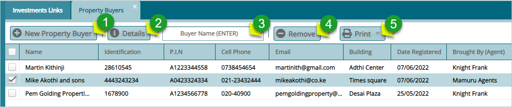  

**Action**

-   Click **Label 1** button to add a new property buyer.

-   Click **label 2** button to view the details of a selected agent from the grid table.

-   Click **label 3** button and type the name of a buyer to filter records by name.

-   Click **label 4** button to remove a selected buyer record from the list.

-   Click **label 5** to compile and display a print version of buyers' details.
  

Clicking the **New Property Buyer** button will open the property buyer's details dialog box through which details for a new buyer can be captured and saved in the system as shown below:

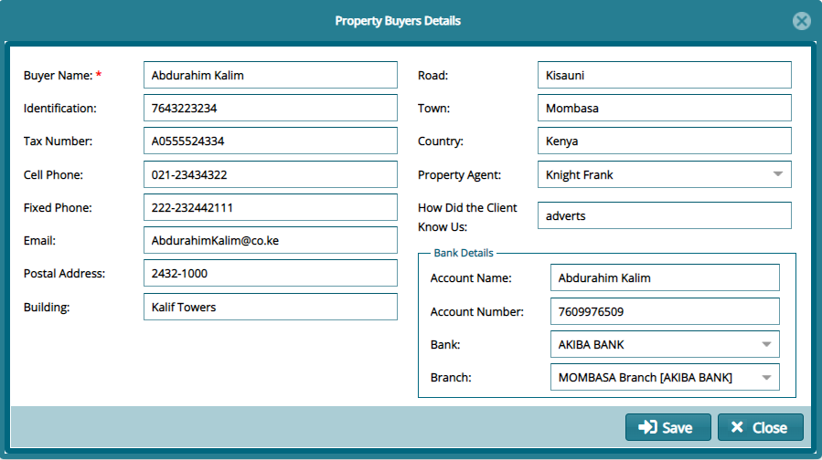  

## Service Charge Types

Click the **Service Charge Types** link to open the service charge types window where all types of charges are listed in a grid table as shown below:

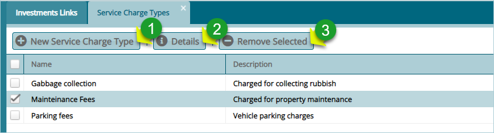  

**Action**

-   Click **Label 1** button to add a new type of service charge.

-   Click **label 2** button to view the details of a selected service type from the list.

-   Click **label 3** button to remove a selected service charge record from the list.
  

Clicking the **New Service Charge Type** button will open the property buyer's details dialog box through which details for a new service charge can be created and saved in the system as shown below:

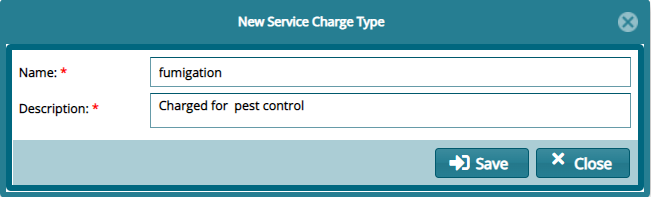  

### Unit Sale Additional Cost Types

Click the **Unit Sale Additional Cost type** link to open the service charge types window where all types of charges are listed in a grid table as shown below:

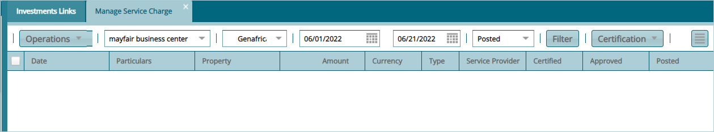  

## Registration of Properties

Configurations under the property’s menu category are set to aid in the management of various participants in a scheme. Click on the drop-down submenu links to open the respective windows for specific configurations as shown below: 

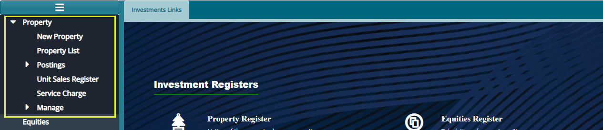  

### New Property

Click the **New Property** link to open the property details dialog box to capture the data for a new property bought by a scheme as shown below:

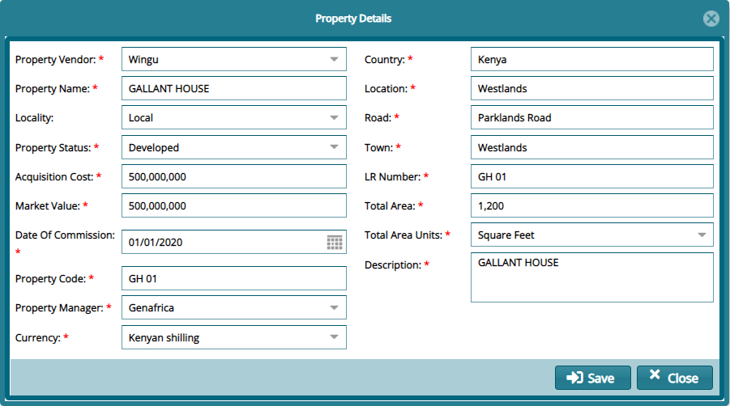  

### Property List

Click the **Property List** link to open the properties window where all scheme's properties in a scheme are listed in a grid table as shown below:

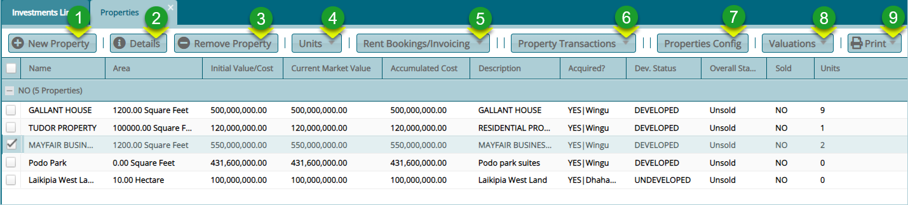  

**Action**

-   Click **Label 1** button to add a new property's details.

-   Click **Label 2** button to edit details of a selected property from the list.

-   Click **Label 3** button to remove a selected property from the list.

-   Click **Label 4** button to create units for a selected property among other related actions.

-   Click **Label 5** button to book for renting of a selected property from the list.

-   Click **Label 6** button to run the process of acquiring a selected property from the list.

-   Click **Label 7** button to configure general property settings.

-   Click **Label 8** button to set up a selected property for valuation.

-   Click **label 9** button to compile and display a print version of property's details.
  

**Creating property units**

Click the **Units** menu to view a drop-down menu from which a new unit can be created, existing units updated, view existing leases, a list of a property units as shown in the screenshot below:

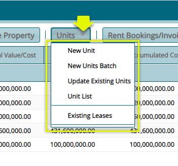 

**Action**

-   Click **New Unit** to add a unit to a property.

-   Click **New Unit Batch** to add many units from a template to a property.

-   Click **Update Existing Units** to change unit details.

-   Click **Unit List** to view all units in a selected property.

-   Click **Existing Leases** to view details of already leased property units.

**Creating a New Unit**

To create a new property unit, select a property from the grid table and click the **New Unit** link to open a dialog box and provide details for a new unit as shown below:

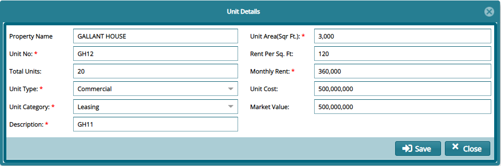  

**Viewing a list of Unit**

To create a new property unit, select a property from the grid table and click the **List of Unit** link to open a window where all units are listed in a grid table as shown below:

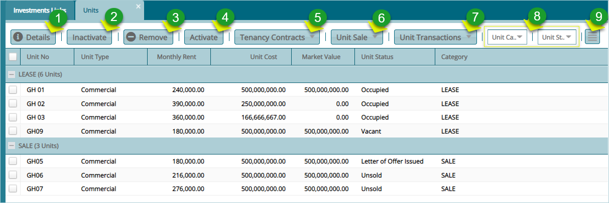 

**Action**

-   Click **Label 1** button to view the details of a selected unit.

-   Click **Label 2** button to Inactivate a selected unit.

-   Click **Label 3** button to remove a selected unit.

-   Click **Label 4** button to activate a selected unit.

-   Click **Label 5** button to view tenancy agreements.

-   Click **Label 6** button to initiate sales related operations.

-   Click **Label 7** button to carry out transactions such as cancelation of a unit reservation.

-   Click **Label 8** text fields to filter records accordingly.

-   Click **label 9** button to load an extra section on the lower side of the window displaying extra details of a selected unit among other actions.

**Tenancy contracts**

Click the **Tenancy Contract** menu to view a drop-down menu from which a new agreement can be created (single or in batch) and existing agreements viewed as shown in the screenshot below:

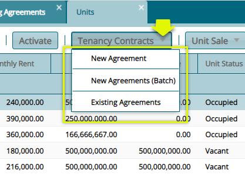  

**Creating a New Agreement**

To create a new unit agreement, select a unit from the grid table and click the **New Agreement** link to open a dialog box and provide details for a new unit agreement as shown below:

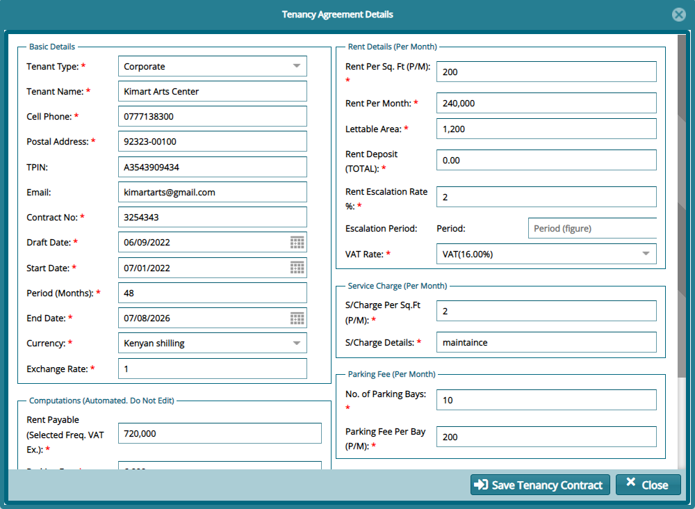  

**Booking/Invoicing Property**

Click the **Rent Booking/Invoicing** menu to view a drop-down menu from which a new a rent invoice can be booked among other actions as shown below:

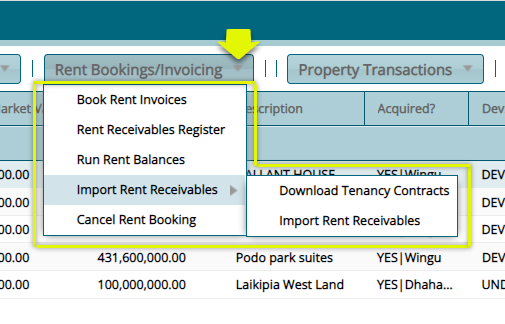  

**Property Acquisition Processing**

Click the **Property Transactions** menu to view a drop-down menu from which an acquisition can be processed among other actions as shown below:

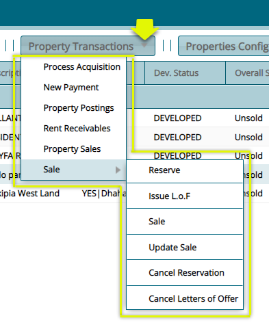  

Click **Reserve** menu to process the reservation of a selected property as shown below:

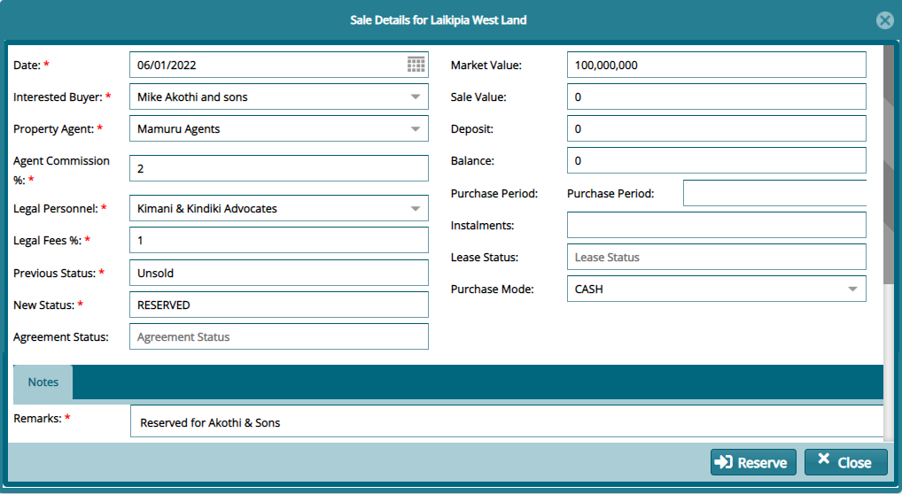  

**Property Configuration**

Click the **Property Configuration** menu to open a dialog box for configuring property various property parameter as shown below:

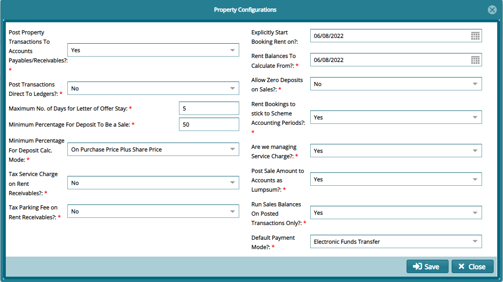  

**Valuations**

Click the **Valuation** menu to view a drop-down menu from which a property valuation can be done, and the history of the same property viewed as shown below:

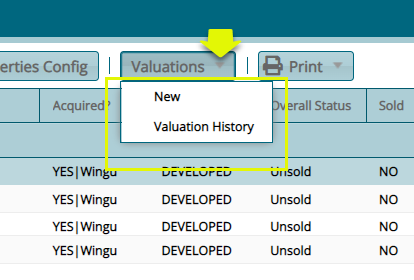  

To create a valuation, click the **New** link to open a valuations details dialog box as shown below:

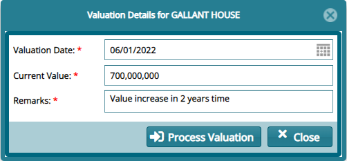  

**Print reports**

Click the **Print** menu to view a drop-down menu from which various reports can be viewed and printed as shown below:

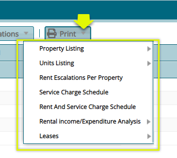  

## Postings

The two links under the posting menu allow viewing of a scheme's property details. Click a link to open the respective window for specific configurations as shown below:

  

### Property Postings

Click the **Property Postings** link to open the property posting window where all scheme's properties details are listed in a grid table. From this window the records in the grid table can be filtered from the top menu bar, clicking the icon on the upper right side will load a submenu where other operations such as certification and receipting can be done
as shown below:

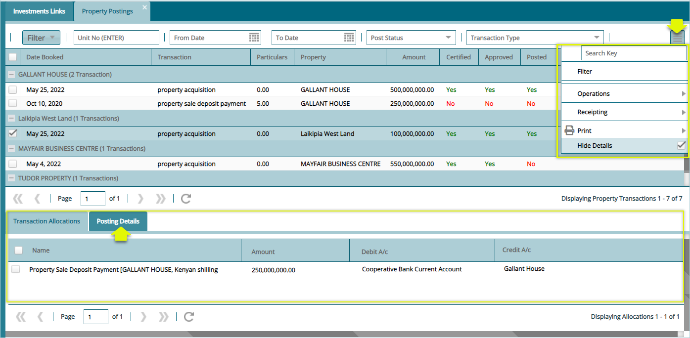  

**Tip**

Click the **Posting Details** tab on the lower section of the window as highlighted above to view posting details of a selected record.