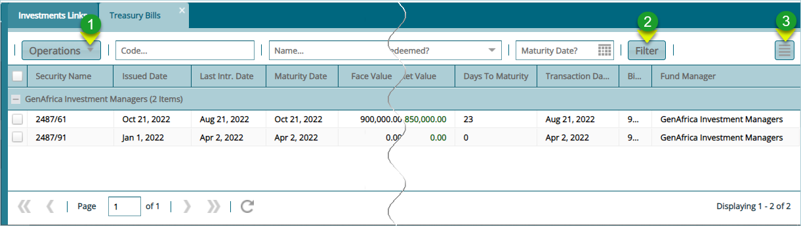
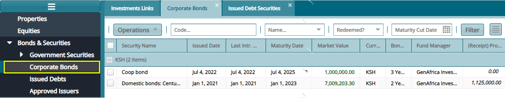
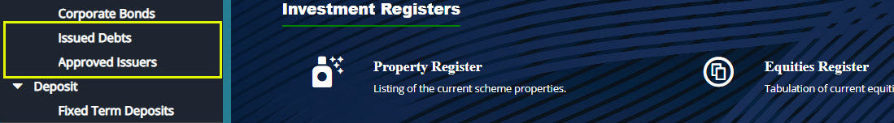
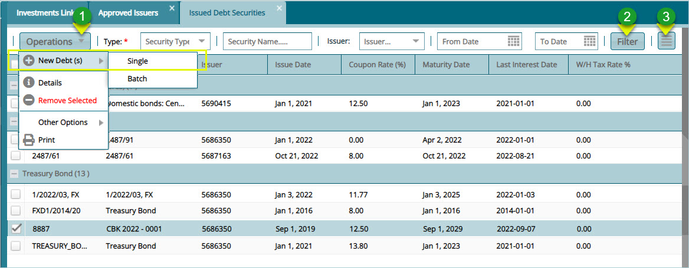
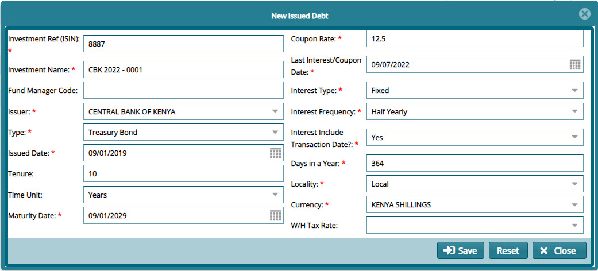
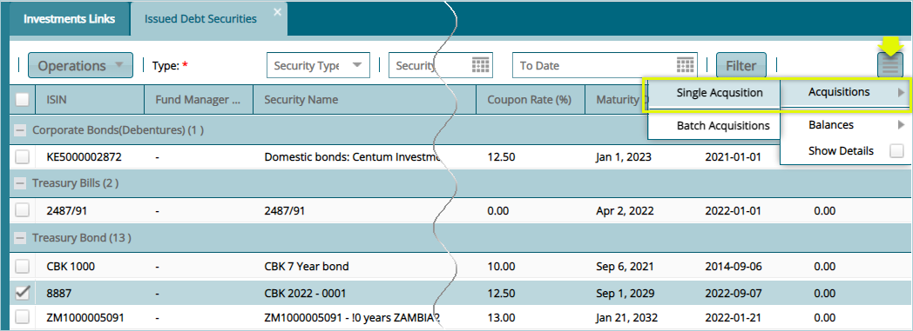
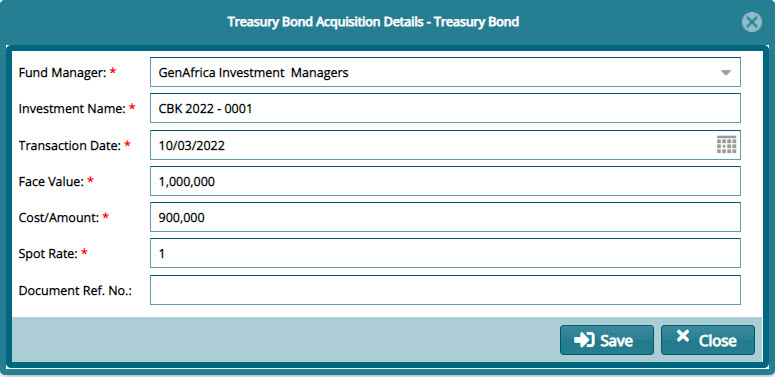
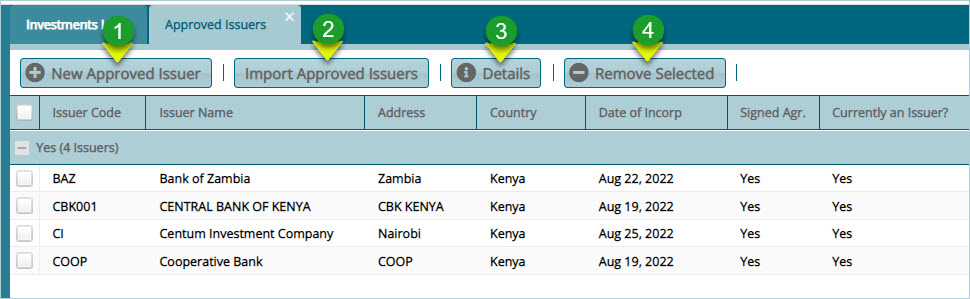
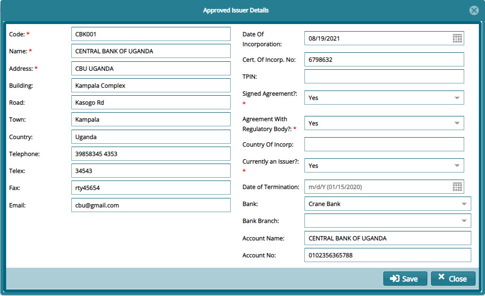

#### Treasury Bills

Under the Government Securities sub menu, click the **Treasury Bills** option to view a grid table with a list of all the added bills in categories of maturity terms in years as shown below:

  

**Action**

-   Click **Label 1** button to open a drop-down menu with different activity options such as valuation of a bond.

-   Click **Label 2** button to filter records based on set parameters such as redeemed or not, maturity date etc.

-   Click **Label 3** button to load a section on the lower section of the window showing all transaction details of a selected bill record.
  

**Corporate Bonds**

Corporate Bond are just like treasury bonds only that they are issued by private institutes. **Corporate bonds acquired can be viewed in a** grid table from the corporate bonds window as shown below:

  

**Tips**

-   Note that before a bond is listed on this window it has already been bought through the acquisition process from the Issues window.

-   Process corporate bonds just like you could treasury bonds as demonstrated in a previous section.
  

### Issues Debts & Approved Issuers

  

### Issued Debts

Under the Government Securities sub menu, click the **Issued Debts** option to open the Issued Debts Securities window where all issued securities are listed in a grid table as shown below:

  

**Action**

-   Click **Label 1** button to open a drop-down menu with different activity options such as creating a new debt.

-   Click **Label 2** button to filter records based on set filter parameters such as security type, by date range, issuer etc.

-   Click **Label 3** button load a section on the lower section of the window showing all transaction details of a selected bond record.

#### Creating New Security

Clicking the **New Debt(S)** menu (Single or batch) will open a dialog box through which a new bond - example of a single bond - is issued as shown below:

  

#### Bond Acquisition

To acquire a bond, select the bond from the Issued Debt Securities window, click the hamburger button on the right upper side and from the drop-down menu, select **Acquisition** then **Single Acquisition** as show below:

  

Clicking the **Single Acquisition** button will open a dialog box to fill bond acquisition details as shown below:

  

**Tip**

-   A newly acquired bond will be listed on the treasury bonds window under the bond years category.
  

### Approved Issuers

Under the Government Securities sub menu, click the **Approved Issuers** option to open the Approved Issuers window where all issuers of securities are listed in a grid table as shown below:

  

**Action**

-   Click **Label 1** button to add a new approved Issuer.

-   Click **Label 2** button to load more than one issuer in a template.

-   Click **label 3** button to view the details of a selected Issuer from the grid table.

-   Click **label 4** button to remove a selected buyer record from the list.

#### Creating New Issuer

Clicking the **New Approved Issuers button** will open a dialog box through which a new issuer details are captured in the system as shown below:

  

