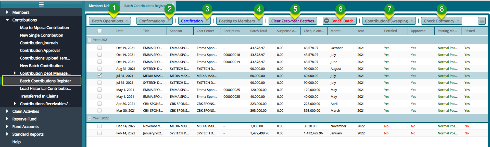
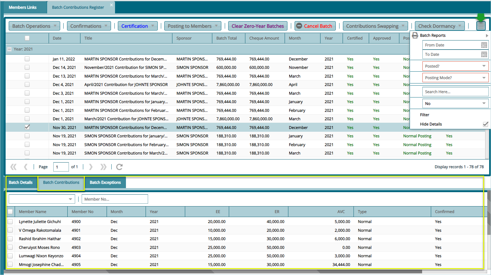

### Batch Contributions Register

After batch contributions are successfully uploaded into the system, they are collectively saved in a register where all the members batch contributions are tabulated based on the different sponsors in the scheme. To open this register, click the **Batch Contributions Register** link to view batch records as shown below:

 

**Action**

-   Click **label 1** button to create a new batch.

-   Click **label 2** button to confirms various aspects of a selected batch e.g., presence of new members.

-   Click **label 3** button to certify and approve a batch from the list.

-   Click **label 4** button to distribute contributions from the batch to members accounts.

-   Click **label 5** button to remove empty year records from a selected batch.

-   Click **label 6** button to remove from the register a selected batch.

-   Click **label 7** to swap the contributions of a year with another batch.

-   Click **label 8** to check the state of a contribution on the register.

### Batch Contribution Distribution to Members

To view contributions distribution to members accounts, check the **Show Details** checkbox found in a drop-down menu on the right upper corner of the window. This will display Extra details such as contributions allocation, batch exceptions and batch details on the lower section of the window as shown below:

 
