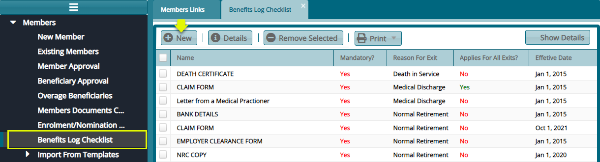

### Benefits Log Checklist

The benefits checklist enables the collation and management of documents needed for beneficiaries when processing benefits. 

Click the **Benefits Log Checklist** link to open the Benefits Log Checklist window and view the listed documents needed in the event of claiming benefits. To add a new benefits log checklist, click the **New** button as shown in the screenshot below:

 
