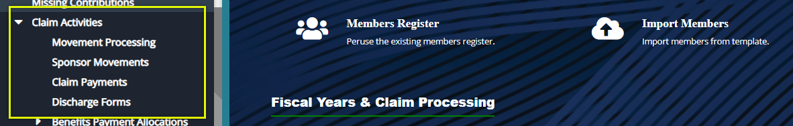
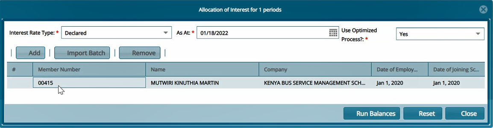
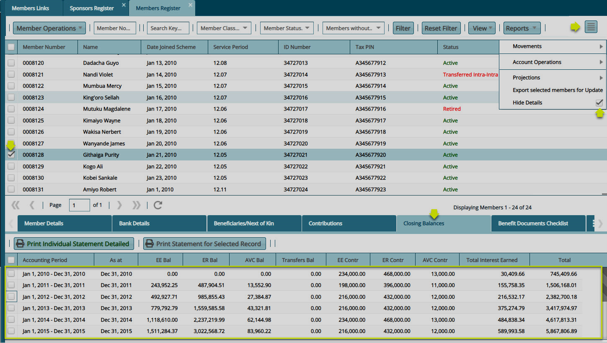
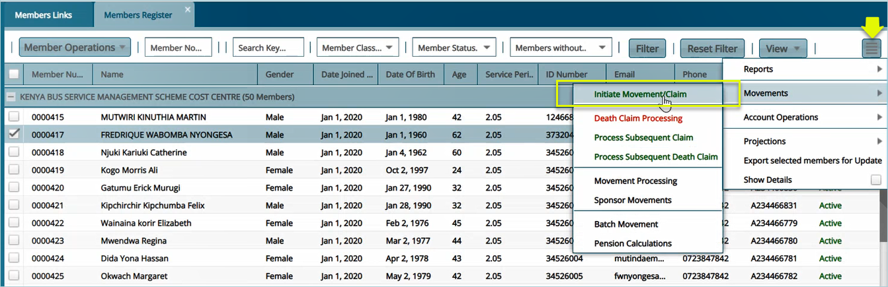
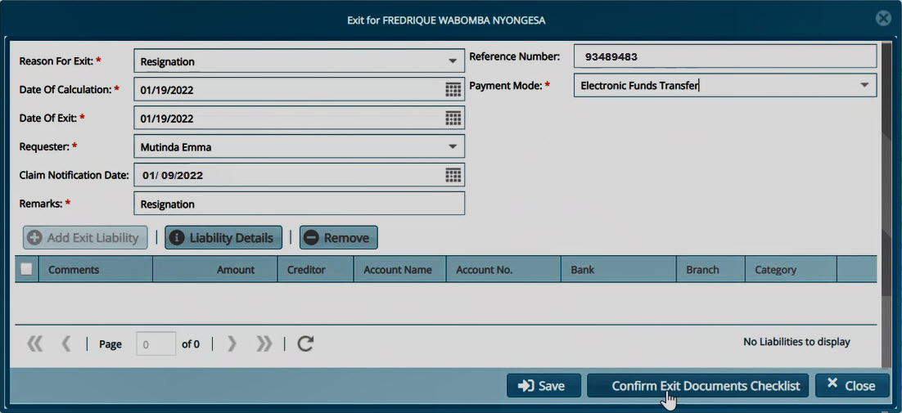
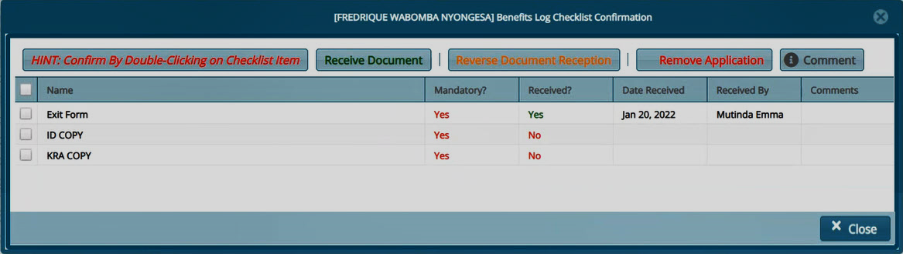
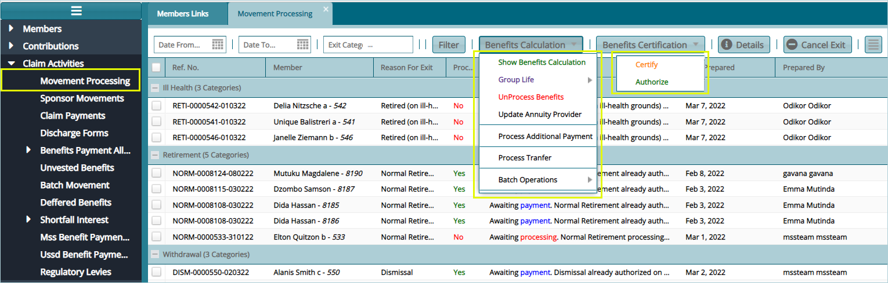
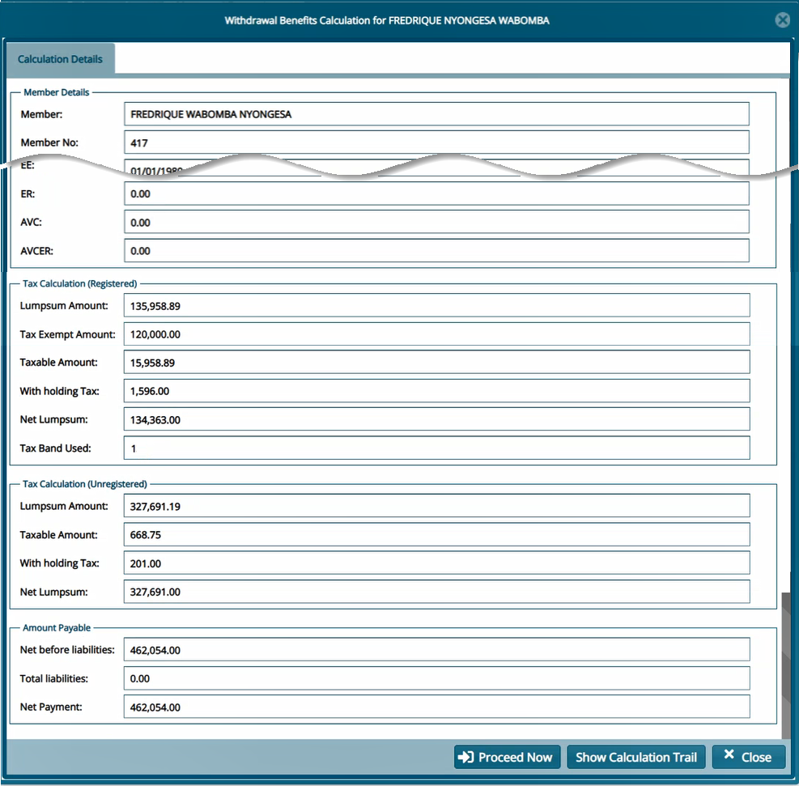
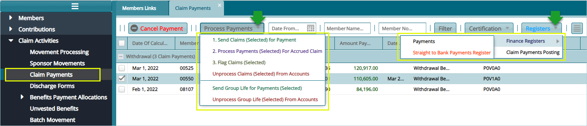
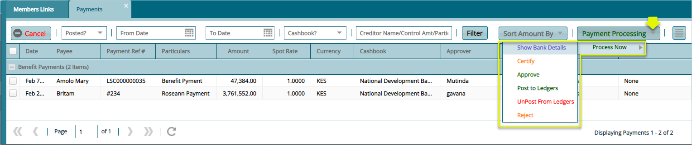

### Claim Activities

The procedures under this menu are related to claim processing. To start an activity, click the appropriate link from the enclosed drop-down menu to open the respective window as shown in the screenshot below:

 

## Claim Processing

The processing of a claim commences after running members balances to confirm correct crediting of Members contributions to their accounts. 

### Running balances

After configuring parameters and other key setups as demonstrated previously, the claim process commences by running members balances to confirm correct allocation of interests to members accounts. The system can run balances for a
few selected members or for a batch.

### Balances for Few Members

To run balances for a few members, navigate to the **Financial Periods Register** and select the **Financial Period** to run balances for from the list. Locate the **Period End Processes** tab from the menu bar and initiate the process of balance running as shown in the following illustration:

 

Clicking the **Select Members** tab as shown previously, will load a new form through which the **Type of Interest Rate** to use in running the balances, and the members to run balances for, are selected. See the following illustration:

 

### Balances for All Members

To run member balances in batch, follow the same process used previously to access the **Period End Processes** but on the drop-down menu, select **Run Batch** and on the submenu click **Scheme Level.** See the navigation steps in the following illustration:

 

#### Declared Vs Interim Interest Rates

Clicking the **Scheme Level** tab will load a dialogue form where the type of Interest Rates, **Declared or Interim**, can be selected to run the balances. Select the interest rate type from the drop-down list and confirm the year to
run balances for. Click the **Run Balance** button as shown in the illustration below:

 

To confirm if balances have been successfully distributed to members account, navigate to the members register and activate the details tab to display a section at the lower part of the window. Click to select individual members from
the list and click on the **Closing Balances** tab on lower section’s menu bar as demonstrated in the following illustration:

 

### Initiating Movement/Claim

After balances are ran, a Member's Claim can be initiated, and the claim record is then listed on the Movements window. To initiate a Claim for a Member, navigate to the Members Register and select the Member's record from the list. Click the **Movements** button to access the **Initiate Movement/Claim** buuton as shown in the following sample screenshot:

 

 
### Processing a Resignation Claim

To initiate a claim whose **Reason for Exit** is **Resignation**, Click **Initiate Movement/Claim** link will load an exit form (see the following screenshot) where configurations for processing the claim are set. Fill the form with the required details and then click the **Confirm Exit Documents Checklist** button (as shown in the next screenshot but one) to confirm receipt of relevant documents from the member.

After confirming receipt of documents, click the Save button to proceed with the claim process as shown below:

 

Clicking the **Confirm Exit Documents Checklist** button, as shown in the previously, will open the Benefits Log Checklist Confirmation window.  Select a document from the list and double click to confirm receipt of the document. Otherwise click the **Receive Document** button to upload the document as shown below:

 

A successful configuration of exit form and confirmation of receipt of relevant claim documents, is noted on the status column where a member’s status is changed from **Active** to **On Notice** as shown in the following screenshot:

 

## Movement Processing

Clicking the **Movement Processing** link will open the Movement Processing window where all the initiated claims are listed awaiting verification and benefits calculation as shown below:

 

### Benefits Calculation

Clicking the **Show Benefits Calculation** link from the Benefits Calculation  drop-down menu will load the Withdrawal Benefits Calculation form for a selected  member from the list. This will show all the member’s benefits tabulations as 
shown in a sample screenshot below:

 

### Claim Status

Next, click the **Proceed Now** button on the Withdrawal Benefits Calculation form to process the payment and save the records awaiting certification towards disbursement of moneys from the scheme accounts. See screenshot below:

 

## Claim Payments

After claim processing, all claim records for different members under different retirement reasons are listed in the Claims Payment window awaiting disbursement of moneys.

To view all claims ready for payment, click the **Claim Payments** link to open the claim payments window. Locate the **Process Payments** menu and from the drop-down menu select **Send Claims (selected) for Payment** or select **Unprocess Claim (selected)From Accounts** among other actions in the list. 

From the **Certification** drop-down menu, click to **Certify** and **Authorize** the payment of records selected. Click the **Register** menu and from the drop-down, access windows where all effected payments are listed as shown in the screenshot below:

 

### Finance Register

After claim processing and payment of benefits to members, all the payments transactions are saved in a **Finance Register**. To check records of payments, from the **Registers** drop-down menu, select **Payments** link from the Finance Registers sub menu as shown in the previous screenshot to open the Payments window.

Clicking the **Payment Processing** drop-down menu will allow a selected payment from the list to be certified, posted to ledger or rejected among other actions as shown in the following screenshot:

 