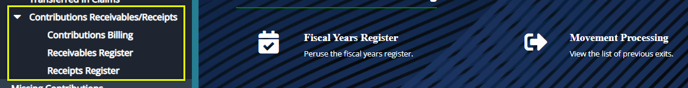
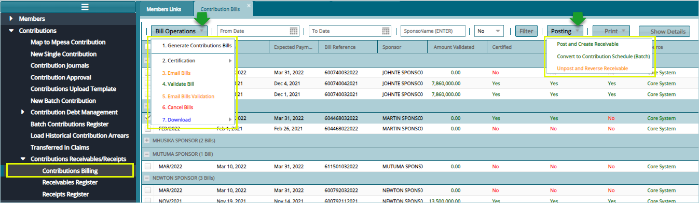
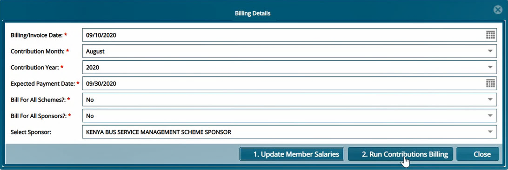
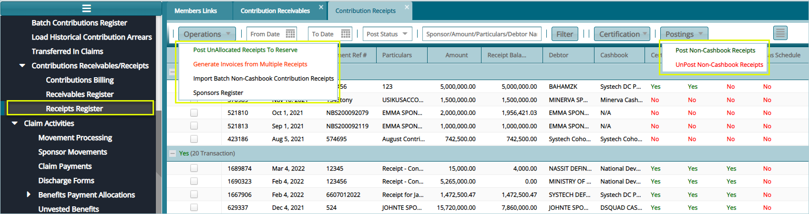

### Contributions Receivables/Receipts

The links under this category give access to windows where the Contributions Billing, Receivables Register, and Receipts Register configurations are set. 

Click on the drop-down submenu links enclosed below to load the respective windows and set configurations appropriately:

 

## Contributions Billing

To view the bills and generate a new one, click the **Contributions Billing** to open the Contribution Bills window through which the billing process is initiated as shown below:

 

### Generating a Bill

Clicking the **Generate Contributions Bills** link will open a Billing Details window where bill details are filled in a form accordingly. After Updating Member Salaries by clicking the provided button, click the **Run Contributions Billing** button to create a new bill as shown in the screenshot below:

 

## Receivables Register

Clicking the **Receivables Register** link will load a grid table listing all the received contributions. Click the **New** button to add a new contribution. You can search and **filter** records by dates among other operations as shown
below:

 

## Receipts Register

Clicking the **Receipts Register** link will load a grid table listing all the receipted contributions. Click the **Operations** menu to **Generate an Invoice** for a selected receipt on the list among other actions from the
drop-down list. Also search and **filter** the records by dates and **Post Non-Cash Book Receipts** among other operations as shown below:

 
