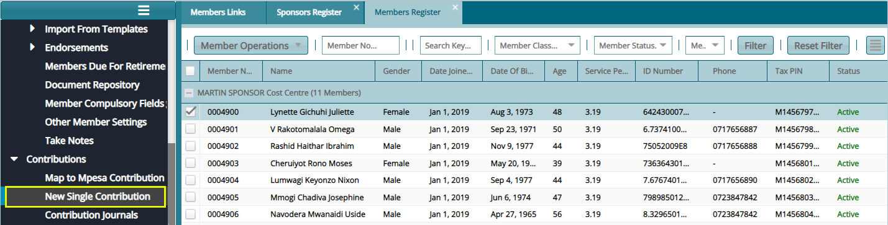
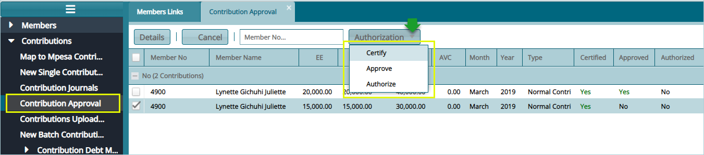

### Contributions Processing

After the process of adding Members and Sponsors to a Scheme, the next step is to upload members contributions. Contributions can be uploaded to the system in two ways: as a single contribution for one member or multiple contributions for more than one member in batch using a template.

## Single Contribution

To make a single contribution, select a member from the list of Members Register and click the **New Single Contribution** link as shown below:

 

Clicking this link will load a dialogue box through which the contributions details are captured as shown in the screenshot below:

 

## Single Contribution Approval

For every single contribution uploaded, authentication of the action is needed before the process is committed. This is done by clicking the **Contribution Approval** link to open the Contributions Approval window. Select the record from the list and on the **Authorization** menu, Certify, Approve, and Authorize as shown below:

 

## Contribution Upload Template

To make contribution in batches, the members’ contributions are uploaded using a template which is generated and downloaded from the system. The teplate is populated with data and uploaded back for verification process before the posting of the contributions to members accounts.

The screenshot below shows how to navigate and download the template to the your computer. Click the **Contributions Upload Template** link to open the window through which a sponsor is picked as shown below:

 

Click the **Generated Template** button to open an export dialogue box for specifying how the export should be done as shown below:

 

## New Batch Contribution

After downloading the contributions template and filling it with data, click the **New Batch Contribution** link to open the window through which the template is uploaded back into the system.

The following screenshot shows an example of a successful upload:

 

**Tip**

- In the event of unagreeable data or tempered with template settings, the system will reject the upload through an error alert message in the troubleshooting window.