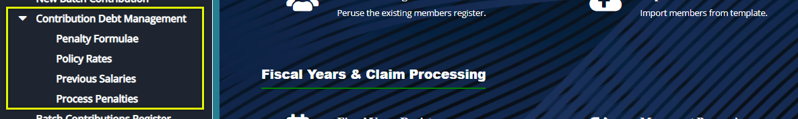
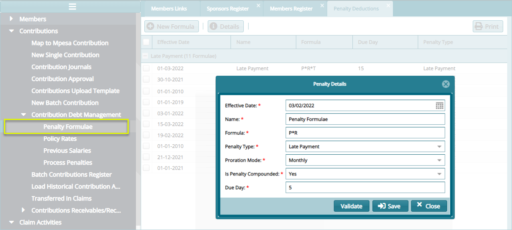
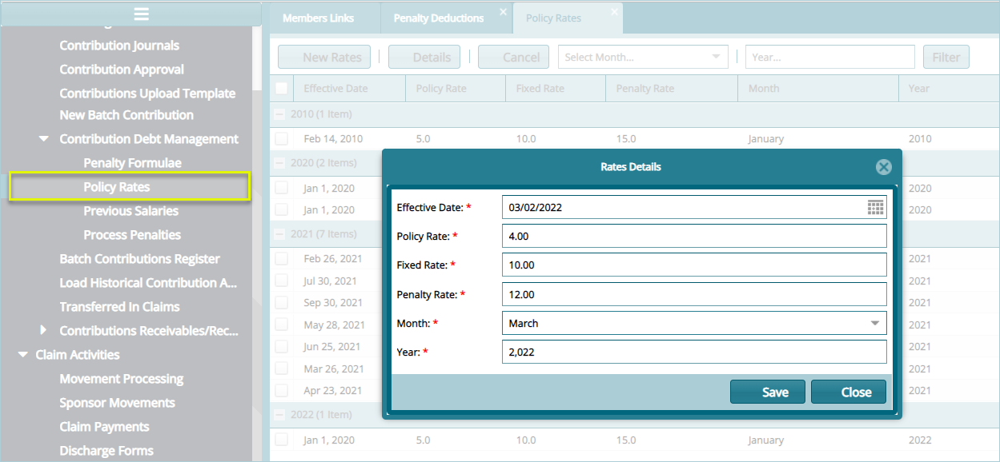

### Contributions Debt Management Configs

The configurations under this category are set to determine among other things the penalty formulae to use in case of rate contributions payments, the policy rates setting for processing penalties, and previous salaries are also configured. Click on the drop-down submenu links enclosed as shown below to load the respective dialog boxes to set up different configurations:

 

## Penalty

Click the **Penalty Formulae** link to open a Penalty Details dialogue box through which a new the penalty formulae is set as shown in the screenshot below:

 

## Policy Rates

Click the **Policy Rates** link to open a Rate Details dialogue box through which a new rate is configured as shown in the screenshot below:

 
