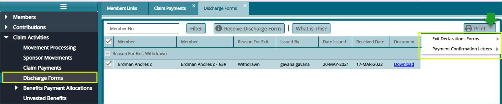

### Discharge Forms

Discharge forms are configured to documents members exit details from a scheme after claiming his/her benefits.

To access the list of claim forms in a scheme, click the **Discharge Forms** link to open a window where all exited members forms are listed in a grid table. Clicking the **Print** button on the upper right side will allow you to view various **Exit Declaration Forms** and **Payment Confirmation Letters** for a selected members form on the list as shown below:

 
