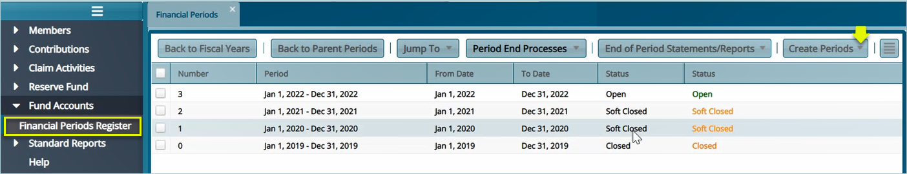

### Fund Accounts

The fund Accounts manage all the transactions from the Reserve Fund. This tool enables the creation of the different financial periods and allows different activities related to the records. Access the link to the Financial Periods Register by clicking on the drop-down submenu as shown below:
 
 

 
## Financial Periods Register

Clicking the **Financial Periods Register** link will open the Financial Periods Register window where all fund financial periods in a scheme are listed. You can also create periods by clicking the Create Periods drop-down menu as shown below:
 
 