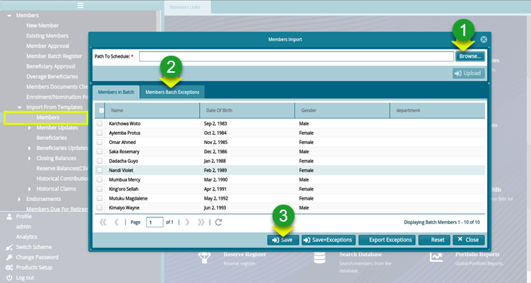

### Importing Members by Templates

To register members in batches, a template populated with data is uploaded into the system. To begin this process, click on the drop-down submenu link shown below to open the upload window as shown below:

 

 
This method enables massive registration of members at a go. See a sample template used to import and upload members below:

 

### Members Import Process

To import members in batch, after preparing the template, click the **Members** link to open the **Members Import** window through which the template is loaded from a user’s storage device to the system as shown below:

 

**Action**

-	Click **label 1** button to provide a link for fetching the template file from another device.

-	Click **label 2** button to check for exceptions (possible errors) before proceeding.

-	Click **label 3** button to save the uploaded list of members from the batch file.