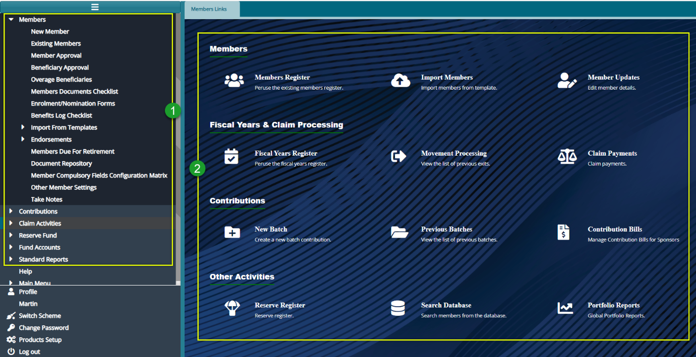

### Members Module Configs

The Members Module enables the registration of members (contributors)into a scheme. The members are connected to their respective sponsors (employers) through Cost Centers. This association makes the management of different sponsors, members’ contributions, and other operations possible. Additionally, the module allows viewing of existing members, onboarding members, uploading members’ contributions, and running claim processes. 

Below is a screenshot of the Members Module dashboard with the left side panel expanded to reveal links to different configuration windows:

 

**Action**

-	Click the menu item links listed on the left side panel in the section **labelled 1** to configure all members related settings.

-	Click the hot links under the section **labelled 2** to access shortcuts routes to commonly visited links in the members module.

### Scheme Data Importation

**Prerequisites**

For efficient upload of members’ details, their beneficiaries, contributions, and opening balances into a new scheme setup in the system, a scheme administrator will need templates populated with data beforehand. Such templates include:  

-	**Member details template**: This template contains members’ details with three unique columns: member number, member class code, cost, and center code.

-	**Beneficiary details template**: This template contains the beneficiaries’ details with one unique column, the member number column which attaches a beneficiary to a specific member.

-	**Opening balances templates**: These consist of two templates: the registered and the unregistered opening balances templates. Each of the templates has balances but with a unique member number column. The member number column attaches the balances to specific members.

-	**Member contributions template**: This template has the members’ contributions and salary but contains a unique member number column that ties the amounts to a specific member.

There are two ways in which you can upload member data into the system’s member register:

**1.**	A single member can be added by filling in details in a member’s details form. The added member must then be approved via the **Member Approval** window to officially be saved in the member’s register.

**2.**	More than one member can be added in a batch using a template file (e.g., MS Excel) which is filled with the member’s details and then uploaded into the system. 