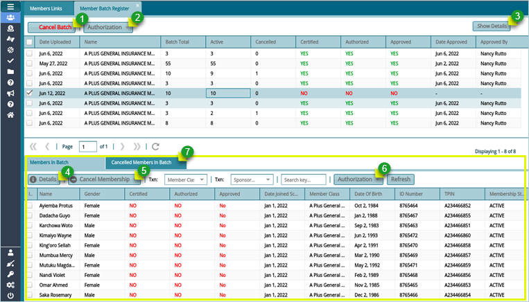
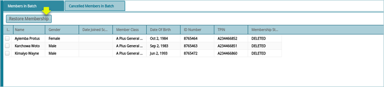

### Member Batch Register

The Members Batch Register holds the details of the members who have been uploaded via a template. From this window click the Authorization button to certify, authorize and approve a selected batch from the grid table. Click the Show Details button on the upper right corner to load a new section on the lowers side of the window listing all members in the batch as shown below:

 

 
**Action**

-	Click **label 1** button to delete a batch from the register and therefore not affect the member’s register.

-	Click **label 2** button and from the drop-down menu click to certify, authorize, and approve a selected batch from 
the list.

-	Click **label 3** button to load a new section showing members in the batch as shown in the screenshot above.

-	Click **label 4** button to view all the details of a selected individual member in the batch. 

-	Click **label 5** button to revoke the membership of a selected member in the batch.

-	Click **label 6** button and from the drop-down menu click to certify, authorize, and approve selected members from the batch.

-	Click **label 7** to see a list of all the members whose membership has been revoked from the batch being proceeded.

Clicking the **Cancel Membership** button will open a section listing all members whose membership has been revoked. To retore membership, select individuals from the grid table and click the **Restore Membership** button as shown below:

 

 
