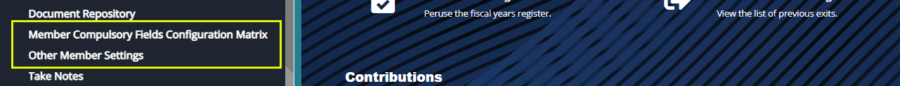

### Members Module Configurations

Before the actual onboarding of members, several configurations need to be set based on the needs and expectations of a particular scheme and the participants. Such configs are **Compulsory Fields Configurations Matrix** and **Members Document Checklist** among others. To set these configs, click on the links shown below:

 

### Compulsory Fields Configuration Matrix

Click the **Compulsory Fields Configuration Matrix** link to open a dialog box where the mandatory fields (that need to be filled are configured) are set to **Yes** or **No**. See screenshot below: 

 

### Other Member Settings

Click the **Other Members Settings** link to open a dialog box and select Yes or No for the parameters listed as shown below: 

 
