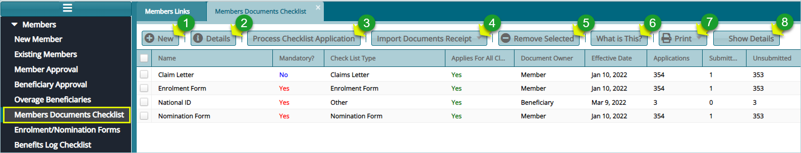
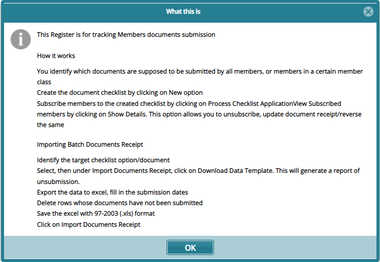

### Members Documents Checklist

For successful registration of members, the administrators of a scheme will need the members to submit specific documents as a requirement for the registration process. The screenshot below shows the window through which a list of such documents is displayed:

 

**Action**

-	Click **label 1** button to create a new document checklist.

-	Click **label 2** button to view the details of a selected document checklist.

-	Click **label 3** button to process the distribution of a selected checklist to the target group.

-	Click **label 4** button to import the document checklist.

-	Click **label 5** button to remove a selected checklist from the list.

-	Click **label 6** button to get information regarding what the document checklist is.

-	Click **label 7** button to view a print layout copy of checklist listing, compliance report, etc.

-	Click **label 8** button to open a grid table on the lower side of the window showing members’ document checklist application. The documents from members can be received, reversed, or removed.

### Adding New Document checklist

To add a new document checklist, click the **New** button, as shown previous, to open a dialog box through which the details for a new document checklist are captured and saved as shown below:

 

Clicking the **Process Checklist Application** button will open a dialog box through prompting for confirmation regarding the distribution of the document checklist to members as shown below:

 

Click the **Yes** button to load another dialog box through which a document checklist is distributed to members based on the statutes selected from the drop-down list as shown below:

 

Click the **What is this** button to open a new window displaying detailed information as shown below:

 

### Receiving Documents

Click the **Receive Document** button after selecting a member from the list. Otherwise reverse a received document, remove applications among other actions as shown below:

Clicking the **Show Details** button (as shown previous) will display a new section within the same window with a grid table listing documents that need to be uploaded to the system towards a member’s verification process. 

To upload a document, click the **Receive Document** button after selecting a member from the list. Otherwise, reverse a received document, and remove an application among other actions as shown below:

 