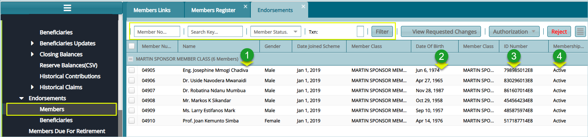
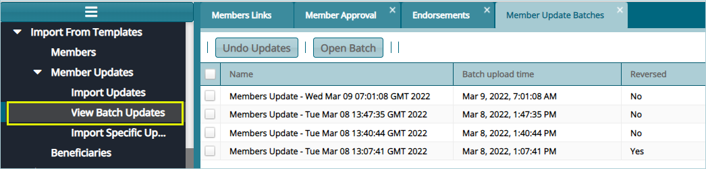

### Member Endorsement

After updating the Members Register, the changes need to be confirmed through an endorsement process that has three levels of authorization as shown below:

 

**Action**

-   Click **label 1** text boxes to configure how to filter records from the list.

-   Click **label 2** button to open a new window showing requested data changes to be member data.

-   Click **label 3** button to open a drop-down list with certify, approve, and authorize buttons.

-   Click **label** 4 to nullify presented changes request to member data.

### View Request Changes

Clicking the **view Requested Changes** button will open a window displaying the changes to be made on the data records if the update process is successful. See screenshot below:

 

### Viewing Batch Updates

Clicking the **View Batch Updates** link will open a grid table with a list of details on the updates such as actual update time as shown below:

 
