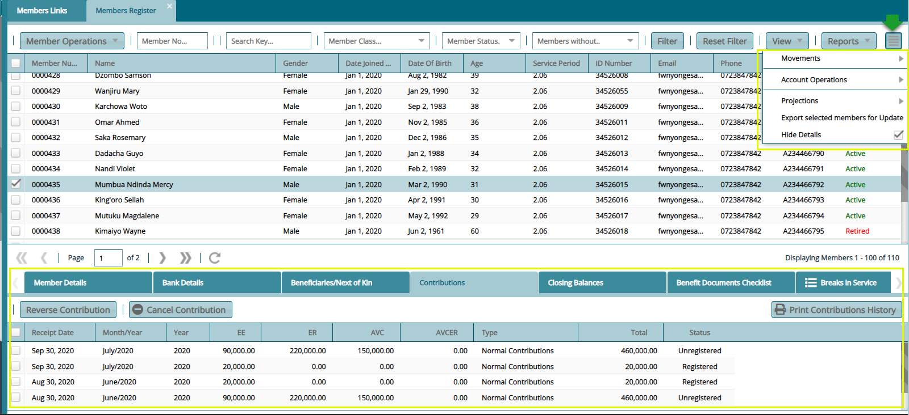

### Members Register

Clicking the **View Member** button will open the **Members Register** window where all members are listed under a selected sponsor as shown below:

 

**Action**

•	Click **label 1** button to carry out operations such as adding a new member from the drop-down list.

•	Click **label 2** text boxes to configure how to filter members from the list.

•	Click **label 3** button to access extra links such as a link to view members’ contribution balance history and various reports.

•	Click **label 4** checkboxes to display a section with extra details at the lower part of the window.

**Tip**

- More columns can be shown on the grid table by clicking the header cell of any column and adding new data fields.

### Accessing Member’s Extra Details

Clicking the **Show Details** checkbox will add a section on the lower part of the window showing member's extra details e.g., contribution, beneficiaries, closing balances, etc. as shown below:

 

