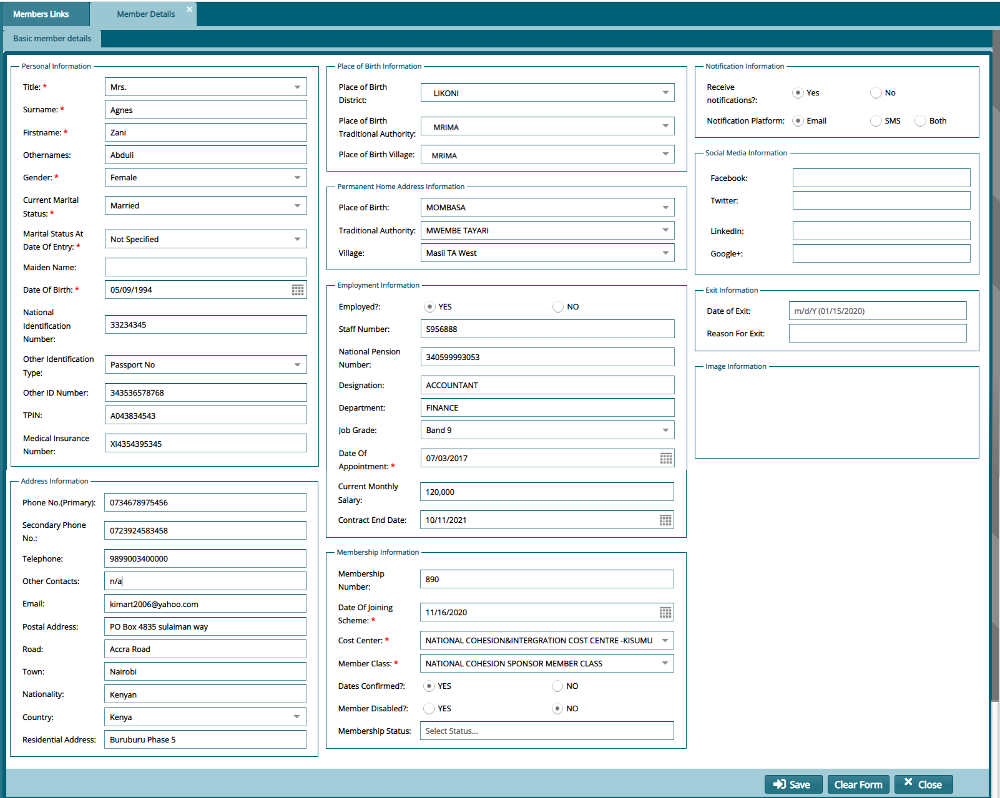

### Creating a New Member

To register a single member in a scheme, a member details form is used to capture member data for the registration process. To begin the process, click the link shown below:

 

Clicking the **New Member** link shown above will open a dialog box through which a member’s basic details are captured. A screenshot of the member's details dialog box is shown below:

 

**Tip**

-	Remember to go to the member approval window to approve a newly created member. This is demonstrated in a later section.

