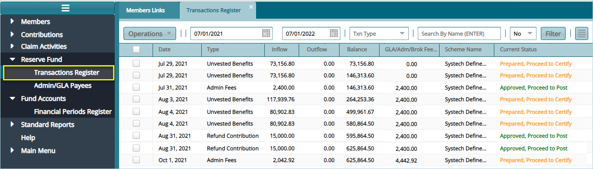

### Reserve Fund
FundMaster maintains records of balances (overpayments and underpayments) for different contributions transactions. See relevant Reserve Fund links below:

 

## Transactions Register

Transactions Register keeps records for all Reserve Fund transactions.

Clicking the **Transactions Register** link will open the Transactions Register where different transaction balances are listed. The transactions are normally recorded as **inflows**, which basically denotes overpayments. These inflows can later be used to settle deficits, say later underpayments from the same sponsor account. 

The screenshot below shows a sample of a Reserve Fund Transactions Register in FundMaster: 

 

**Tip**

- Movement of money from the **Fund Accounts** to bridge the deficit is treated as an Outflow. 

